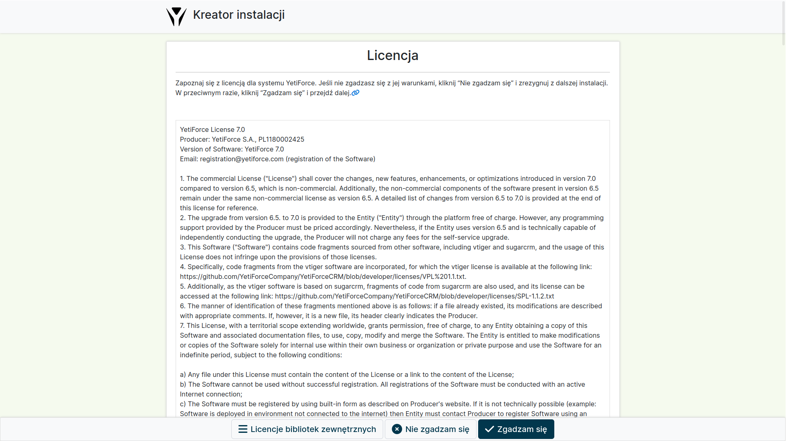
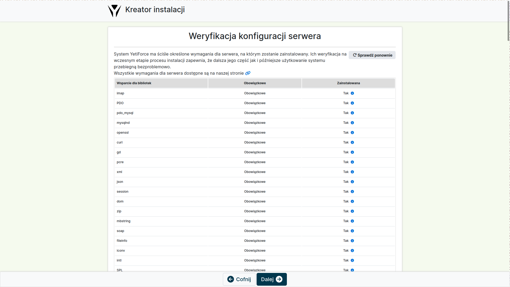
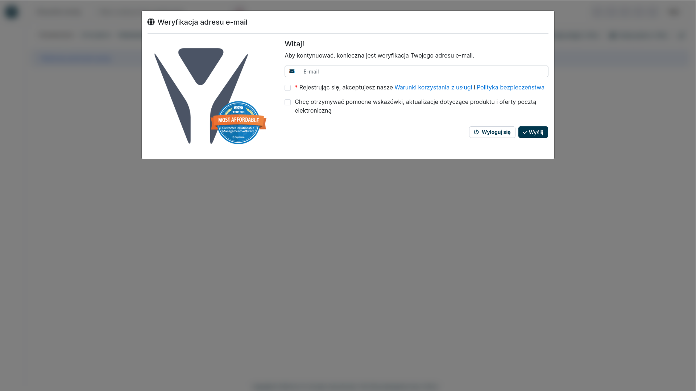

W tym artykule znajdziesz wszystko, co powinieneś wiedzieć o instalacji YetiForce - niezbędne informacje, instrukcję instalacji krok po kroku, oraz najczęściej pojawiające się błędy i problemy. **Koniecznie zapoznaj się ze wszystkimi poniższymi informacjami przed przystąpieniem do instalacji systemu.**

## Jak zainstalować system YetiForce?

Proces instalacji YetiForce jest bardzo prosty. Instalacja YetiForce odbywa podobnie do instalacji większości aplikacji webowych, czyli za pomocą kreatora przez przeglądarkę.

Przed instalacją sprawdź czy twój serwer jest zgodny z wymaganiami: [Wymagania systemu YetiForce](requirements) lub [Jak skonfigurować serwer z Debian 10 dla systemu YetiForce](/developer-guides/environments/debian-10)

:::important

Osoba, która instaluje system, powinna mieć co najmniej podstawową wiedzę na temat serwerów, baz danych i uprawnień serwera. 99% problemów instalacyjnych wynika z niewystarczającej wiedzy osób, które instalują aplikację. Jeśli nie jesteś pewien, czy jesteś w stanie samodzielnie przeprowadzić proces instalacji, poproś o pomoc kogoś posiadającego odpowiednią wiedzę z zakresu IT. Cała operacja instalacji zajmie maksymalnie 2 - 30 minut. Instalacja YetiForce jest podobna do instalacji takich aplikacji jak: WordPress, Joomla, Drupal. Różnice pomiędzy poszczególnymi narzędziami są niewielkie. Tak więc, jeżeli poradziłeś sobie z instalacją systemu klasy CMS, to poradzisz sobie również z YetiForce.

:::

## Pobierz i wgraj pliki systemu

W pierwszej kolejności przygotuj pliki instalacyjne. **[Pobierz YetiForce](download) z naszych oficjalnych źródeł.**

:::warning

Zalecamy pobranie wersji "complete", na przykład `YetiForceCRM-7.0.0-complete.zip`. Jeśli została pobrana inna wersja niż "complete", to przed instalacją systemu należy zainstalować biblioteki przy użyciu `yarn` i `composer`. Ważna jest kolejność - najpierw `yarn`, potem `composer`. Przykładowy skrypt instalacyjny możesz pobrać [stąd](https://github.com/YetiForceCompany/YetiForceCRM/blob/developer/tests/setup/dependency.sh).

:::

- Pobrany plik ZIP rozpakuj, np. za pomocą programu [7-Zip](http://7-zip.org/).
- Katalog z systemem CRM, który otrzymasz po rozpakowaniu pliku ZIP, skopiuj na serwer WWW, np. za pomocą programu [WinSCP](https://winscp.net/).
- Następnie postępuj zgodnie z kreatorem, którego wywołasz z poziomu WWW tam, gdzie skopiowałeś pliki YetiForce CRM.

Lub z konsoli bash

```bash
cd /home/yfprod/html/
wget -O YetiForceCRM.zip https://api.yetiforce.eu/download/crm/doc/7.0.4-complete
unzip YetiForceCRM.zip
chown -R yfprod:yfprod /home/yfprod/html/
```

## Krok 1 - Uruchomienie kreatora instalacji

Uruchom w oknie przeglądarki adres docelowy twojego systemu - powinien pokazać się kreator instalacji. Jeśli nie pokazał się kreator, to może znaczyć, że wystąpiły jakieś problemy, możesz spróbować uruchomić adres: **SITE_URL**/install/Install.php


Na ekranie startowym w kreatorze instalacji dostępna jest możliwość konfiguracji języka instalacji (domyślnie język jest predefiniowany na podstawie języka przeglądarki). Przejdziemy przez kolejne etapy nowej instalacji. **Kliknij `Zainstaluj` i przejdź do następnego kroku.**

## Krok 2 - Zapoznanie się z warunkami licencji i ich akceptacja

W drugim kroku kreator wymaga zaakceptowania licencji. Licencja YetiForce jest bardzo podobna do licencji MIT, jest otwarta i pozwala na dowolną modyfikację kodu z pozostawieniem informacji o pierwotnym autorze. Przeczytaj w pełni informacje o licencji, ponieważ z perspektywy firmy, dla której wdrażasz oprogramowanie, zapisy i warunki licencji są istotne.



## Krok 3 - Weryfikacja konfiguracji serwera

W trzecim kroku możesz znaleźć aktualną konfigurację serwera w porównaniu z wymaganiami YetiForce (wraz z informacją co należy zmienić i jakie wartości należy ustawić). Należy pamiętać, że w zależności od wymagań, jakie się stawia aplikacji CRM, konfiguracja ta może ulec zmianom. Firma wdrożeniowa powinna uwzględnić zmiany we własnym zakresie. Na przykład jeśli generujesz duże raporty, które mają dłuższy czas generowania niż maksymalny czas określony w parametrze `max_execution_time`, konieczne jest ustawienie parametrów w taki sposób, aby czas wykonania skryptu był zawsze dłuższy niż czas potrzebny na sporządzenie raportu. W przeciwnym wypadku taki raport może się nie wygenerować.

Dla pewności, poproś swojego administratora, aby zapoznał się z tymi [wymaganiami dla serwerów WWW](/introduction/requirements/). Jeśli mimo niespełnienia wszystkich wymaganych parametrów zdecydujesz się kontynuować instalację, aplikacja wyświetli komunikat ostrzegawczy.

Po zapoznaniu się z ryzykiem związanym z nieprawidłową konfiguracją serwera możesz kliknąć "OK" i przejść do następnego kroku.



## Krok 4 - Konfiguracja danych dostępowych

W tym kroku musisz wprowadzić dane dostępowe do bazy danych oraz ustawić parametry wyjściowe dla systemu. Na podstawie tych danych zostanie utworzona baza danych (gdy ta opcja została aktywowana). Na podstawie tych danych system utworzy bazę danych (o ile opcja ta została aktywowana), wgra strukturę bazy danych razem z podstawowymi danymi oraz utworzy podstawowe konto administratora, do którego będziesz mógł się zalogować po instalacji.

Jeżeli wprowadzisz nieprawidłowe dane dostępowe do bazy danych pokaże się błąd.

W takim wypadku musisz cofnąć się do ekranu poprzedniego i prawidłowo wprowadzić dane dostępowe. Jeżeli wszystko zostanie uzupełnione prawidłowo, zobaczysz ekran podobny do tego, który jest w kroku następnym.


## Krok 5 - Podsumowanie danych


## Krok 6 - Określ profil działalności


## Step 7 - Zweryfikuj adres e-mail



## Krok 8 - Wprowadzenie danych rejestracyjnych

Wprowadź dane firmy, która będzie korzystała z systemu. Te dane zostaną potem wykorzystane do rejestracji systemu.

Zgodnie z zapisami licencji każdy system musi być zarejestrowany po okresie próbnym 14 dni.


Jeżeli instalacja zostanie wykonana prawidłowo, zostaniesz automatycznie przeniesiony do systemu CRM.

## Proces instalacji nie powiódł się

Co zrobić, gdy system pokazuje komunikat `Invalid session ID` na początku instalacji.


### Co oznacza wiadomość `Invalid session ID`?

"Wysłany ID sesji nie jest zgodny z otrzymanym z serwera. Zalecamy usunięcie pamięci podręcznej przeglądarki, a jeśli to nie naprawi problemu, zalecamy poprawienie konfiguracji serwera."

Błąd pojawia się często, gdy na jednym adresie jest lub było kilka instancji systemu w różnych wersjach. Różne wersje CRM mają różną konfigurację cookie i dlatego czasem podczas instalacji nie można zaktualizować ID sesji.

Można to sprawdzić w konsoli przeglądarki:


### Jak naprawić nieprawidłowy identyfikator sesji

Naprawa jest prosta, wystarczy usunąć pamięć podręczną przeglądarki lub usunąć wszystkie cookies dla domeny (na której jest uruchamiany system).

:::warning

Zwróć uwagę na usunięcie ciasteczek dla HTTP i HTTPS!!!

:::

#### HTTP


#### HTTPS


### Jak wyczyścić pamięć podręczną przeglądarki tylko dla jednej domeny

Możesz łatwo usunąć pamięć podręczną przeglądarki, ale jak to zrobić tylko dla jednej domeny, aby nie stracić wszystkich danych?

W narzędziach deweloperskich jest możliwość podejrzenia i usunięcia danych podręcznych. Opcje usuwania danych podręcznych znajdują się w różnych modułach konfiguracji przeglądarki, w zależności od rodzaju używanej przeglądarki. Więcej informacji można znaleźć w artykule [Jak wyczyścić pamięć podręczną przeglądarki?](/administrator-guides/faq/how-to-clear-browser-cache/)
