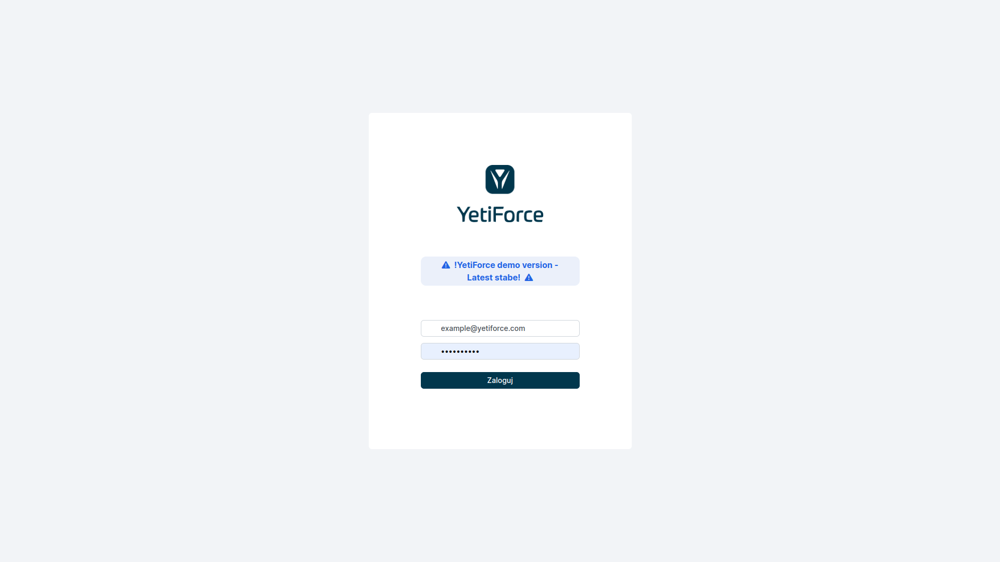

Migracja lub przywracanie systemu z backupu odbywa się w kilku krokach. By mieć pewność, że wykonujesz ją poprawnie, zapoznaj się z artykułem poniżej.

## Prezentacja wideo

import Tabs from '@theme/Tabs';
import TabItem from '@theme/TabItem';
import ReactPlayer from 'react-player';

<Tabs groupId="AAnD_Npa0ZM">
    <TabItem value="youtube-AAnD_Npa0ZM" label="🎬 YouTube">
        <ReactPlayer
            url="https://www.youtube.com/watch?v=AAnD_Npa0ZM"
            width="100%"
            height="500px"
            controls={true}
        />
    </TabItem>
    <TabItem value="yetiforce-AAnD_Npa0ZM" label="🎥 YetiForce TV">
        <ReactPlayer url="https://public.yetiforce.com/tutorials/system-migration.mp4" width="100%" height="500px" controls={true} />
    </TabItem>
</Tabs>

## Wgraj pliki do katalogu web root

Najlepiej rozpakować pliki bezpośrednio na serwerze, dzięki temu będą zachowane oryginalne uprawnienia na plikach.

:::tip

Jeżeli masz oddzielną kopię katalogu storage, tak jak w przypadku [Chmury (YetiForce Cloud)](https://yetiforce.com/pl/marketplace/chmura), to należy rozpakować kopię zapasową do katalogu `__YETIFORCE_PATH__/storage` tak, aby w tym katalogu nie było katalogu storage, tylko katalogi z danymi https://github.com/YetiForceCompany/YetiForceCRM/tree/developer/storage

:::

:::warning

Aby prawidłowo przenieść system na inny serwer, powinieneś wykonać pełną kopię systemu (pliki i baza danych). Najlepiej spakować programem do kompresji danych np.

```bash
zip -r `date +"%Y%m%d_%H%M"`.zip __YETIFORCE_PATH__ -q
```

```bash
tar -zcvf /var/www/html/`date +"%Y%m%d_%H%M"`.tar.gz /var/www/html/
```

**Podczas przenoszenia lub przywracania systemu nie może wystąpić żaden błąd, ponieważ później może okazać sie, że baza jest niekompletna.**

:::

## Wgraj bazę danych

Bazę danych wgrywamy za pomocą konsoli CLI (zalecane) lub klienta bazodanowego np. DBeaver, Database Workbench , SQLyog

```sql
mysql -P 3306 -h 127.0.0.1  -u yetiforce -p yetiforce < dump.sql
```

## Aktualizacja plików konfiguracyjnych

Po wgraniu plików i zaimportowaniu bazy danych zaktualizuj następujące pliki:

- [config/Main.php](https://doc.yetiforce.com/code/classes/Config-Main.html#property_site_URL)

```php
/** Ukośnik odwrotny jest wymagany na końcu adresu URL */
public static $site_URL = 'https://example.yetiforce.cloud/';
```

- [config/Db.php](https://doc.yetiforce.com/code/classes/Config-Db.html)

```php
/** Gets the database server */
public static $db_server = 'localhost';
/** Gets the database port */
public static $db_port = '3306';
/** Gets the database user name */
public static $db_username = 'root';
/** Gets the database password */
public static $db_password = '';
/** Gets the database name */
public static $db_name = 'yetiforce';
```

- [config/Security.php](https://doc.yetiforce.com/code/classes/Config-Security.html)

Warto też sprawdzić następujące parametry:

```php
/** Restricted domains */
public static $EMAIL_FIELD_RESTRICTED_DOMAINS_VALUES = ['yetiforce.com','github.com'];

/** Allowed domains for loading images, used in CSP. */
public static $allowedImageDomains = [];

/** Generally allowed domains, used in CSP. */
public static $generallyAllowedDomains = ['yetiforce.com', 'github.com'];

/** List of allowed domains for fields with HTML support */
public static $purifierAllowedDomains = ['yetiforce.com', 'github.com'];
```

Sprawdź, czy wymuszanie HTTPS jest włączone. Mogą wystąpić problemy, jeśli HTTPS był na starym serwerze i przekierowanie zostało włączone, a nowy serwer nie ma aktywnego HTTPS.

```php
/** Force site access to always occur under SSL (https) for selected areas. You will not be able to access selected areas under non-ssl. Note, you must have SSL enabled on your server to utilise this option. */
public static $forceHttpsRedirection = false;
```

Sprawdź czy jest skonfigurowana komunikacja przez `proxy`

```php
/** Proxy protocol: http, https, tcp */
public static $proxyProtocol = '';

/** Proxy host */
public static $proxyHost = '';

/** Proxy port */
public static $proxyPort = 0;

/** Proxy login */
public static $proxyLogin = '';

/** Proxy password */
public static $proxyPassword = '';
```

- [config/Components/Backup.php](https://doc.yetiforce.com/code/classes/Config-Components-Backup.html)

Jeśli na serwerze mamy dostępny katalog dla kopii zapasowej, to możemy go włączyć (może to wymagać konfiguracji uprawnień do plików)

```php
/** Backup catalog path. */
public static $BACKUP_PATH = '';
```

## Zweryfikuj czy konfiguracja zgadza się z wymaganiami

Zawsze po przeniesieniu systemu na nowy serwer, przywróceniu z backupu lub aktualizacji serwera LAMP uruchom weryfikację konfiguracji serwera zgodnie z wymaganiami z wbudowanego narzędzia do weryfikacji konfiguracji ([Dokumentacja Administratora → Logi → Serwer - konfiguracja](/administrator-guides/logs/server-configuration)) lub w artykule [Wymagania YetiForce](/introduction/requirements/).

:::warning

Jeśli serwer nie spełnia wymogów, nie należy z niego korzystać, ponieważ może to powodować utratę danych. Jeśli jakieś parametry widnieją na żółto lub czerwono, to należy je poprawić.

:::

Ważnym jest również to, aby właścicielem plików był ten sam użytkownik na którym działa serwer www (apache, nginx).

## CRON

Uruchom i zweryfikuj działanie [CRON-a](/administrator-guides/automation/cron)

## Zarejestruj ponownie system

Przeniesienie na nowy serwer lub przywrócenie z backupu [wymaga ponownej rejestracji systemu](/administrator-guides/app-id#dlaczego-app-id-ulega-zmianie).

## Aktualizacja dodatków

Niektóre dodatki mogą wymagać ponownej konfiguracji podczas zmiany lokalizacji lub adresu systemu YetiForce np. [`System settings → Integration → Mail integration panel`](/administrator-guides/integration/mail-integration-panel/outlook).

### YetiForce Outlook Integration Panel

Wymaga ponownej reinstalacji i zainstalowania nowego pliku XML.

Stary dodatek zainstalowany w Outlook należy usunąć, pobrać nowy plik XML z panelu systemu YetiForce zgodnie z instrukcją [Dodatek typu add-in do programu Outlook](/administrator-guides/integration/mail-integration-panel/outlook).

## Tworzenie środowiska testowego

Jeżeli tworzymy środowisko testowe warto jest wprowadzić kilka istotnych zmian które pomogą nam w rozróżnieniu i bezpieczeństwie środowisk.

### Zmienić hasła użytkowników

### Wizualne odróżnienie środowisk

Warto jest dodać komunikat o tym że jest to środowiska testowe, można to zrobić na stronie logowania oraz na górnej belce systemu.

Od wersji `6.2` można dodać do pliku konfiguracyjnego [config/Main.php](https://doc.yetiforce.com/code/classes/Config-Main.html#property_headerAlertMessage) kilka dodatkowych wiadomości.

```php
/** Header alert message */
public static $headerAlertMessage = '';

/** Header alert type, ex. alert-primary, alert-danger, alert-warning, alert-info */
public static $headerAlertType = '';

/** Header alert icon, ex.  fas fa-exclamation-triangle, fas fa-exclamation-circle, fas fa-exclamation, far fa-question-circle, fas fa-info-circle */
public static $headerAlertIcon = '';

/** Login page alert message */
public static $loginPageAlertMessage = '';

/** Login page alert type, ex. alert-primary, alert-danger, alert-warning, alert-info */
public static $loginPageAlertType = '';

/** Login page alert icon, ex.  fas fa-exclamation-triangle, fas fa-exclamation-circle, fas fa-exclamation, far fa-question-circle, fas fa-info-circle */
public static $loginPageAlertIcon = '';
```




### Zmienić nazwę nadawcy w SMTP lub wyłączyć zadanie CRON-a wysyłające maile

Wiadomości wysyłane z nowego środowiska będą wyglądały identycznie jak z produkcyjnego, dlatego warto wyłączyć wysyłanie wiadomości mail lub zmienić nazwy nadawców w SMTP aby umieć odróżnić wiadomości mailowe.

Panel: [Konfiguracja systemu → Automatyzacja → CRON](/administrator-guides/automation/cron)

## Zmienić klucze API

Warto zmienić dane dostępowe do API, aby były inne na każdym z środowisk. Aby przypadkiem ktoś mając dostęp do wersji testowej nie próbował uzyskać danych z wersji produkcyjnej.

Panel: [Konfiguracja systemu → Integracja → Web service - Aplikacje](/administrator-guides/integration/webservice-apps/)
