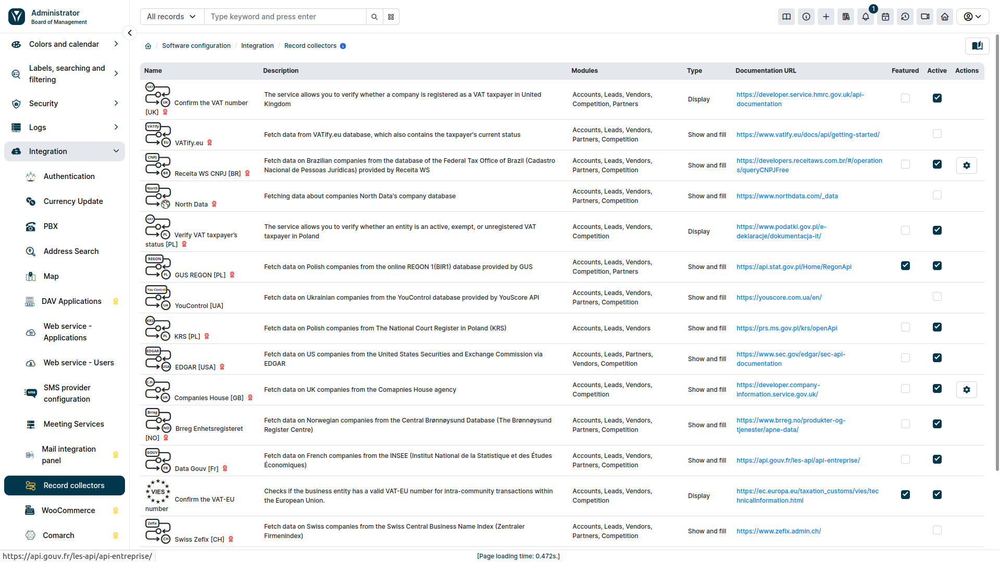
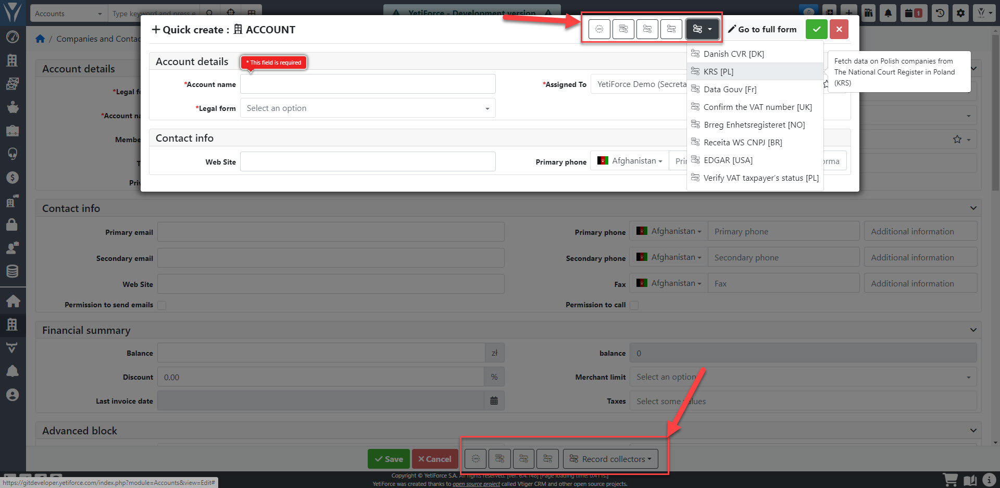

## Video guide

import Tabs from '@theme/Tabs';
import TabItem from '@theme/TabItem';
import ReactPlayer from 'react-player';

<Tabs groupId="XlIXiQpC9ug">
	<TabItem value="youtube-XlIXiQpC9ug" label="🎬 YouTube">
		<ReactPlayer
			url="https://www.youtube.com/watch?v=XlIXiQpC9ug"
			width="100%"
			height="500px"
			controls={true}
		/>
	</TabItem>
	<TabItem value="yetiforce-XlIXiQpC9ug" label="🎥 YetiForce TV">
		<ReactPlayer url="/video/record-collector.mp4" width="100%" height="500px" controls={true} />
	</TabItem>
</Tabs>

Record collector is used to load data from various sources and enables displaying and loading data into the YetiForce CRM system. The mechanism is available in all modules, however it has to be enabled and configured for each module to work correctly.

## Configuration

Konfigurując **kolektor rekordów** w pierwszej kolejności należy nadać odpowiednie uprawienia dla odpowiednich ról w systemie. Szczegółowe informacje na ten temat znajdują się w artykule: [Uprawnienia do kolektora rekordów](/administrator-guides/integration/record-collectors/).

Następnie przejdź do sekcji administracyjnej i wybierz ```Integracja → Kolektor rekordów```. Po otwarciu zakładki wyświetli się lista dostępnych kolektorów.



**Najważniejsze kolumny**
* **Moduły** - pokazuje miejsca w systemie, dla których dany kolektor jest dostępny
* **Typ** - określa typ kolektora:
      - **wyświetl** - wyświetla informację pobraną z kolektora
      - **pokaż i wypełnij** - pozwala nie tylko wyświetlić dane pobrane z kolektora, ale również wypełnić nimi formularz w systemie
* **Adres URL dokumentacji** - link do dokumentacji dostawcy usługi, zawierający szczegółowe informacje na temat kolektora. Znajdziesz tam m.in. instrukcje konfiguracji czy też sposób uzyskania danych autoryzacyjnych, jeżeli są one potrzebne
* **Wyróżniony** - oznacz ten checkbox, aby ikona danego kolektora została wyświetlona obok listy rozwijanej wszystkich uruchomionych kolektorów. Ułatwi to szybki dostęp do najczęściej używanych integratorów
* **Aktywny** - oznacz ten checkbox, aby dany kolektor był dostępny do wybrania w systemie
* **Akcje** - kliknij ikonę akcji (<kbd><i className="fas fa-cog"></i></kbd>), aby rozwinąć okno dialogowe z dodatkowymi opcjami konfiguracyjnymi kolektora


## Available collectors

Below is a list of all currently available record collectors. Free collectors available in the system by default are marked with ★, the remaining ones can be purchased from the Marketplace.
We regularly add new record collectors to the YetiForce system.

:::warning
Należy pamiętać, że dostęp do danych z niektórych kolektorów może wymagać odpowiednich danych uwierzytelniających.

**Prosimy o zapoznanie się z dokumentacją danego kolektora, aby uzyskać więcej informacji na temat wymagań dotyczących dostępu.**
:::

- GUS [PL] - Fetches data on Polish companies from the online REGON 1(BIR1) database provided by GUS
- ★ VIES [EU] - Checks if the business entity has a valid VAT-EU number for intra-community transactions within the European Union
- KRS [PL] - Fetches data on Polish companies from The National Court Register in Poland (KRS)
- Receita WS CNPJ [BR] - Fetches data on Brazilian companies from the database of the Federal Tax Office of Brazil (Cadastro Nacional de Pessoas Jurídicas) provided by Receita WS
- Swiss Zefix [CH] - Fetches data on Swiss companies from the Swiss Central Business Name Index (Zentraler Firmenindex)
- Danish CVR [DK] - Fetches data on Danish and Norwegian companies via CVR API from the Danish Central Business Register (CVR)
- Data Gouv [FR] - Fetches data on French companies from the INSEE (Institut National de la Statistique et des Études Économiques)
- Brreg Enhetsregisteret [NO] - Fetches data on Norwegian companies from the Central Brønnøysund Database (The Brønnøysund Register Centre)
- North Data - Fetches data about companies North Data's company database
- ★ Orb Intelligence - Fetches companies data from around the world
- CEIDG [PL] - Fetches data on Polish companies from the Central Register and Information on Economic Activity in Poland (CEIDG)
- VAT [PL] - Verifies whether an entity is an active, exempt, or unregistered VAT taxpayer in Poland
- ★ YouControl [UA] - Fetches data on Ukrainian companies from the YouControl database provided by YouScore API
- Companies House [GB] - Fetches data on UK companies from the Comapnies House agency
- VAT [GB] - Verifies whether a company is registered as a VAT taxpayer in the United Kingdom
- EDGAR [USA] - Fetches data on US companies from the United States Securities and Exchange Commission via EDGAR
- VATify.eu - Fetches data from VATify.eu database, which also contains the taxpayer's current status


## Wykorzystanie kolektora

W celu skorzystania z kolektora rekordów, przejdź do formularza w module, dla którego jest on dostępny. Na dole pojawi się wówczas lista dostępnych kolektorów. Te, które zostały oznaczone w sekcji administracyjnej jako **Wyróżnione** zostaną wyświetlone na liście niezależnie. Pozostałe aktywne kolektory dostępne są pod przyciskiem <kbd>Kolektory rekordów</kbd>. Po kliknięciu to pole, rozwinie się lista aktywnych kolektorów.

Dostęp do kolektorów również jest możliwy w formularzach typu "Szybkie tworzenie". W oknie modalnym pojawiają się one u góry po prawej stronie, jak to zostało przedstawione na poniższym zrzucie ekranu.

