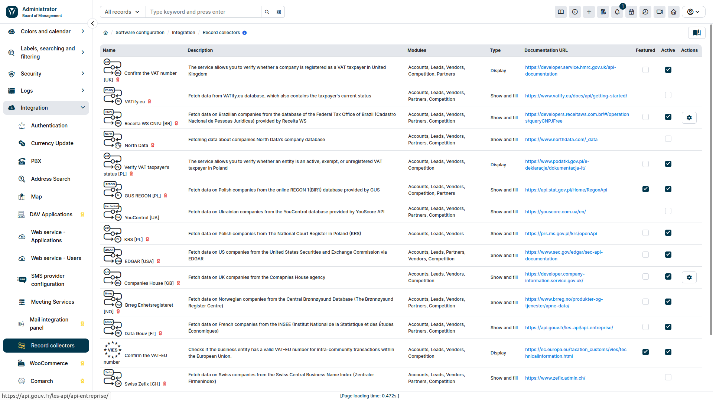
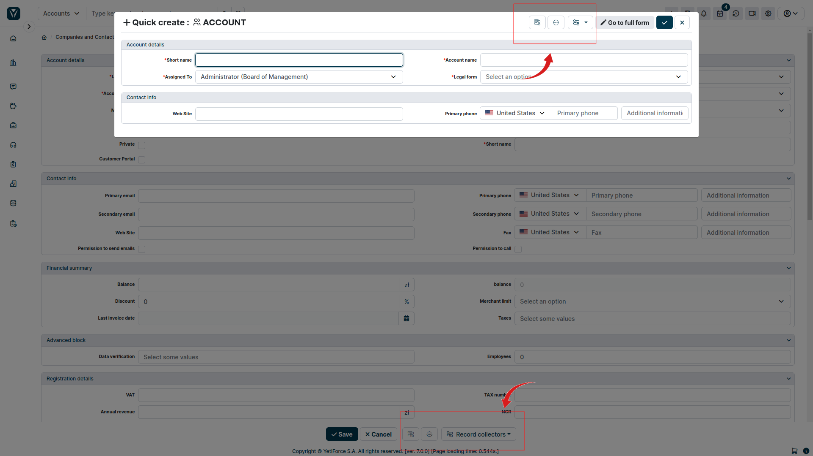

## Prezentacja wideo

import Tabs from '@theme/Tabs';
import TabItem from '@theme/TabItem';
import ReactPlayer from 'react-player';

<Tabs groupId="XlIXiQpC9ug">
    <TabItem value="youtube-XlIXiQpC9ug" label="🎬 YouTube">
        <ReactPlayer
            src="https://www.youtube.com/watch?v=XlIXiQpC9ug"
            width="100%"
            height="500px"
            controls={true}
        />
    </TabItem>
    <TabItem value="yetiforce-XlIXiQpC9ug" label="🎥 YetiForce TV">
        <ReactPlayer src="https://public.yetiforce.com/tutorials/record-collector.mp4" width="100%" height="500px" controls={true} />
    </TabItem>
</Tabs>

Kolektor rekordów jest używany do ładowania danych z różnych źródeł i umożliwia wyświetlanie i wczytywanie danych do systemu YetiForce CRM.

Mechanizm jest dostępny we wszystkich modułach, jednak musi być włączony i skonfigurowany dla każdego modułu do poprawnego działania.

## Konfiguracja

Konfigurując **kolektor rekordów** w pierwszej kolejności należy nadać odpowiednie uprawienia dla odpowiednich ról w systemie. Szczegółowe informacje na ten temat znajdują się w artykule: [Uprawnienia do kolektora rekordów](/administrator-guides/integration/record-collectors/).

Następnie przejdź do sekcji administracyjnej i wybierz `Integracja → Kolektor rekordów`. Po otwarciu zakładki wyświetli się lista dostępnych kolektorów.

**Najważniejsze kolumny**

- **Moduły** - pokazuje miejsca w systemie, dla których dany kolektor jest dostępny
- **Typ** - określa typ kolektora:
  - **wyświetl** - wyświetla informację pobraną z kolektora
  - **pokaż i wypełnij** - pozwala nie tylko wyświetlić dane pobrane z kolektora, ale również wypełnić nimi formularz w systemie
- **Adres URL dokumentacji** - link do dokumentacji dostawcy usługi, zawierający szczegółowe informacje na temat kolektora. Znajdziesz tam m.in. instrukcje konfiguracji czy też sposób uzyskania danych autoryzacyjnych, jeżeli są one potrzebne
- **Wyróżniony** - oznacz ten checkbox, aby ikona danego kolektora została wyświetlona obok listy rozwijanej wszystkich uruchomionych kolektorów. Ułatwi to szybki dostęp do najczęściej używanych integratorów
- **Aktywny** - oznacz ten checkbox, aby dany kolektor był dostępny do wybrania w systemie
- **Akcje** - kliknij ikonę akcji (<kbd><i className="fas fa-cog"></i></kbd>), aby rozwinąć okno dialogowe z dodatkowymi opcjami konfiguracyjnymi kolektora

## Dostępne kolektory

Poniżej znajduje się lista wszystkich aktualnie dostępnych kolektorów rekordów. Darmowe kolektory dostępne w systemie są domyślnie oznaczone tagiem, pozostałe mogą być zakupione w Marketplace. Regularnie dodajemy do systemu YetiForce nowe kolektory rekordów.

:::warning

Należy pamiętać, że dostęp do danych z niektórych kolektorów może wymagać odpowiednich danych uwierzytelniających.

**Prosimy o zapoznanie się z dokumentacją danego kolektora, aby uzyskać więcej informacji na temat wymagań dotyczących dostępu.**

:::

- GUS [PL] - Pobiera dane o polskich firmach z bazy danych **REGON 1(BIR1)** dostarczonej przez GUS
- ★ VIES [EU] - Sprawdza, czy podmiot gospodarczy posiada ważny numer VAT-UE dla transakcji wewnątrzwspólnotowych w Unii Europejskiej
- KRS [PL] - Pobiera dane o polskich firm z Krajowego Rejestru Sądowego w Polsce (KRS)
- Receita WS CNPJ [BR] - Pobieranie danych o firmach brazylijskich z bazy **Cadastro Nacional de Pessoas Jurídicas** dostarczonej przez Receita WS
- Swiss Zefix [CH] - Pobiera dane o spółkach szwajcarskich ze szwajcarskiego centralnego indeksu nazw przedsiębiorstw (Zentraler Firmenindex)
- Duński CVR [DK] - Pobieranie danych o duńskich i norweskich firmach przez CVR API z bazy Duńskiego centralnego rejestru przedsiębiorstw (CVR)
- Data Gouv [FR] - Pobieranie danych o francuskich przedsiębiorstwach z Państwowego Instytutu Statystyki i Badań Gospodarczych (Institut National de la Statistique et des Études Économiques)
- Brreg Enhetsregisteret [NO] - Pobieranie danych o norweskich przedsiębiorstwach z centralnej bazy Brønnøysund (The Brønnøysund Register Centre)
- North Data - Pobieranie danych firm z bazy North Data
- ★ Orb Intelligence - pobiera dane firm z całego świata
- CEIDG [PL] - Pobierz dane polskich firmy z **Centralnej Ewidencji i Informacji o Działalności Gospodarczej** w Polsce (CEIDG)
- VAT [PL] - Usługa umożliwiająca sprawdzenie, czy podmiot jest czynnym, zwolnionym czy też niezarejestrowanym podatnikiem w VAT w Polsce
- ★ YouControl [UA] - Pobieranie danych o ukraińskich firm dostarczone przez YouScore API z bazy YouControl
- Comapnies House [GB] - Pobiera dane z brytyjskich firm z agencji **Comapnies House**
- VAT [GB] - Sprawdza czy firma jest zarejestrowana jako podatnik VAT w Wielkiej Brytanii
- EDGAR [USA] - Pobieranie danych o firmach w **USA z U.S. Securities andExchange Commission (SEC)** z bazy EDGAR
- VATify.eu - Pobieranie danych firm z bazy **VATify.eu**, która również zawiera aktualny status płatnika VAT

## Wykorzystanie kolektora

W celu skorzystania z kolektora rekordów, przejdź do formularza w module, dla którego jest on dostępny. Na dole pojawi się wówczas lista dostępnych kolektorów. Te, które zostały oznaczone w sekcji administracyjnej jako **Wyróżnione** zostaną wyświetlone na liście niezależnie. Pozostałe aktywne kolektory dostępne są pod przyciskiem <kbd>Kolektory rekordów</kbd>. Po kliknięciu to pole, rozwinie się lista aktywnych kolektorów.

Dostęp do kolektorów również jest możliwy w formularzach typu "Szybkie tworzenie". W oknie modalnym pojawiają się one u góry po prawej stronie, jak to zostało przedstawione na poniższym zrzucie ekranu.

