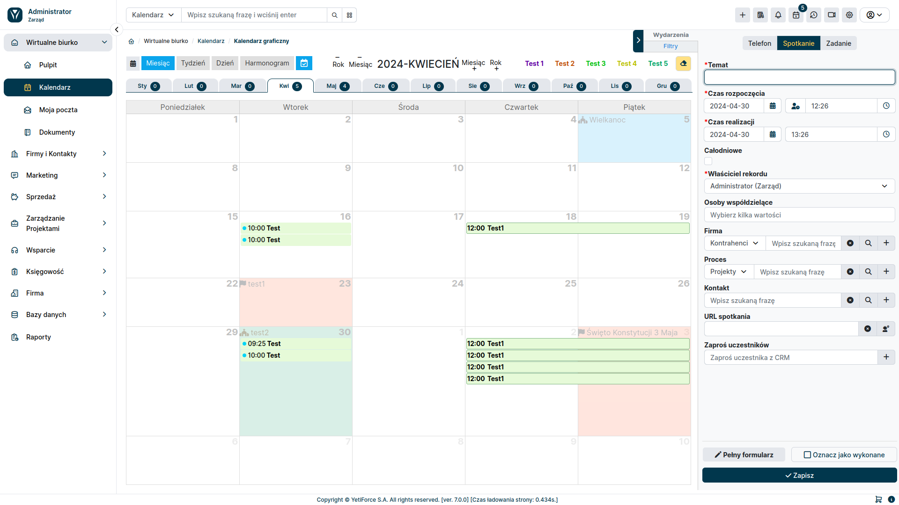

## Dodatkowe źródła danych

:::tip
Ta funkcja jest dostępna dla YetiForce w wersji `7.0` i później
:::

Dodatkowe źródła danych umożliwiają wyświetlanie informacji ze wszystkich modułów z rekordami, które mają pole daty lub czasu i daty. Blok konfiguracyjny jest dostępny w panelu filtrów po prawej stronie.

### Pola

#### Tytuł

Nazwa, która będzie wyświetlana na liście źródeł danych

#### Rodzaj

Typ określa na podstawie ilu i jakich pól mają być prezentowane dane. Dzięki temu rozwiązaniu, system daje możliwość wyświetlania danych z zakresu lub w oparciu o dwa pola daty i czasu jako jedną wartość.

Możesz wybrać następujące typy:

- Jedno pole daty lub data i czas
- Dwa pola daty i czasu
- Zakres czasu dla jednego pola daty lub daty i godziny
- Zakres czasu dla dwóch pól data i czas

#### Publiczny

Parametr określa, czy dane źródło danych będzie widoczne dla innych użytkowników. Domyślnie każdy widzi tylko własne źródła danych, a ta opcja umożliwia ich udostępnianie. Dostępne tylko dla administratorów systemu.

#### Uwzględnij filtry

Wybranie tej opcji zawęzi wyniki do wybranych użytkowników i grup. Pozostawienie tej opcji odznaczonej pokaże wszystkie wpisy, niezależnie od wybranych użytkowników i grup.

#### Moduł

Określa, z którego modułu będą wyświetlane dane.

#### Widok niestandardowy

Lista z filtrami dla wybranego modułu, daje możliwość dodatkowego filtrowania wyświetlanych danych w oparciu o warunki z filtrów. Więcej informacji w artykule [Warunki filtrów](/user-guides/interface-guide/list-view/filter#conditions).

#### Pole etykiety

Lista wyboru pozwala zmienić domyślną etykietę rekordu na wybrane pole, które chcesz wyświetlić w kalendarzu.

#### Dane oparte na polach

W zależności od wybranego typu dla wybranego modułu będzie dostępna jedna lub cztery listy rozwijane z polami. Dane wyświetlania kalendarza zostaną pokazane na podstawie wybranych pól.

### Uprawnienia

Funkcjonalność dodatkowych źródeł danych jest dostępna dla zwykłych użytkowników dopiero po przyznaniu im niezbędnych uprawnień.

Możesz zarządzać uprawnieniami w [Konfiguracja systemu → Uprawnienia → Profile](/administrator-guides/permissions/profiles/)

Uprawnienia są podzielone na dwie opcje:

- **Kalendarz - Dodatkowe źródła danych** - daje dostęp do całego bloku i wyświetlania danych
- **Kalendarz - Utwórz dodatkowe źródła danych** - pozwala użytkownikowi na tworzenie własnych źródeł danych
