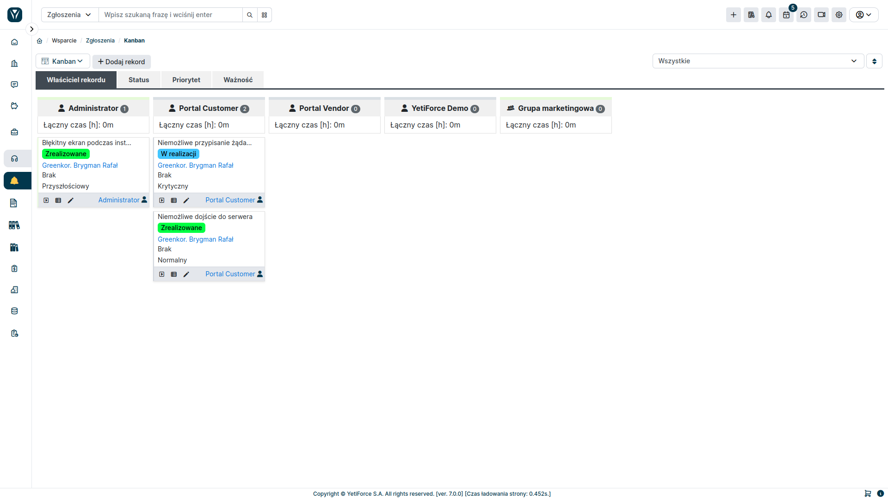
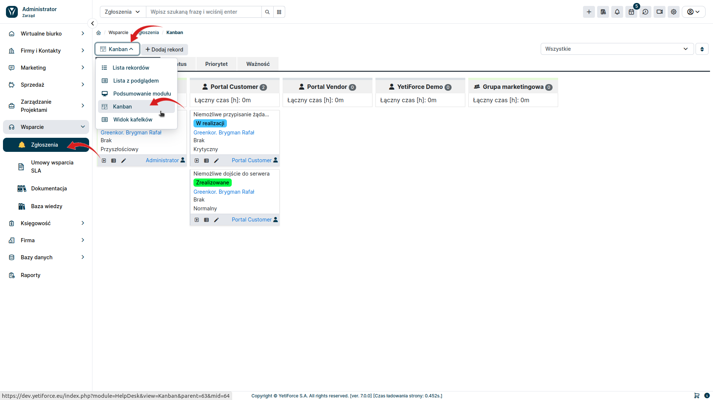
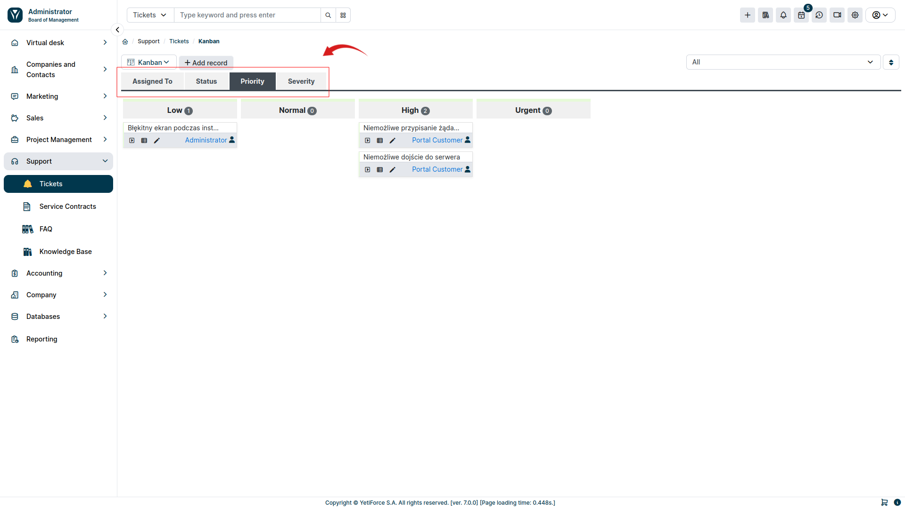

Tablica Kanban to narzędzie używane głównie do zarządzania projektami, jednak w YetiForce widok ten jest dostępny we wszystkich modułach użytkownika, w których przechowywane są dane. Kanban pomaga wizualizować dane grupując je w przeróżny sposób, efektywnie definiować ilość pracy w toku i zwiększać wydajność.

:::warning

Tablica Kanban jest dodatkiem płatnym dostępnym w naszym Marketplace - [**Kup YetiForce Kanban Board**](https://yetiforce.com/pl/yetiforce-kanban)

:::

## Uruchomienie widoku tablicy

By przejść do widoku tablicy Kanban w module, w którym skonfigurowane zostały tablice, wybierz ten moduł z listy, a następnie wybierz widok Kanban z listy dostępnych widoków w tym module:

Jeśli w danym module zostało skonfigurowanych więcej tablic, będą one widoczne jako zakładki. By zmienić widoczną tablicę wystarczy kliknąć w odpowiednią zakładkę:

## Przenoszenie elementów

By przenieść element tablicy Kanban miedzy kolumnami wystarczy najechać kursorem na dany blok (kursor myszy zmieni ikoną na <i class='fa-solid fa-up-down-left-right'></i>) i przeciągnąć ją w odpowiednie miejsce:

## Konfiguracja

Opis panelu konfiguracyjnego znajduje się w częścią administratora: [`Konfiguracja systemu → Moduły standardowe → Kanban`](/administrator-guides/standard-modules/kanban/)
