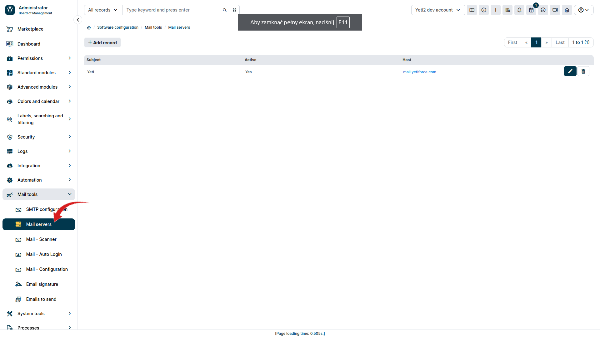
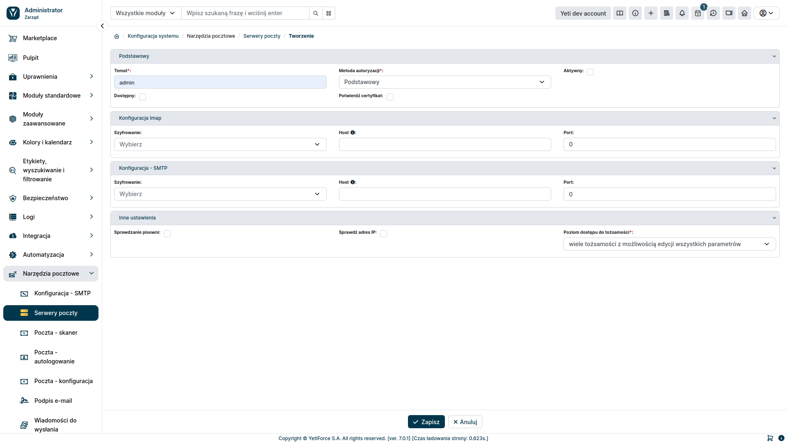
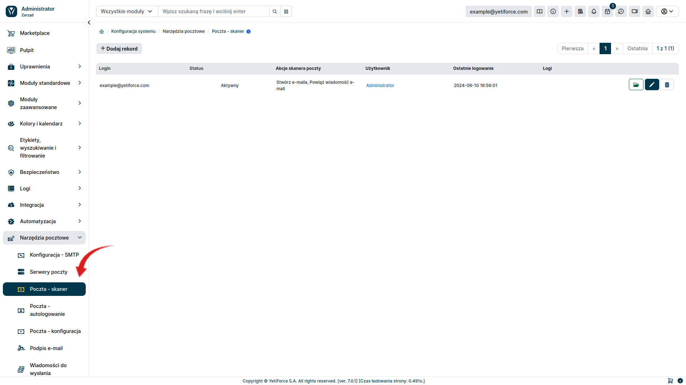
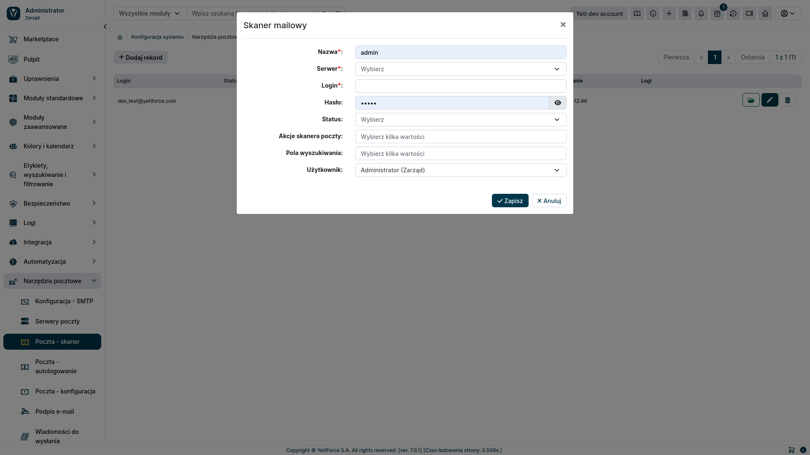
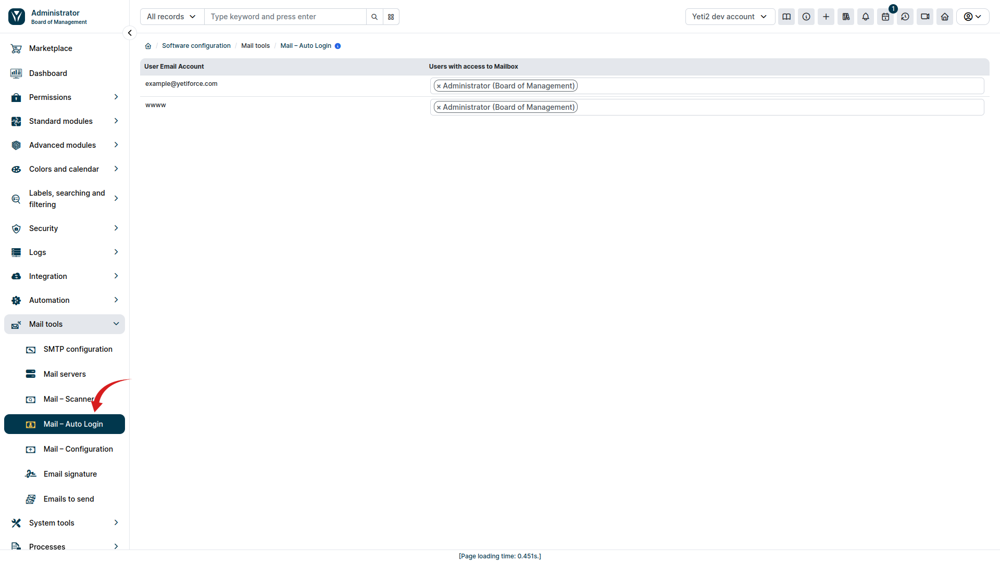
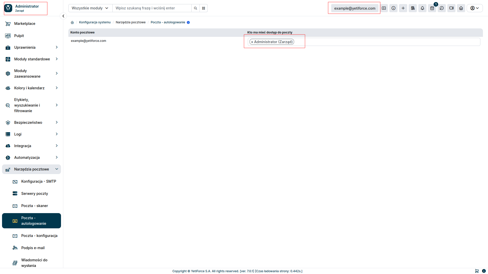
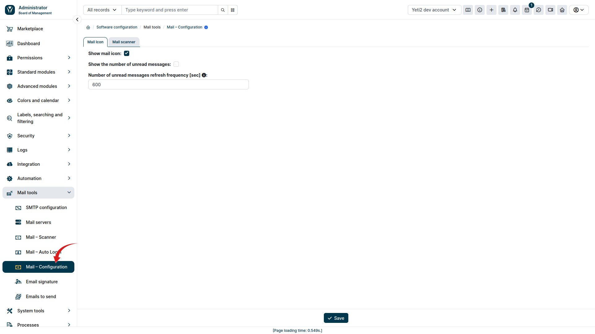
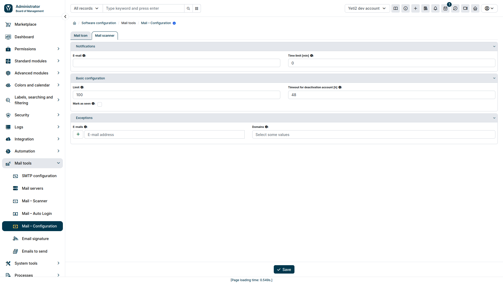
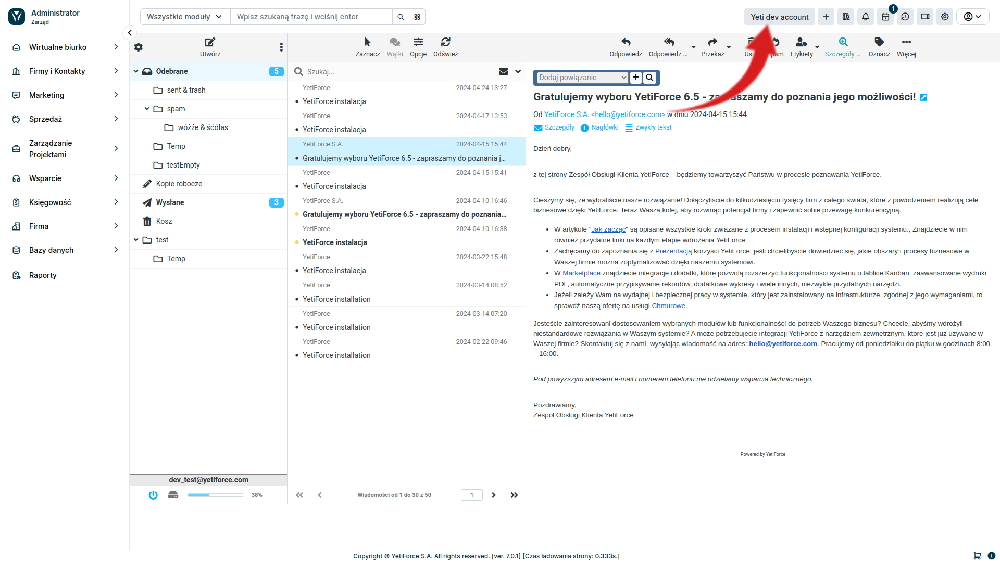
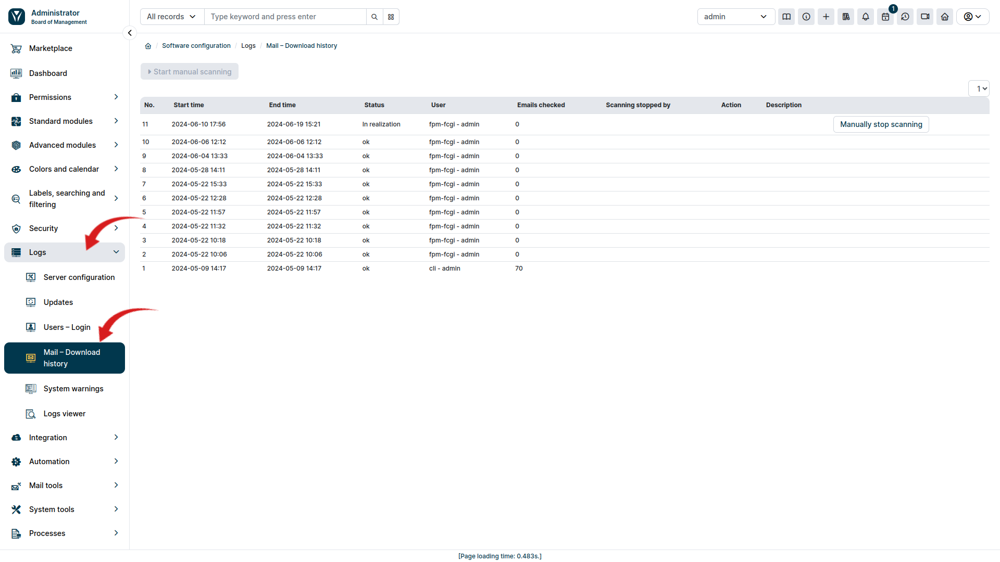

Skrzynki firmowe w systemie YetiForce to funkcjonalność pozwalająca na centralne zarządzanie korespondencją e-mailową w ramach organizacji. Dzięki nim możliwe jest monitorowanie, odbieranie i wysyłanie wiadomości e-mail z różnych kont pocztowych bezpośrednio z poziomu systemu CRM YetiForce.

Skrzynki firmowe są ściśle zintegrowane z innymi modułami YetiForce CRM. Pozwala to na automatyczne przypisywanie e-maili do odpowiednich rekordów w systemie.

## Konfiguracja 

By móc skorzystać z tej funkcjonalności konieczne jest skonfigurowanie w panelu administracyjnym ```Serwera poczty``` oraz ```Skanera poczty```. Natomiast by móc wysyłać wiadomości przez system YetiForce CRM należy dodatkowo ustawić sekcję ```Autologowanie```. Poniżej znajduje się opis jak można to zrobić.

### Serwer poczty

W celu rozpoczęcia korzystania ze skrzynki korporacyjnej, należy skonfigurować w panelu konfiguracyjnym systemu serwer pocztowy.
Żeby to zrobić, wybierz w menu po lewej stronie ```Narzędzia pocztowe``` a następnie ```Serwery poczty```.
W tym miejscu możemy dodać nowe konfiguracje za pomocą przycisku ```Dodaj rekord``` lub edytować aktualnie istniejące.



Po naciśnięciu przycisku ```Dodaj rekord```, będziemy mieć możliwość w pełni skonfigurować sposób podłączenia się pod usługę mailową.
Konfiguracja imap umożliwi prawidłowe odbieranie wiadomości pocztowych a natomiast SMTP na wysyłanie wiadomości przez YetiForce z korporacyjnej skrzynki mailowej.



### Skaner poczty

Kolejnym krokiem jest skonfigurowanie skanera poczty. Służy on do pobierania wiadomości mailowych z serwera pocztowego a następnie umożliwia, by w oparciu o nie wykonać odpowiednie operacje w systemie YetiForce.
W celu jego konfiguracji z lewego menu należy wybrać ```Narzędzia pocztowe``` a następnie ```Poczta - skaner```. 




Przycisk ```Dodaj rekord``` umożliwi stworzenie nowego skanera poczty.



#### Pole formularza tworzenia skanera pocztowego
- Serwer - serwer pocztowy utworzony w ```Narzędzia pocztowe``` > ```Serwery poczty```
- Login - login służący do zalogowania się do poczty
- Hasło - hasło umożliwiające zalogowanie się do poczty (opcjonalne przy uwierzytelnianiu OAuth)
- Akcje skanera poczty
    - Stwórz e-maila - wybranie tej opcji powoduje pobieranie wiadomości email z serwera pocztowego
    - Powiąż wiadomość e-mail - pozwala połączyć wiadomość z użytkownikiem lub innym zasobem systemu na podstawie kryteriów określonych w ```Pole wyszukiwania```
    - Otwórz zgłoszenie - ustawia odpowiedni status dla zgłoszenia powiązanego z pobraną wiadomością mailową
    - Utwórz zgłoszenie - tworzy nowe zgłoszenie w systemie
- Pola wyszukiwania - określa kryteria powiązania wiadomości z elementem systemu
- Użytkownik - określa użytkownika, do którego będzie przypisane utworzony element systemu

### Wysyłanie wiadomości pocztowych

Funkcjonalność wysyłania wiadomości pocztowych, ma zastosowanie tylko w zakresie wewnętrznego klienta pocztowego (RoundCube).
Jeżeli chcemy by system YetiForce CRM nie tylko odbierał pocztę, ale także umożliwiał nam wysyłanie wiadomości pocztowych, należy w panelu administrcyjnym wybrać  ```Narzędzia pocztowe ``` a nastepnie zakładkę ```Poczta - autologowanie```.



Dla każdego utworzonego konta pocztowego wybieramy użytkownika z systemu YetiForce, który ma mieć do niego dostęp. Pozostawienie pustej wartości spowoduje, że nikt w systemie nie będzie mógł się zalogować do skrzynki pocztowej.
Gdy nadamy użytkownikowi prawo dostępu do skrzynki pocztowej, w pasku na górze strony, po prawej stronie, pojawi się dodatkowy przycisk z nazwą jaką podaliśmy w skanerze poczty.
Jeżeli użytkownik będzie miał nadany dostęp do kilku skrzynek, zamiast przycisku pojawi się lista rozwijana, z której możemy wybrać interesującą nas skrzynkę.




### Konfiguracja poczty

Zakładka ```Poczta - konfiguracja``` pozwala nam ustawić parametry odnośnie pobierania wiadomości z serwera pocztowego, takie jak: częstotliwość sprawdzania czy pojawiły się nowe wiadomości, limit maksymalnej liczby wiadomości, które mozna pobrać jednorazowo czy też filtry pozwlajace okreslić jakie wiadomości skaner poczty ma pomijać.





### Klient poczty

Po wykonaniu powyższych kroków, system YetiForce będzie w stanie pobierać wiadomości z serwera pocztowego i odpowiednio je obsłużyć. 
Żeby przejrzeć pobrane wiadomości lub wysłać wiadomość mailową, wybieramy nazwę poczty, która znajduje się w górnym menu po prawej stronie.
Zostaniemy wówczas przeniesieni do klienta pocztowego.



Do klienta pocztowego możemy również się dostać z poziomu panelu użytkownika. Należy w tym celu wybrac z lewego menu ```Wirtualne biurko``` a następnie ```Moja poczta```


### Logi skanera poczty

System YetiForce pozwala przejrzeć pracę skanera poczty na podstawie logów zawierających czas pracy skanera i liczbę pobranych wiadomości.
By to sprawdzić należy w panelu administracyjnym wybrać z lewego menu ```Logi``` a następnie ```Maile - historia pobrań```


