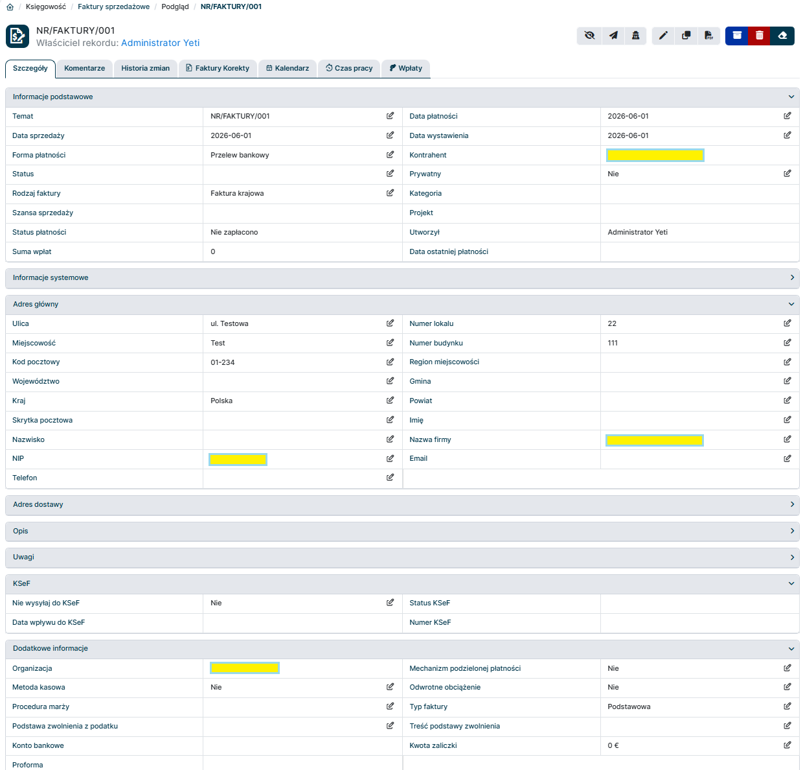
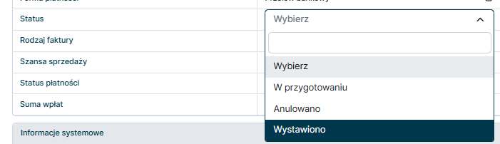
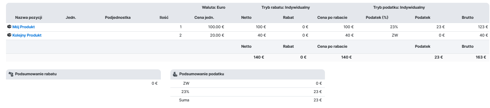
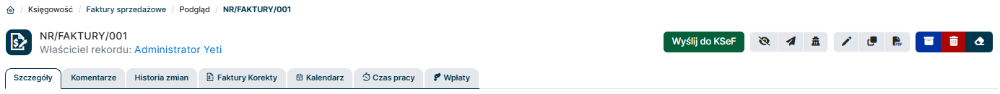
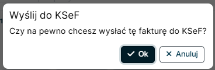

Wystawienie faktury sprzedażowej z integracją z KSeF w systemie YetiForce jest proste i intuicyjne. Poniżej znajdziesz krok po kroku instrukcję, jak to zrobić:

## 1. Utwórz nową fakturę sprzedażową w systemie YetiForce

Stwórz nowy rekord Faktura Sprzedażowa klikając przycisk `Dodaj rekord` w module Faktury Sprzedażowe.

## 2. Wypełnij wymagane pola

Wypełnij odpowiednio pola rekordu. Pola posiadają domyślne mapowanie do swoich odpowiedników w KSeF, co ułatwia proces wystawiania faktury.

Kluczowe pola do uzupełnienia to:

- `Temat` - numer własny faktury
- `Kontrahent` - wybierz kontrahenta z listy lub dodaj
- `Data wystawienia` - data wystawienia faktury
- `Data sprzedaży` - data sprzedaży towaru lub usługi
- `Forma płatności` - wybierz z listy
- `Status` - aby wysłać fakturę do KSeF to pole musi być ustawione na "Wystawiono".
- Blok `Adres główny` - wypełnij dane adresowe kontrahenta, a także `Nazwa firmy` oraz `NIP` - będą to dane Podmiotu (odbiorca faktury) na fakturze ustrukturyzowanej
- `Nie wysyłaj do KSeF` - zaznacz "Tak", jeśli faktura *nie ma być wysyłana* do KSeF.
- `Organizacja` - wybierz powiązany podmiot z modułu Struktura Organizacji. Dane tego podmiotu zostaną użyte do uzupełnienia Podmiotu wystawiającego fakturę. Ważne jest również aby dla danej Organizacji został w panelu administracyjnym YetiForce skonfigurowany certyfikat KSeF, który będzie używany do uwierzytelniania wysyłki faktury do KSeF.
- `Typ faktury` - w przypadku Faktury Sprzedażowej zwykłej należy wybrać opcję "Podstawowa".
- Dodatkowe opcjonalne pola jak np. `Konto bankowe`, `Metoda kasowa`, `Podstawa zwolnienia z podatku`, `Treść podstawy zwolnienia` itp. można uzupełnić w zależności od potrzeb.

- Blok zaawansowany zawiera informacje o pozycjach na fakturze. Wpisz pozycje wraz z kwotami netto oraz stawkami podatkowymi.

## 3. Wyślij fakturę do KSeF

Jeżeli na rekordzie faktury pola wypełnione są w sposób umożliwiający wysyłkę do KSeF na górnym pasku akcji pojawi się nowy przycisk `Wyślij do KSeF`. Kliknij ten przycisk, aby wysłać fakturę do KSeF.

:::warning

Uwaga - potwierdzenie operacji wysyłki faktury do KSeF spowoduje, że faktura zostanie wysłana do KSeF i operacji tej nie będzie można cofnąć. Upewnij się, że wszystkie dane na fakturze są poprawne przed potwierdzeniem wysyłki do KSeF.

:::

## 4. Poczekaj na potwierdzenie statusu z KSeF

Po pewnym czasie od wysyłki faktury do KSeF informacja o statusie faktury zostanie przetworzona i na rekordzie automatycznie zaktualizowane zostaną pola:

- `Status KSeF` - status wysyłki faktury do KSeF, np. "W trakcie wysyłki", "Wysłana", "Błąd" itp.
- `Data wpływu do KSeF` - data wpływu otrzymana z KSeF
- `Numer KSeF` - numer faktury nadany przez KSeF (tzw. "numer KSeF")
