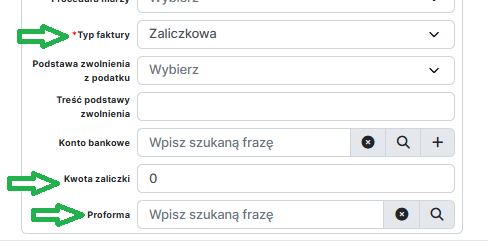

:::info

Faktury zaliczkowe w systemie YetiForce z integracją z KSeF są wystawiane na podobnej zasadzie jak standardowe faktury sprzedażowe. Zapoznaj się z instrukcją dotyczącą wystawiania **[Faktur Sprzedażowych](../01-finvoice/README.md)** w systemie YetiForce z integracją z KSeF.

:::

## Kluczowe różnice przy wystawianiu faktur zaliczkowych (względem faktur podstawowych)

### 1. Utwórz Fakturę Proformę

Faktura Proforma nie jest dokumentem księgowym wysyłanym do KSeF, ale służy do wystawienia oferty lub potwierdzenia zamówienia. W systemie YetiForce faktura proforma jest dokumentem bazowym, do którego będą odnosić się faktury zaliczkowe oraz rozliczeniowe dotyczące tej samej transakcji.

### 2. Utwórz fakturę sprzedażową typu "Zaliczka"

- W polu `Typ faktury` wybierz opcję "Zaliczkowa"
- W polu `Proforma` wskaż rekord odpowiedniej faktury proformy
- W polu `Kwota zaliczki` wpisz kwotę zaliczki, jaką obejmuje faktura zaliczkowa

