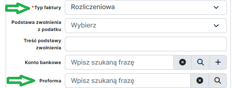

:::info

Faktury rozliczeniowe w systemie YetiForce z integracją z KSeF są wystawiane na podobnej zasadzie jak standardowe faktury sprzedażowe. Zapoznaj się z instrukcją dotyczącą wystawiania **[Faktur Sprzedażowych](../01-finvoice/README.md)** oraz **[Faktur Zaliczkowych](../02-finvoice-advance/README.md)** w systemie YetiForce z integracją z KSeF.

:::

## Kluczowe różnice przy wystawianiu faktur rozliczeniowych (względem faktur podstawowych)

### 1. Znajdź odpowiednią Fakturę Proformę

Faktura Proforma nie jest dokumentem księgowym wysyłanym do KSeF, ale służy do wystawienia oferty lub potwierdzenia zamówienia. W systemie YetiForce faktura proforma jest dokumentem bazowym, do którego będą odnosić się faktury zaliczkowe oraz rozliczeniowe dotyczące tej samej transakcji. Jako że faktura rozliczeniowa jest dokumentem końcowym, musi odnosić się do faktury proformy z której wynikają faktury zaliczkowe (patrz instrukcja dotycząca wystawiania **[Faktur Zaliczkowych](../02-finvoice-advance/README.md)**).

### 2. Utwórz fakturę sprzedażową typu "Rozliczeniowa"

- W polu `Typ faktury` wybierz opcję "Rozliczeniowa"
- W polu `Proforma` wskaż rekord odpowiedniej faktury proformy

Kwota rozliczenia zostanie automatycznie obliczona na podstawie faktury proformy i powiązanych faktur zaliczkowych.

