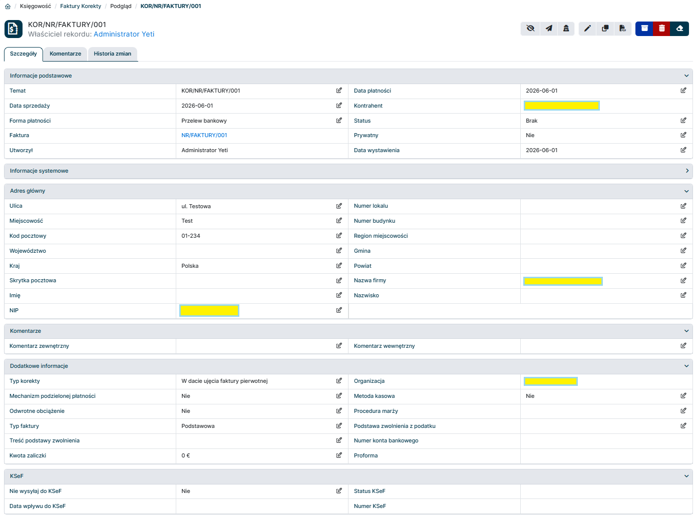
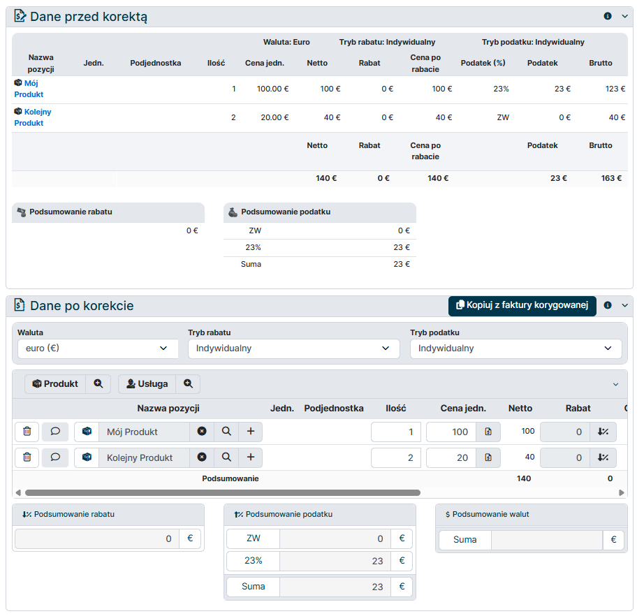
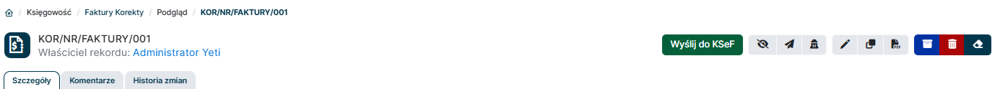

## 1. Utwórz nową fakturę korygującą w systemie YetiForce

Fakturę korygującą utworzysz w systemie YetiForce w module o nazwie "Faktury Korekty". Aby faktura korygująca mogła powstać, musi istnieć faktura sprzedażowa, do której będzie wystawiana korekta. Faktura korygująca jest powiązana z fakturą sprzedażową poprzez pole `Faktura`.

## 2. Wypełnij wymagane pola

Wypełnij odpowiednio pola rekordu. Pola posiadają domyślne mapowanie do swoich odpowiedników w KSeF, co ułatwia proces wystawiania faktury.

Kluczowe pola do uzupełnienia to:

- `Faktura` - rekord powiązany z fakturą sprzedażową, do której wystawiana jest korekta. **Po wybraniu faktury sprzedażowej pola faktury korygującej zostaną automatycznie uzupełnione danymi z faktury sprzedażowej**.
- `Temat` - numer własny faktury
- `Kontrahent` - wybierz kontrahenta z listy lub dodaj
- `Data wystawienia` - data wystawienia faktury
- `Data sprzedaży` - data sprzedaży towaru lub usługi
- `Forma płatności` - wybierz z listy
- `Status` - aby wysłać fakturę do KSeF to pole musi być ustawione na "Wystawiono".
- Blok `Adres główny` - wypełnij dane adresowe kontrahenta, a także `Nazwa firmy` oraz `NIP` - będą to dane Podmiotu (odbiorca faktury) na fakturze ustrukturyzowanej
- `Nie wysyłaj do KSeF` - zaznacz "Tak", jeśli faktura *nie ma być wysyłana* do KSeF.
- `Organizacja` - wybierz powiązany podmiot z modułu Struktura Organizacji. Dane tego podmiotu zostaną użyte do uzupełnienia Podmiotu wystawiającego fakturę. Ważne jest również aby dla danej Organizacji został w panelu administracyjnym YetiForce skonfigurowany certyfikat KSeF, który będzie używany do uwierzytelniania wysyłki faktury do KSeF.
- `Typ faktury` - należy wybrać odpowiednią opcję z listy "Podstawowa", "Zaliczkowa", "Rozliczeniowa" w zależności od rodzaju faktury sprzedażowej, którą korygujemy.
- Dodatkowe opcjonalne pola jak np. `Konto bankowe`, `Metoda kasowa`, `Podstawa zwolnienia z podatku`, `Treść podstawy zwolnienia` itp. można uzupełnić w zależności od potrzeb.

- Blok zaawansowany zawiera informacje o pozycjach na fakturze. Dane przed korektą zostaną skopiowane z faktury źródłowej. Uzupełnij pozycje w bloku "Dane po korekcie" wraz z kwotami netto oraz stawkami podatkowymi.

## 3. Wyślij fakturę do KSeF

Jeżeli na rekordzie faktury pola wypełnione są w sposób umożliwiający wysyłkę do KSeF, na górnym pasku akcji pojawi się nowy przycisk `Wyślij do KSeF`. Kliknij ten przycisk, aby wysłać fakturę do KSeF.

:::warning

Uwaga - potwierdzenie operacji wysyłki faktury do KSeF spowoduje, że faktura zostanie wysłana do KSeF i operacji tej nie będzie można cofnąć. Upewnij się, że wszystkie dane na fakturze są poprawne przed potwierdzeniem wysyłki do KSeF.

:::

## 4. Poczekaj na potwierdzenie statusu z KSeF

Po pewnym czasie od wysyłki faktury do KSeF informacja o statusie faktury zostanie przetworzona i na rekordzie automatycznie zaktualizowane zostaną pola:

- `Status KSeF` - status wysyłki faktury do KSeF, np. "W trakcie wysyłki", "Wysłana", "Błąd" itp.
- `Data wpływu do KSeF` - data wpływu otrzymana z KSeF
- `Numer KSeF` - numer faktury nadany przez KSeF (tzw. "numer KSeF")

## 5. Faktury korygujące faktury zaliczkowe

Podobnie jak w przypadku **[Faktur Zaliczkowych](../02-finvoice-advance/README.md)** na fakturze korygującej zaliczkę należy wskazać Fakturę Proforma. W systemie YetiForce faktura proforma jest dokumentem bazowym, do którego będą odnosić się faktury zaliczkowe oraz rozliczeniowe dotyczące tej samej transakcji.

### Dodatkowe pola na rekordzie Faktury Korygującej typu "Zaliczka"

- W polu `Typ faktury` wybierz opcję "Zaliczkowa"
- W polu `Proforma` wskaż rekord odpowiedniej faktury proformy
- W polu `Kwota zaliczki` wpisz kwotę zaliczki, jaką obejmuje korygowana faktura zaliczkowa

## 6. Faktury korygujące faktury rozliczeniowe

Podobnie jak w przypadku **[Faktur Rozliczeniowych](../03-finvoice-settlement/README.md)** na fakturze korygującej rozliczeniową należy wskazać Fakturę Proforma. W systemie YetiForce faktura proforma jest dokumentem bazowym, do którego będą odnosić się faktury zaliczkowe oraz rozliczeniowe dotyczące tej samej transakcji.

### Dodatkowe pola na rekordzie Faktury Korygującej typu "Rozliczeniowa"

- W polu `Typ faktury` wybierz opcję "Rozliczeniowa"
- W polu `Proforma` wskaż rekord odpowiedniej faktury proformy

Kwota rozliczenia zostanie automatycznie obliczona na podstawie faktury proformy i powiązanych faktur zaliczkowych.

