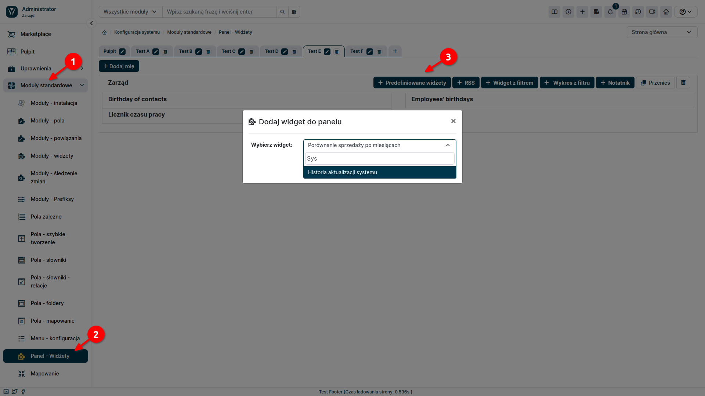

**widżety Premium**  pozwalają na wyświetlenie na pulpicie i w podsumowaniu rekordu dodatkowych informacji, dzięki czemu wszystkie niezbędne szczegóły mogą być dostępne dla użytkownika na wyciągnięcie ręki. W chwili obecnej w zestawie dostępne są 2 widżety - **Podgląd PDF** oraz **Historia zmian**

:::warning

widżet Podgląd PDF i Historia Zmian są dostępne tylko dla użytkowników YetiForce CRM z wykupioną subskrypcją widżety Premium.
:::

## Podgląd PDF
Jest to widżet, który pozwala na podgląd dokumentu PDF do wygenerowania w czasie rzeczywistym. Dzięki temu będziesz miał możliwość podglądu faktury, lub innego dokumentu PDF, przed jego fizycznym wygenerowaniem. Takie rozwiązanie znacznie ułatwi pracę użytkownikom odpowiedzialnym za wystawianie i przesyłanie dokumentów PDF, oraz pracownikom działu księgowego, gdyż umożliwia weryfikacje dokumentu przed jego wystawieniem.

### Konfiguracja Podglądu PDF

W pierwszej kolejności należy się upewnić, czy dla danego modułu posiadamy stworzony szablon PDF.
Następnie możemy przejść do konfiguracji samego widżetu:

1. Przejdź do panelu administracyjnego YetiForce CRM.
2. Wybierz z lewego menu  Moduły standardowe ➜ Moduły widżety.
3. Z pola wyboru, po prawej stronie wybierz moduł, dla którego chcesz dodać widżet **Podgląd PDF**.
4. Kliknij przycisk Dodaj widżet.
5. Wybierz widżet **Podgląd PDF** z listy dostępnych widżetów
6. Wprowadź nazwę widżetu i zapisz zmiany

Widżet **Podgląd PDF** jest już gotowy do użycia. W panelu użytkownika, przejdź do modułu dla którego go dodałeś a następnie wybierz jeden z rekordów. Widżet powinien pojawić się na podsumowaniu rekordu.

## Historia zmian
Jest to widżet, który umożliwia wgląd w historię aktywności na rekordach modułów. Pozwala on na weryfikacje konkretnej aktywności dowolnych użytkowników w obrębie wybranego modułu bądź globalnie. Wyświetla on listę rekordów, które były otwierane lub modyfikowane przez użytkowników, czas przeprowadzanej aktywności, oraz użytkownika, który danej operacji dokonał. widżet zawiera liczne zaawansowane filtry, które pozwolą zawęzić wyświetlaną treść do interesujących nas wyników.

### Konfiguracja Historii Zmian

:::warning

Pamiętaj by przy tworzeniu widżetu wybrać odpowiednią rolę oraz pulpit, na którym ma się on pojawić.
:::

1. Przejdź do panelu administracyjnego YetiForce CRM.
2. Wybierz z lewego menu  Moduły standardowe ➜ Panel widżety.
4. Kliknij przycisk Predefiniowane widżety.
5. Wybierz widżet **Historia aktualizacji systemu** z listy dostępnych widżetów
6. Wprowadź parametry widżetu i zapisz zmiany

Widżet **Historia aktualizacji systemu** jest już gotowy do użycia. W panelu użytkownika przejdź do Zakładki **Pulpit**,  gdzie pojawi się widżet. 

Pierwsza lista rozwijana pozwala nam wybrać moduł systemu, dla którego chcemy śledzić zmiany. Jeżeli z listy wybierzemy pozycję **Podsumowanie**, pojawi nam się historia aktualizacji w wybranym okresie dla całego systemu z podziałem na moduły.

Wybierając natomiast z listy konkretny moduł, uzyskamy dodatkowe informacje, takie jak: kto wykonał akcję, na jakim rekordzie czy też z jakich danych na jakie zostały zmienione

W prawym górnym rogu widżetu znajduje się ikona trybika, pozwalająca ustawić wyświetlane przez niego dane. Możemy wybrać jakie akcje chcemy, żeby zostały wyśwetlone oraz z jakimi użytkownikami mają być one powiązane.

