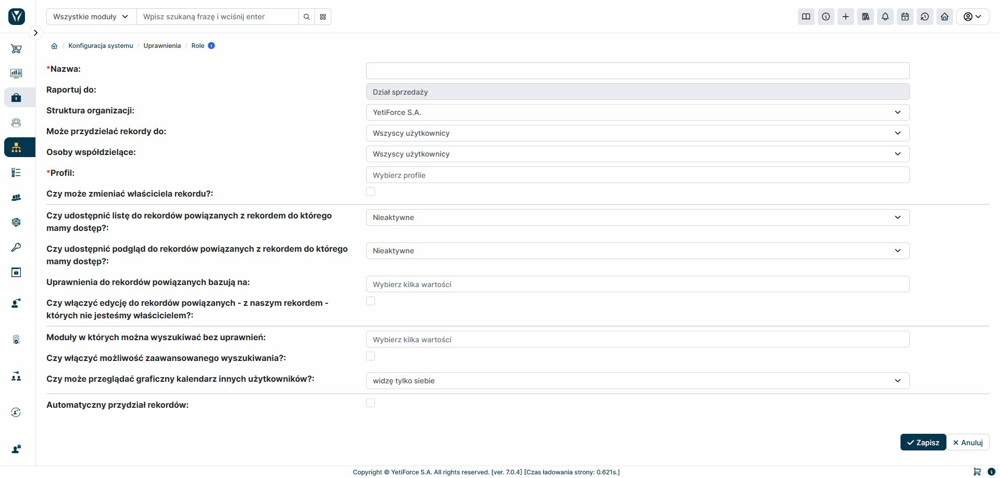

W systemie istnieje wbudowany moduł Ról, umożliwiający mapowanie struktury organizacyjnej firmy. Mechanizm ten może odzwierciedlać nawet najbardziej złożoną strukturę. Aby skonfigurować ten moduł, musisz przejść do "Konfiguracja systemu" i wybrać "Uprawnienia" i "Role".

Zacznijmy od przykładu organizacji, gdzie na samej górze mamy prezesa, pod nim dyrektora, pod nim trzech kierowników i każdy ma po jednym pracowniku. Jest to prosty przykład struktury, ale w systemie YetiForce nie ma ograniczeń jeśli chodzi o ilość poziomów, które można dodać.

## Drzewo ról

Moduł `Role` jest modułem łączącym z jednej strony użytkowników, a z drugiej profile, z których użytkownik dziedziczy uprawnienia do modułów, narzędzi i akcji.

## Dodawanie roli

Tworzenie roli daje ogromne możliwości na definiowanie uprawnień dla użytkowników, którzy zostali przypisani bezpośrednio do tej roli. Do najważniejszych możliwości modułu można zaliczyć:

1. Określenie uprawnień do przypisywania użytkowników/grup dla pola 'właściciel rekordu' - uprawnienie działa globalnie.
2. Określenie uprawnień do przypisywania użytkowników/grup dla pola 'osoby współdzielące' - uprawnienie działa globalnie.
3. Przypisanie do profilu lub profili (w przypadku przydzielenie do wielu profili, system sumuje uprawnienia).
4. Blokada zmiany właściciela rekordu (wówczas przy każdym tworzeniu rekordu to on jest jego właścicielem bez możliwości zmiany - pole jest nieaktywne).

Dla uprawnień opisanych w punktach 1. i 2., system pozwala na ustawienie następujących mechanizmów:

- Tylko ja - użytkownik, który jest zalogowany
- Użytkownicy posiadający podrzędną rolę
- Użytkownicy posiadający podrzędną rolę lub tą samą rolę co ja
- Wszyscy użytkownicy
- Z panelu przydziału rekordów

W praktyce oznacza to, że gdy w punktach 1. i 2. zostanie ustawiona któraś z powyższych wartości, będzie można uzyskać dostęp do różnej listy użytkowników/grup jakie można przydzielać, tworząc rekord. Ostatnia opcja (z panelu) pozwala na dowolną inną konfigurację, którą można określić w niezależnym panelu opisanym również w tej dokumentacji.

Następnie w roli można określić dodatkowe parametry decydujące o 'dziedziczeniu uprawnień':

1. Czy udostępnić listę do rekordów powiązanych z rekordem do którego mamy dostęp?
2. Czy udostępnić podgląd do rekordów powiązanych z rekordem do którego mamy dostęp?
3. Uprawnienia do rekordów powiązanych bazują na:
   1. Właściciel rekordu
   2. Osoby współdzielące
   3. Dostęp do rekordu
   4. Wyjątki zasad dostępu

Parametry te, pozwalają na włączenie zależności dostępu do danych w zależności od hierarchii powiązania modułów, np. jeżeli mamy dostęp do klienta, to możemy mieć również dostęp do wszystkich rekordów powiązanych, np. kalendarz, dokumenty, komentarze, faktury nawet jeżeli użytkownik nie ma do nich bezpośrednio dostępu.

Dodatkowo jeżeli zostanie włączona opcja: 'Czy włączyć edycję do rekordów powiązanych - z naszym rekordem - których nie jesteśmy właścicielem?' wówczas system pozwoli nam na edycję rekordów, nawet jeżeli normalnie nie mielibyśmy do tego dostępu. Należy pamiętać, że dostęp mamy tylko wówczas, gdy system 'wie' z jakiego rekordu 'otrzymaliśmy' te uprawnienia.

Na roli możemy określić poziom do wyszukiwarki oraz do danych jakie możemy wyszukiwać, możemy to ustawić za pomocą narzędzi:

- Moduły w których można wyszukiwać bez uprawnień
- Czy włączyć możliwość zaawansowanego wyszukiwania?

W systemie można wyłączyć również możliwość podglądu innych kalendarzy (z poziomu graficznego interfejsu - 'Czy może przeglądać graficzny kalendarz innych użytkowników?').

Opcja 'Automatyczny przydział rekordów' pozwala na wykorzystanie panelu do automatycznego rozdzielania rekordów w systemie. Opcja ta jest szczególnie przydatna dla firm, które automatycznie ładują do systemu duże bazy leadów i szans sprzedażowych.
