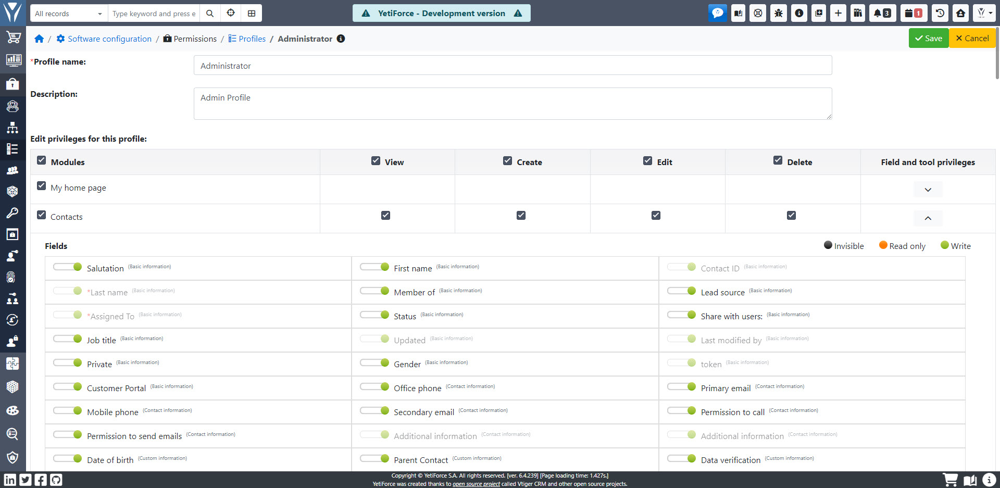

Profile umożliwiają precyzyjne określenie uprawnień do przeglądania, tworzenia, edycji i usuwania rekordów w modułach, do których użytkownik ma dostęp. Dodatkowo, w każdym module można ustalić, do których pól użytkownik ma dostęp (podgląd, edycja) oraz z jakich narzędzi może korzystać.

## Dodawanie nowego profilu

Domyślnie w systemie znajduje się jeden profil — Administrator. Aby dodać nowy profil z wstępnie skonfigurowanymi uprawnieniami, kliknij przycisk <kbd>+ Dodaj profil</kbd> w lewym górnym rogu ekranu. Następnie podaj nazwę i opcjonalnie opis profilu.

W tabeli `Edytuj uprawnienia do profilu` wybierz uprawnienia do akcji w poszczególnych modułach, które powinien posiadać nowy profil.

Oprócz ogólnych uprawnień do tworzenia, przeglądania, edycji i usuwania rekordów, możesz skonfigurować uprawnienia do poszczególnych pól i narzędzi. Aby to zrobić, kliknij strzałkę w dół <kbd>˅</kbd> w kolumnie `uprawnienia do pól i narzędzi` i wybierz dodatkowe opcje:

Moduł wspiera masowe zaznaczanie i odznaczanie uprawnień. Kliknięcie checkboxa w górnej części kolumny "Moduły" zaznaczy/odznaczy wszystkie opcje dla wszystkich modułów. Checkbox obok nazwy akcji pozwala zaznaczyć/odznaczyć uprawnienia dla tej akcji we wszystkich modułach.

Po zakończeniu konfiguracji kliknij <kbd>Zapisz</kbd>.

## Edycja profilu

Aby zmodyfikować uprawnienia istniejącego profilu, kliknij ikonę edycji <kbd>✎</kbd> w ostatniej kolumnie tabeli profili. System wyświetli aktualne ustawienia, które możesz dowolnie zmienić. Po zakończeniu kliknij <kbd>Zapisz</kbd>.

## Duplikowanie profilu

Duplikacja profilu pozwala szybko utworzyć nowy profil na podstawie istniejącego. Kliknij ikonę <kbd>⧉</kbd> w ostatniej kolumnie, a system skopiuje uprawnienia do nowego profilu, który możesz dalej edytować. Po zakończeniu kliknij <kbd>Zapisz</kbd>.

## Usuwanie profilu

Aby usunąć profil, kliknij ikonę kosza <kbd>🗑</kbd> w ostatniej kolumnie tabeli. System poprosi o wskazanie profilu, do którego zostaną przeniesione role przypisane do usuwanego profilu. Potwierdź klikając <kbd>Zapisz</kbd>.

## Ikony

-  – uprawnienie jest aktywne
-  – uprawnienie jest nieaktywne
-  – pole jest niewidoczne dla wybranego profilu
-  – profil ma dostęp tylko do odczytu danych z tego pola
-  – profil ma dostęp do zapisu danych w tym polu
