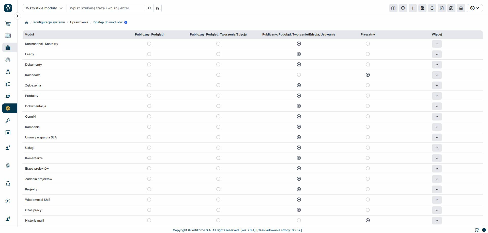

Jednym z ważniejszych modułów zarządzających uprawnieniami jest 'Dostęp do modułów', ponieważ określa on dostęp do rekordów, które nie należą do nas. Dodatkowo przy modułach można tworzyć wyjątki, które pozwalają nam na przegląd i edycję danych, które nie należą do nas.
