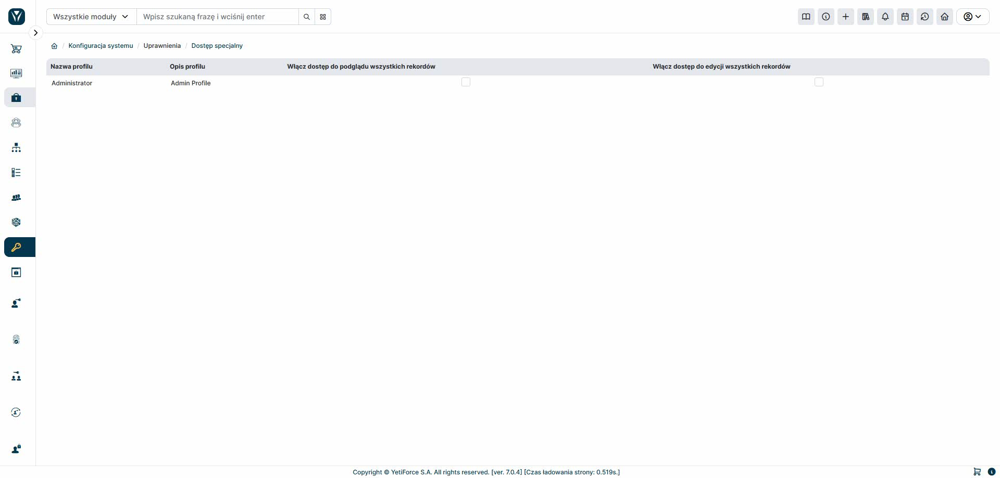

Moduł „Dostęp specjalny” umożliwia nadawanie specjalnych uprawnień wybranym profilom użytkowników. Dzięki tym uprawnieniom użytkownik może przeglądać i edytować wszystkie rekordy w danym module, niezależnie od innych ustawień uprawnień. Jeśli użytkownik ma dostęp do modułu, automatycznie uzyskuje pełny dostęp do wszystkich jego danych.
