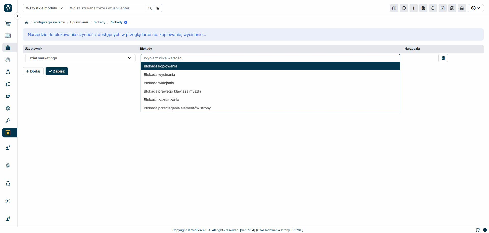

Narzędzie pozwala ograniczać użytkownikom kopiowanie i wklejanie danych z i do systemu. Do podstawowych możliwości narzędzia możemy zaliczyć:

- Blokadę wycinania
- Blokadę kopiowania
- Blokadę wklejania
- Blokadę prawego klawisza myszki
- Blokadę zaznaczenia
- Blokadę przeciągania elementów strony

Należy pamiętać, że ograniczenia te są nakładane na warstwie przeglądarki, a więc jeżeli ktoś użyje przeglądarki, która nie wspiera tego typu zabezpieczeń, to nie będą one działać.
