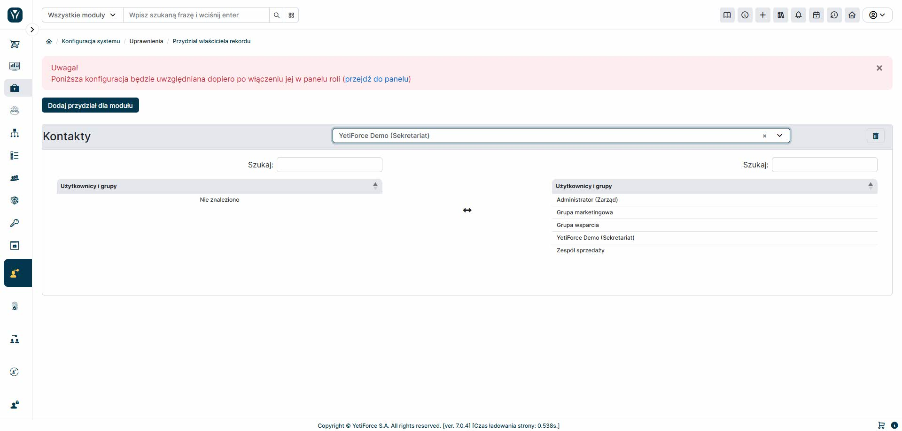

Panel „Przydział osób współdzielących” działa podobnie jak moduł „Przydział właściciela rekordu”, ale dotyczy pola osób współdzielących. Narzędzie to pozwala przeglądać dane na liście rekordów nie tylko na podstawie właściciela, ale także uprawnień wynikających z dziedziczenia.

Warto pamiętać, że w dużych systemach z rozbudowaną bazą danych i wieloma użytkownikami, moduł może działać wolniej. Dodatkowo, mechanizm przydziału działa z pewnym opóźnieniem – czas oczekiwania zależy od konfiguracji CRON-a.
