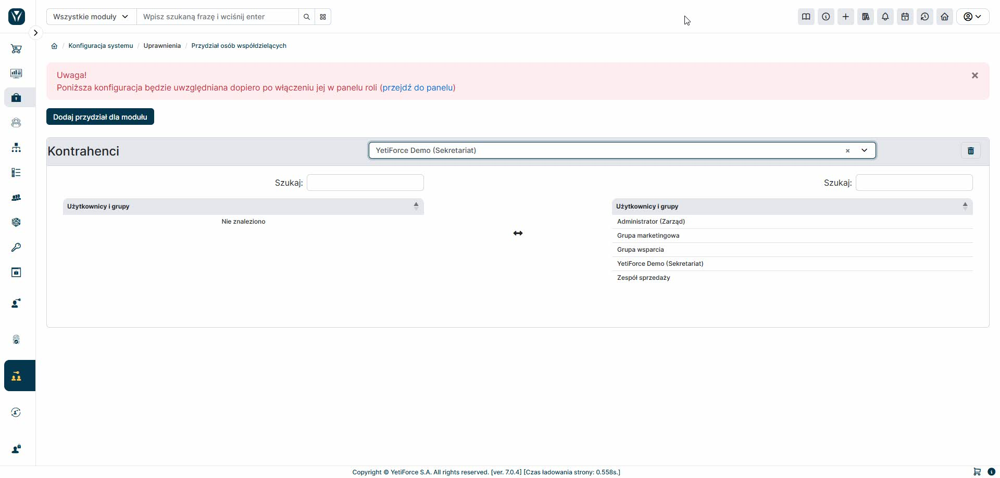

Narzędzie „Przydział właściciela rekordu” pozwala określić, którzy użytkownicy lub grupy będą dostępni do wyboru podczas tworzenia rekordu w wybranym module. Jeśli opcje dostępne w ramach roli są niewystarczające, to narzędzie umożliwia bardziej elastyczną konfigurację dostępności właścicieli rekordów.
