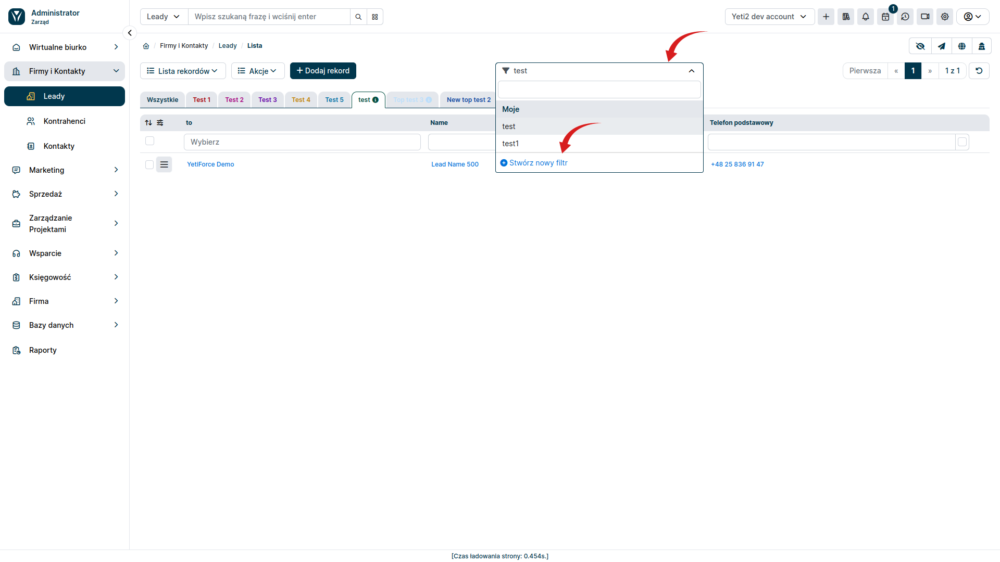
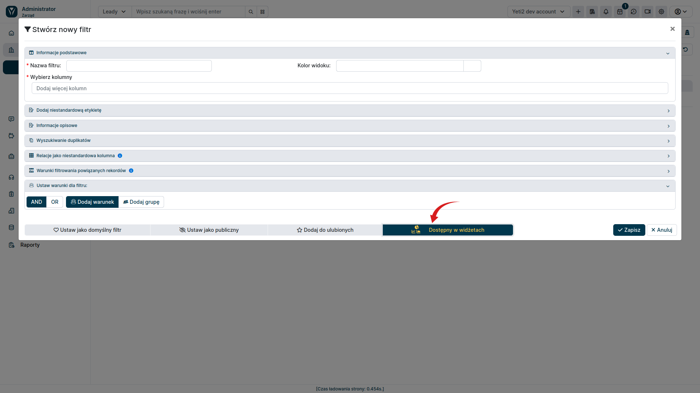
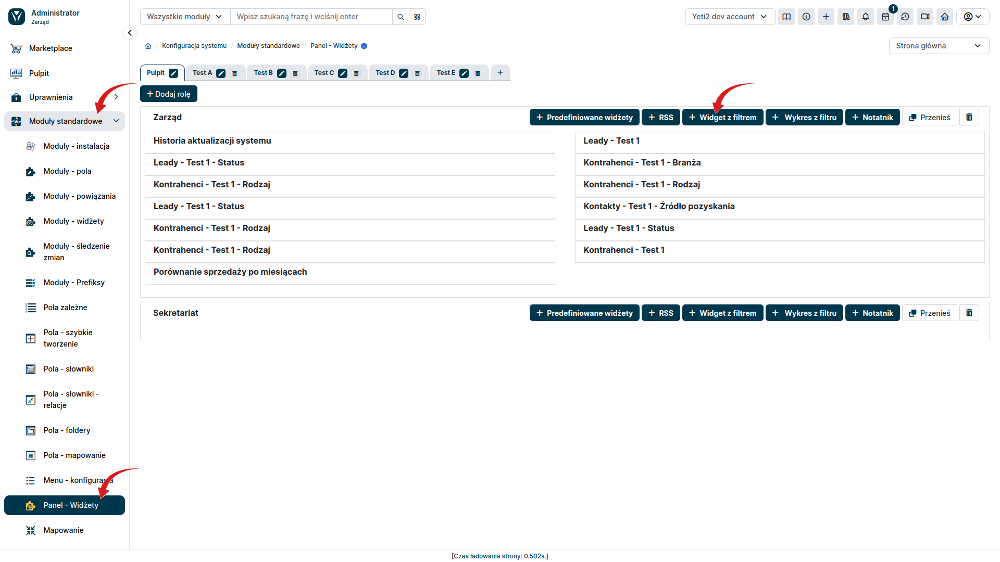

Oprócz predefiniowanych widgetów, YetiForce oferuje widgety oparte o filtry stworzone na listach. Pozwalają one na prezentację danych zgodnie z indywidualnie przyjętymi założeniami i ograniczeniami. Pozwala to dostosować widget konkretnie pod dane potrzeby, ten typ posiada dużo większe możliwości do wyświetlenia danych lecz wymaga wprowadzenia większej ilość parametrów konfiguracyjnych.

## 1. Tworzenie filtru

W sekcji użytkownika przejdź do modułu, z którego chcesz pobrać dane do widgetu. Na przykład, jeśli chcesz utworzyć widget z filtrami dla leadów, przejdź do modułu "Leady". Wybierz znajdująca się w centralnej części ekranu sekcję <kbd>Filtry</kbd> a następnie wybierz przycisk <kbd>Stwórz nowy filtr</kbd>

Po kliknięciu przycisku <kbd>Stwórz nowy filtr</kbd> w widoku listy, pojawia się okno modalne, które oferuje szeroki wachlarz opcji dostosowywania i filtrowania danych.

### Najważniejsze pola tworzonego filtru

* **Wybór kolumn**: Możesz określić, które kolumny z listy mają być wyświetlane w filtrze
* **Relacyjne dane**: Istnieje możliwość wyświetlania danych powiązanych z innych modułów w systemie. Na przykład, jeśli filtrujesz listę leadów, możesz wyświetlać dane z powiązanych kontaktów lub firm.
* **Warunki**: Możesz tworzyć złożone filtry stosując operatory AND i OR do łączenia różnych kryteriów. Pozwala to na precyzyjne filtrowanie danych i wyświetlanie tylko tych informacji, które Cię interesują.

By filtr był dostępny w widgetach, należy zaznaczyć opcję <kbd>Dostępy w widgetach</kbd>. Następnie możemy zapisać utworzony filtr i wykorzystać go w dowolnym widgecie.

## 2. Tworzenie widgetu

Widget z filtru można utworzyć w systemie YetiForce na dwa sposoby. 

### a) Tworzenie widgetu w sekcji administracyjnej

W sekcji administracyjnej z lewego menu wybierz **Moduły Podstawowe ➔ Panel - Widżety**.

Następnie dla odpowiedniego pulpitu i roli wybierz przycisk <kbd>Widget z filtrem</kbd>

W oknie modalnym, które się pojawi wybierz moduł zgodny z modułem, w którym został utworzony filtr i uzupełnij pozostałe informacje niezbędne do działania widgetu.

Następnie należy przejść w sekcji użytkownika do zakładki Pulpit i dodać widget wybierając go z listy, która się pojawi po naciśnięciu przycisku <kbd>Predefiniowane widgety</kbd> 

### b) Tworzenie widgetu przez sekcję użytkownika

Alternatywną metodą stworzenia widgetu z filtrów jest dodanie go z poziomu sekcji użytkownika. W tym celu przejdź do zakładki <kbd>Pulpit</kbd> a następnie wybierz przycisk <kbd>Dodaj widget z filtru</kbd>.

Podobnie jak to miało miejsce w podczas tworzenia widgetu przez sekcję administracyjną, pojawi nam się okno modalne, w którym możemy ustalić szczegóły tworzonego widgetu.

