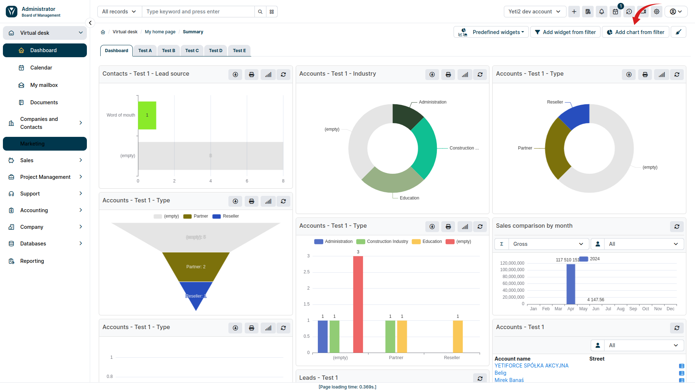
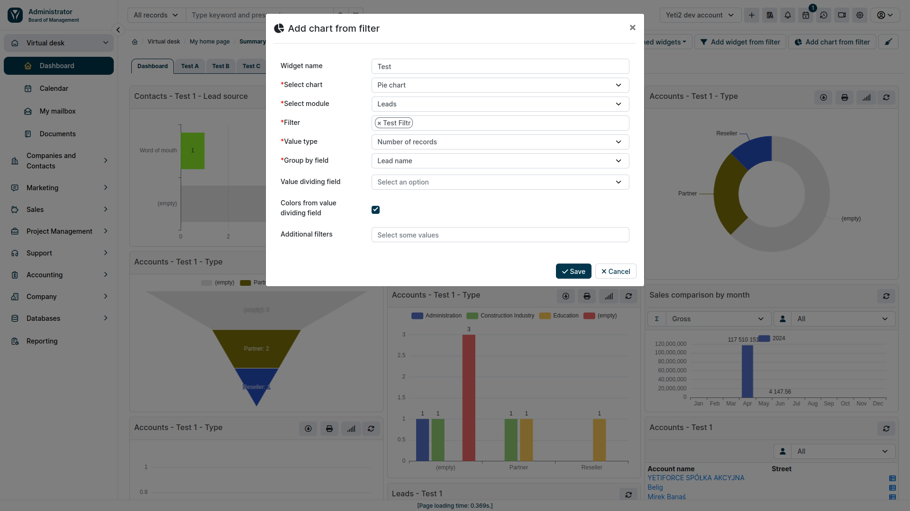

Oprócz widgetów tekstowych, YetiForce oferuje również możliwość umieszczania wykresów na pulpicie nawigacyjnym. Wykresy te pozwalają na intuicyjną i przejrzystą prezentację danych, ułatwiając analizę trendów i identyfikację kluczowych informacji.
W celu utworzenia wykresu z filtru przejdź do zakładki **Pulpit** a następnie wybierz przycisk **Dodaj wykres z filtru**.
Pojawi nam się wówczas okno modalne, w którym możemy ustalić szczegóły tworzonego wykresu.

