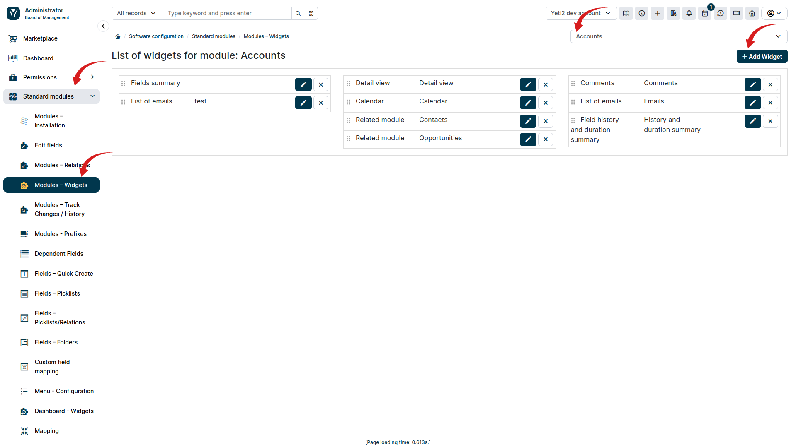
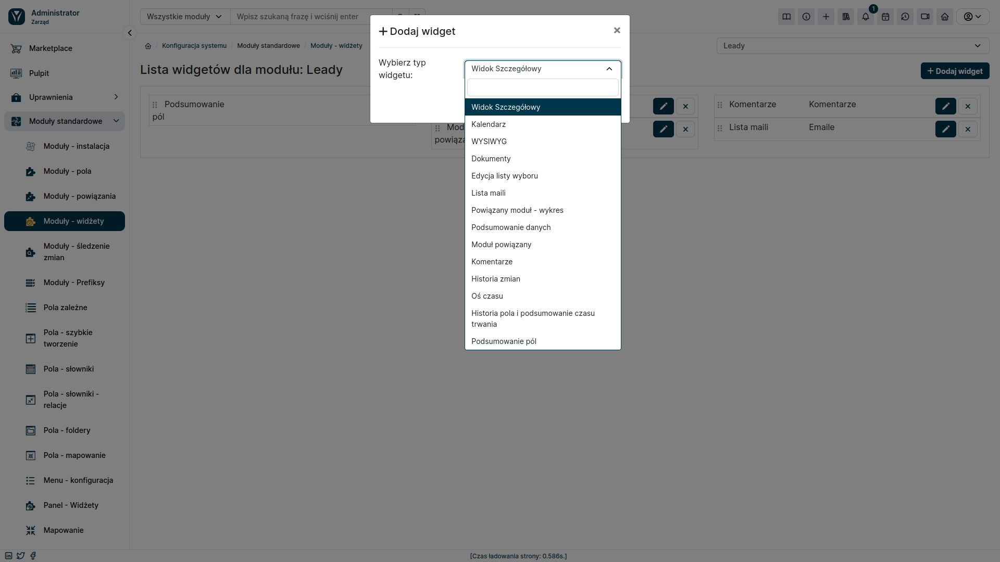
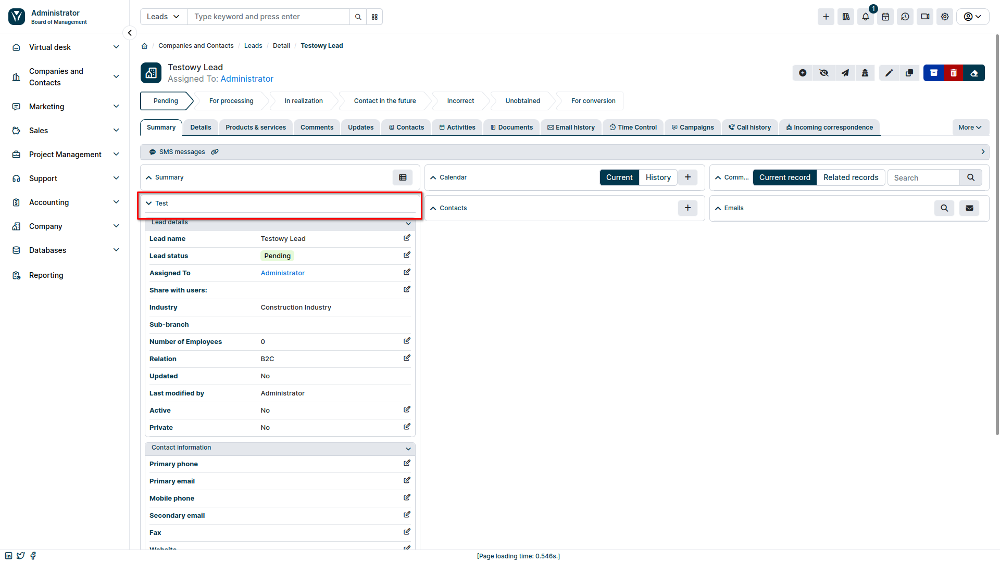

Oprócz widgetów umieszczanych na pulpicie nawigacyjnym, YetiForce oferuje również możliwość dodawania widgetów w szczegółach poszczególnych rekordów. Funkcja ta pozwala na spersonalizowanie widoku i szybki dostęp do najważniejszych informacji dotyczących danego elementu, bez konieczności przechodzenia do innych modułów.

### Konfiguracja 

#### Dostęp do menu konfiguracji

* W sekcji administracyjnej wybierz opcję **Moduły Standardowe** z menu głównego.
* Następnie kliknij **Moduły - Widżety**

#### Wybór modułu i dodawanie widgetu

* Z listy rozwijanej po prawej stronie wybierz moduł, dla którego chcesz dodać widget. (strzałka nr 3 na zrzucie ekranu)
* Kliknij przycisk <kbd>Dodaj Widget</kbd>.

W oknie modalnym ustal wszystkie szczegóły odnośnie tworzonego widgetu.

Dodany widget będzie widoczny w szczegółach rekordów wybranego modułu.

