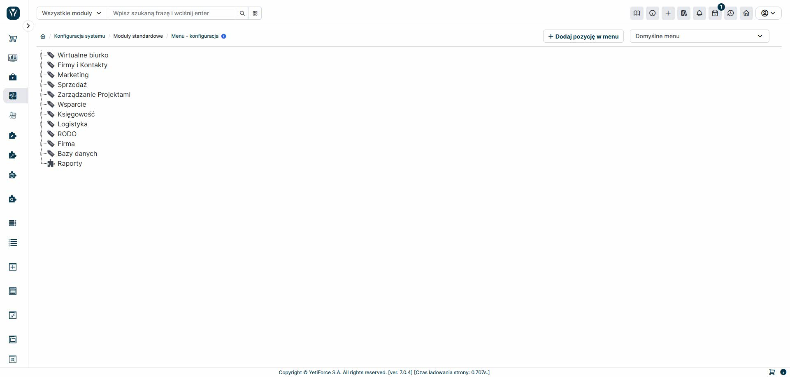
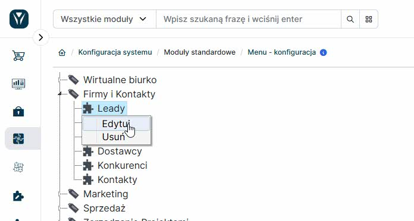
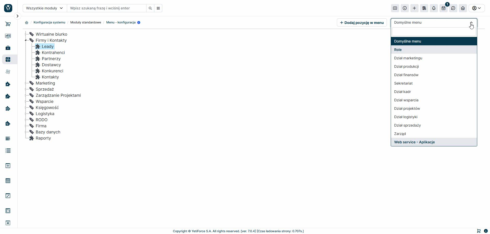

# Zarządzanie menu w systemie YetiForce

Menu w systemie YetiForce jest elastycznym narzędziem, które możesz dostosować do potrzeb Twojej organizacji. Ten przewodnik pomoże Ci zrozumieć, jak efektywnie zarządzać strukturą menu i wprowadzać w nim zmiany.

## Odświeżanie menu w systemie

System YetiForce oferuje dwie proste metody odświeżania menu:

### 1. Poprzez interfejs graficzny (sposób zalecany)

Ta metoda jest najprostsza i nie wymaga wiedzy technicznej:

1. Wejdź w dowolną pozycję menu, którą chcesz zmodyfikować
2. Wprowadź zmiany i zapisz je
3. System automatycznie odświeży strukturę aktualnie używanego menu

**Ważne:** Jeśli chcesz, aby zmiany były widoczne we wszystkich dostępnych menu w systemie, należy powtórzyć tę operację dla każdego z nich.

### 2. Poprzez konsolę systemową (dla zaawansowanych)

Dla administratorów systemowych dostępna jest szybsza metoda odświeżania wszystkich menu jednocześnie poprzez komendę w konsoli.

Szczegółowe instrukcje znajdziesz w dokumentacji technicznej: [Dokumentacja programisty→ YetiForce CLI → System](/developer-guides/cli/System#odświeżanie-menu).
