Tablice Kanban w systemie YetiForce to wizualne narzędzie do zarządzania procesami i projektami. Pozwalają one na organizację pracy poprzez podział na
kolumny reprezentujące etapy procesu (np. "Do zrobienia", "W trakcie", "Zakończone") oraz karty symbolizujące konkretne zadania, które można przeciągać między
kolumnami. Dzięki temu w łatwy sposób możemy śledzić postęp prac, identyfikować wąskie gardła i optymalizować przepływ zadań. Tablice Kanban są zintegrowane z
innymi modułami YetiForce, co wspiera zarządzanie zadaniami w kontekście działań sprzedażowych, projektowych, serwisowych i innych.

:::warning
Dodatek YetiForce Kanban Board jest dostępny do subskrypcji w naszym Marketplace.  - [**Więcej informacji**](https://yetiforce.com/pl/tablica-kanban.html)
:::

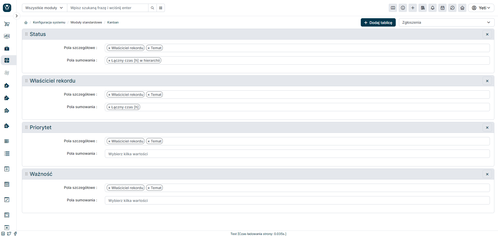

## Konfiguracja

Panel konfiguracyjny YetiForce Kanban Board znajduje się w  <kbd>Konfiguracja oprogramowania → Standardowe moduły → Kanban</kbd>.

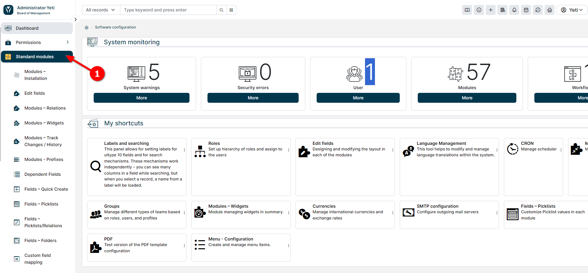
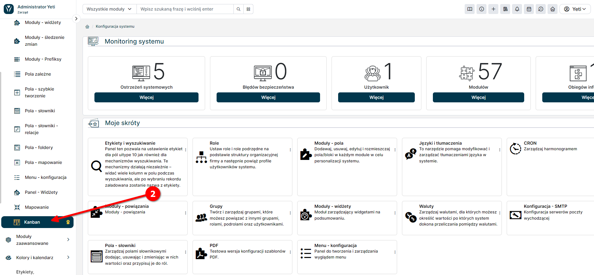

Z listy dostępnych modułów, widocznej w prawym górnym rogu ekranu (1), należy wybrać moduł (2), w którym powinny być dostępne tablice Kanban:

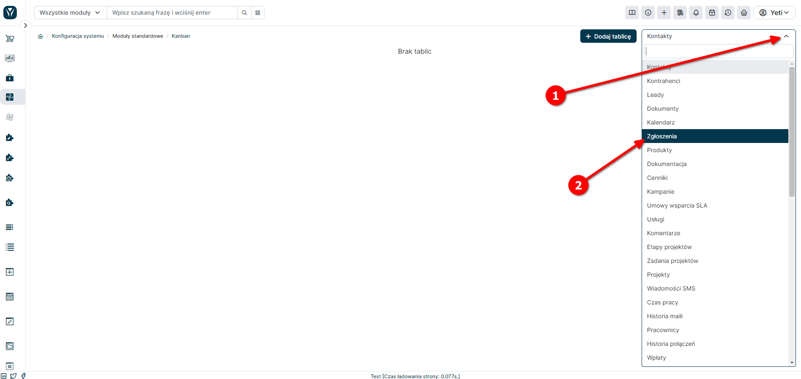

## Tworzenie tablic

Kliknij przycisk <kbd>+ Dodaj tablicę</kbd> i wybierz pole, które zostanie użyte do stworzenia tablicy w wybranym w poprzednim kroku module:

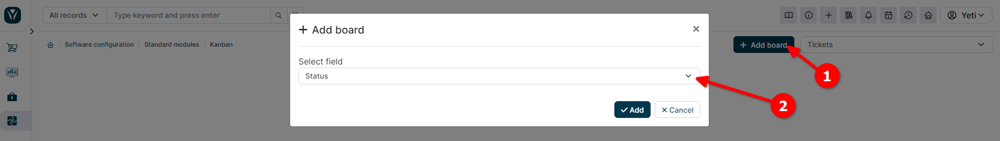

Po kliknięciu przycisku <kbd>Dodaj</kbd>, tablica będzie dostępna w wybranym module.

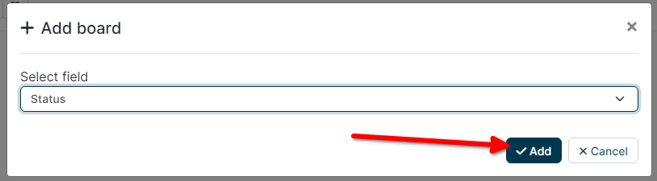

## Parametry tablicy

- Pola szczegółowe - lista pól w których mają się pojawić dane rekordu. Jeśli dane pole ma ustawioną ikonę, to będzie ona widoczna. Dostępne są wszystkie pola z systemu z uwzględnieniem uprawnień użytkownika.

  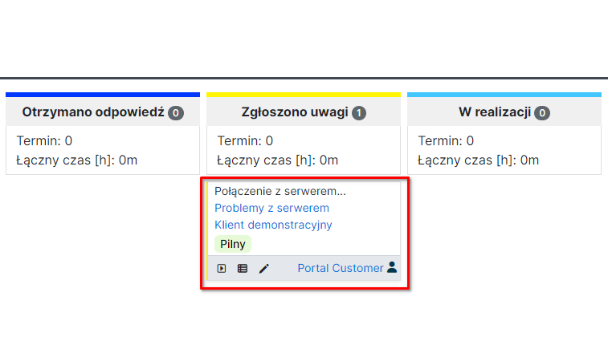

- Pola sumowania - lista pól które mają być poddane sumowaniu dla danej wartości (słupka kanbana), dla której jest wyświetlany kanban. Dostępne są tylko pola liczbowe, na których można wykonać operacje sumowania.

  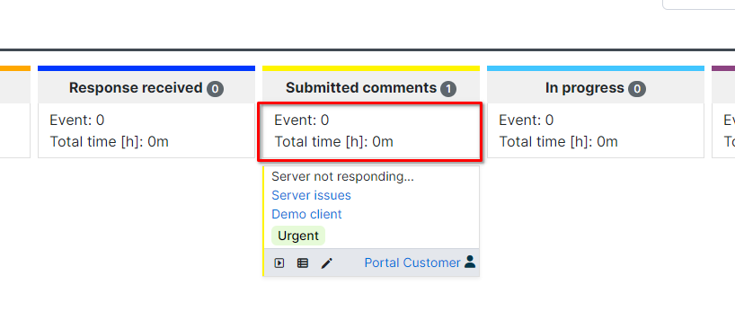

Dane na liście wyboru są zapisane automatycznie podczas każdej zmiany.

## Uprawnienia

Aby użytkownik mógł korzystać z widoku Kanban, musi posiadać on odpowiedni poziom uprawnień.

W tym celu należy przejść do <kbd>[`Konfiguracja systemu → Uprawnienia → Profile`](/administrator-guides/permissions/profiles/)</kbd>, a następnie
wybrać odpowiedni profil:

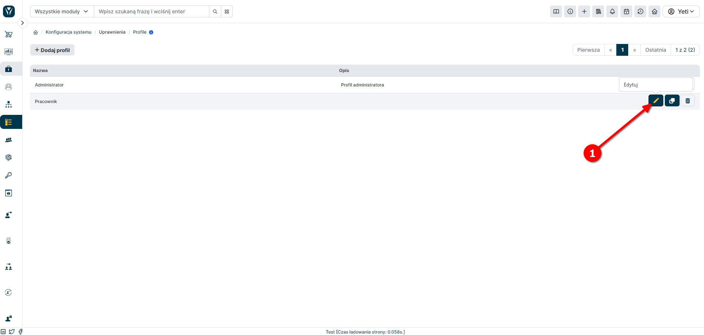

po czym wybrać odpowiedni moduł, w którym, opcja Kanban powinna być dostępna

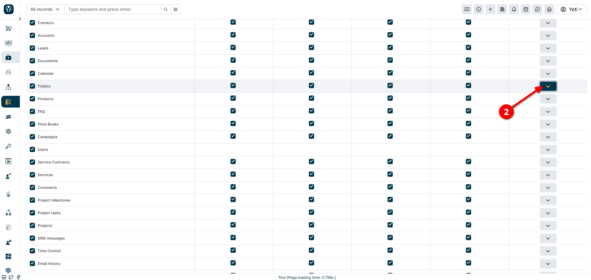

finalnie, dostosować opcje uprawnień

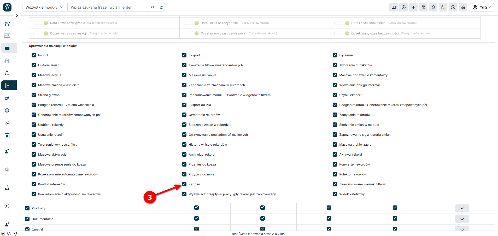
