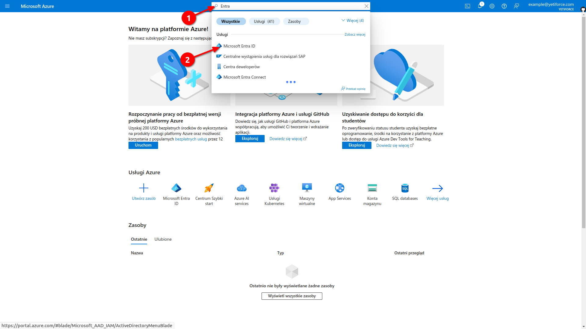
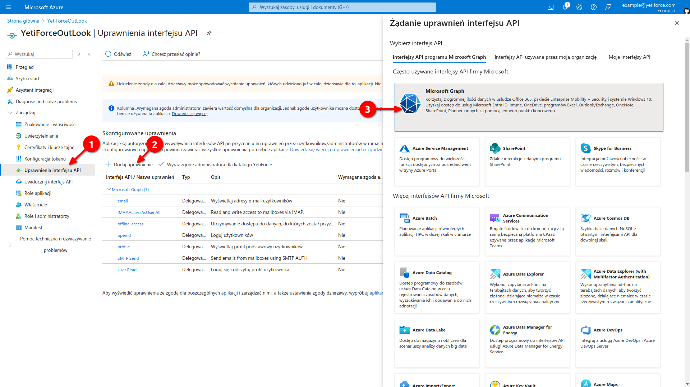
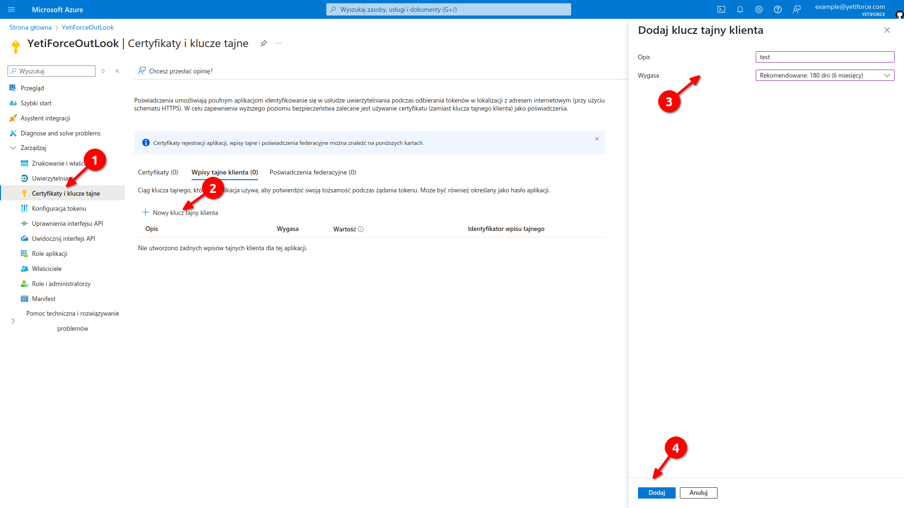
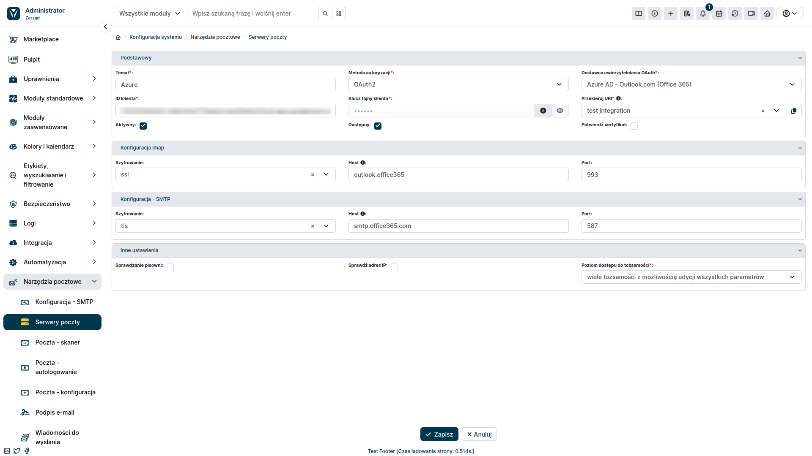

Ten artykuł stanowi uzupełnienie instrukcji [integracji YetiForce z klientami poczty](/administrator-guides/integration/mailbox). Skupia się on na tym by pokazać jak wygenerować Client ID i Client Secret w portalu Azure AD. Te dane są niezbędne do uwierzytelnienia połączenia między YetiForce a Twoim kontem Outlook.

### Krok 1: Utwórz projekt w Portalu Azure

- Przejdź do [Portal Azure](https://portal.azure.com/).
- Zaloguj się przy użyciu swojego konta Microsoft.
- W polu wyszukiwania na górze strony wpisz `Microsoft Entra ID` i wybierz usługę z listy.

- Naciśnij przycisk <kbd>+ Utwórz</kbd> a następnie z listy, która się pojawi wybierz `Rejestracja aplikacji`.

- Wypełnij formularz rejestracji aplikacji.

- **Nazwa**: Unikalna nazwa, która posłuży do jego identyfikacji aplikacji.
- **Obsługiwane typy kont**: Wybierz opcję `Konta w dowolnym katalogu organizacyjnym`.
- **Identyfikator URI przekierowania**: W pierwszym polu, z listy wybierz `Internet`. Wartość dla drugiego pola należy pobrać z YetiForce. Jak to zrobić zostało opisane poniżej.

### Krok 2: Pobieranie identyfikatora URI przekierowania

Powróć do procesu tworzenia serwera pocztowego, który został opisany w [tym artykule](/administrator-guides/integration/mailbox/#dodanie-serwera-pocztowego). Upewnij się, że w polu `Przekieruj URI`, znajduje się nazwa aplikacji, którą utworzyłeś do integracji z pocztą. Następnie skopiuj wartość URI przekierowania naciskając przycisk <kbd><i class="fa-solid fa-copy"></i></kbd>.

### Krok 3: Kontynuacja tworzenia aplikacji Azure

Skopiowaną wartość `URI Przekierowania` wklej w formularzu Azure do pola `Identyfikator URI przekierowania`. Następnie wybierz przycisk <kbd>Rejestruj</kbd>.

### Krok 4: Nadawanie uprawnień aplikacji

Po utworzeniu aplikacji konieczne jest nadanie jej odpowiednich uprawnień.

- Z lewego menu wybierz `Uprawnienia interfejsu API`.
- Naciśnij przycisk <kbd>+ Dodaj uprawnienie</kbd>.
- W oknie, które się pojawiło wybierz `Microsoft Graph`.

- Wybierz typ uprawień: `Delegowanie uprawnień`.
- Korzystając z pola wyszukiwania lub listy wybierz następujące uprawnienia:
  - email
  - IMAP AccessAsUser.All
  - offline_access
  - profile
  - SMT Send
  - User.Read

### Krok 5: Dodanie klucza

- Przejdź w lewym menu do zakładki `Certyfikaty i klucze tajne` a następnie wybierz przycisk <kbd>+ Nowy klucz tajny klienta</kbd>.
- W oknie, które się pojawiło, wpisz opis klucza oraz czas jego ważności.
- Zatwierdź dodanie klucza przyciskiem <kbd>Dodaj</kbd>

### Krok 6: Pobranie wartości Client Secret

Po dodaniu klucza pojawi nam się `Client Secret`, który należy skopiować.

### Krok 7: Pobranie wartości Client ID

By pobrać wartość `Client ID` przejdź do zakładki `Przegląd` a następnie skopiuj Identyfikator aplikacji.

### Krok 8: Dodawanie serwera pocztowego w YetiForce

Po uzyskaniu `Client ID` oraz `Client Secret` wypełniamy resztę formularza, który zaczęliśmy tworzyć w [tym artykule](/administrator-guides/integration/mailbox/#dodanie-serwera-pocztowego).

#### Pola formularza

- **Temat**: Unikalna nazwa, która posłuży do jego identyfikacji.
- **Metoda autoryzacji**: `OAuth2`.
- **Dostawca uwierzytelniania OAuth**: wybieramy `Azure AD - Outlook.com (Office 365)`.
- **ID Klienta**: wartość pobrana w kroku 8.
- **Klucz tajny klienta**: wartość pobrana w kroku 7.
- **Przekieruj URI**: wybieramy aplikację utworzoną do integracji z usługą pocztową.

Pozostało uzupełnienie konfiguracji IMAP i SMTP zgodnie z zaleceniami dostawcy poczty e-mail.

Po dodaniu konta pocztowego musimy powiązać go z kontami użytkowników. Jak to zrobić, zostało opisane w [tym artykule](/administrator-guides/integration/mailbox#krok-3-powiązanie-serwera-pocztowego-z-kontami-użytkowników).
