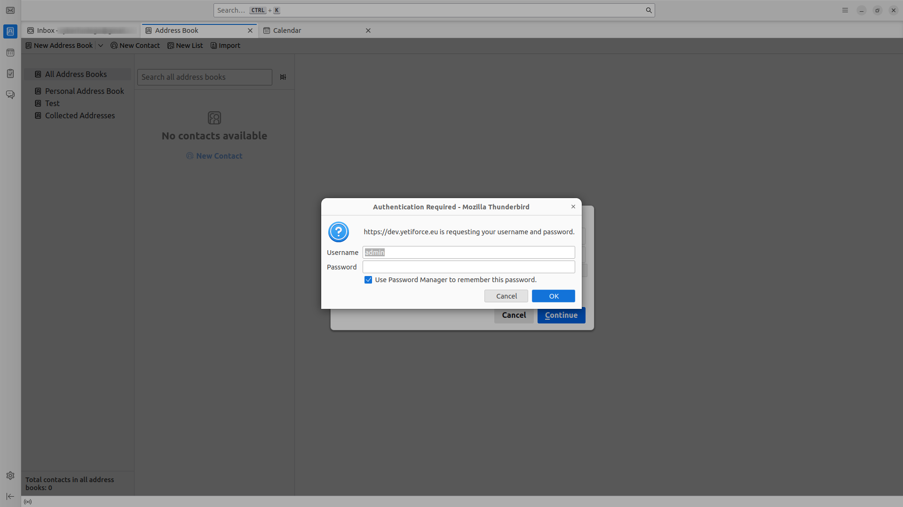

System YetiForce umożliwia integrację z aplikacjami pocztowymi, pozwalając na wymianę danych pomiędzy systemem YetiForce, a programami zewnętrznymi. Wykorzystywane są do tego protokoły **CalDAV** i **CardDAV** służące do synchronizacji odpowiednio kalendarza i kontaktów między różnymi urządzeniami i aplikacjami. Pozwala to na integrację YetiForce z klientami poczty, kalendarzami i książkami kontaktowymi.

**Co to oznacza dla użytkownika?**

- **Synchronizacja kalendarza**: Możesz dodawać, edytować i usuwać wydarzenia w kalendarzu YetiForce z dowolnego urządzenia obsługującego CalDAV (np. telefon komórkowy, tablet, komputer). Zmiany będą automatycznie synchronizowane między wszystkimi urządzeniami.
- **Synchronizacja kontaktów**: Podobnie jak w przypadku kalendarza, możesz zarządzać swoimi kontaktami w YetiForce za pomocą dowolnego klienta CardDAV. Dodawanie, edytowanie i usuwanie kontaktów będzie synchronizowane między różnymi urządzeniami.

:::warning

**Uwaga!** Aby móc zintegrować YetiForce z Dav, potrzebujesz płatnego dodatku **Outlook Integration Panel & DAV**, dostępnego w Marketplace YetiForce.

:::

Poniżej znajduje się instrukcja, która krok po kroku pokaże jak skonfigurować integrację DAV w systemie YetiForce.

## 1. Konfiguracja systemu YetiForce

W celu skorzystania z Dav należy najpierw upewnić się, że system YetiForce został odpowiednio skonfigurowany.

### a. Ustawienie uprawnień

- Wybierz ikonę użytkownika znajdującą się w prawym górnym rogu.
- Z menu, które się pojawiło, wybierz <kbd>Moje ustawienia</kbd>.
- Na liście ustawień przejdź do sekcji `Integracja z DAV`.
- Ustaw odpowiednie uprawnienia dostępu dla CardDav i CalDav.


### b. Uruchomienie odpowiednich zadań Cron

Zadania Cron odgrywają kluczową rolę w synchronizacji danych między YetiForce, a zewnętrznymi usługami, takimi jak DAV. Umożliwiają one automatyczne uruchamianie skryptów w określonych odstępach czasu, co zapewnia ciągłą i bezproblemową wymianę informacji. Dlatego istotnym jest upewnienie się, że odpowiednie zadania Cron zostały uruchomione. W tym celu:

- W sekcji administracyjnej w lewym menu wybierz `Automatyzacja ➔ CRON`
- Upewnij się, że wyzwalacze `Integracja CardDav` i `Integracja CalDav` mają status `Aktywny`.


### c. Aktywacja DAV w plikach konfiguracyjnych

- Otwórz plik `config/Api.php`.
- Do tablicy znajdującej się w zmiennej `$enabledServices` dodaj element `dav`.
- Ustaw wartości zmiennych `enableCardDAV` i `enabledCalDAV` na true, w zależności od tego, co chcesz zsynchronizować (kontakty, kalendarze lub oba).

Poniżej znajduje się przykładowy kod PHP:

```php
public static $enabledServices = ['webservice', 'dav'];

public static $enableCardDAV = true;

public static $enableCalDAV = true;

```

---

## 2. Dodanie klucza autoryzacyjnego

Gdy system YetiForce jest odpowiednio przygotowany, należy wygenerować klucz, który umożliwi integrację z usługą DAV.

- W sekcji administracyjnej w lewym menu wybierz `Integracja ➔ Aplikacja DAV`.
- Kliknij przycisk <kbd>+ Dodaj klucz</kbd>.
- W oknie modalnym, które się pojawi, wybierz użytkownika, dla którego chcesz wygenerować klucz, a następnie określ typ synchronizacji:
  - CalDav: Synchronizacja kalendarzy.
  - CardDav: Synchronizacja kontaktów.


---

## 3. Integracja YetiForce z narzędziem pocztowym

Zaprezentujemy, jak zintegrować YetiForce z narzędziem pocztowym, na przykładzie programu Thunderbird.

### a. CalDAV: Synchronizacja kalendarzy

- Uruchom program Thunderbird na swoim komputerze.
- Z lewego menu wybierz zakładkę **Kalendarze**
- Na liście dostępnych kalendarzy kliknij prawym przyciskiem myszy i z menu, które się pojawi, wybierz <kbd>Nowy kalendarz</kbd>.


- W oknie modalnym wybierz <kbd>Kalendarz zdalny</kbd> i przejdź dalej.


- W następnym kroku uzupełnij formularz następująco:
  - **Nazwa użytkownika**: wartość `Login`, która się pojawiła przy wygenerowanym kluczu.
  - **Położenie**: Odpowiednio skonfigurowany adres, mający postać: `https://dev.yetiforce.eu/dav.php/calendars/(__dav_login__)/YFCalendar/`, gdzie ciąg `(__dav_login__)` zamieniamy na wartość `Login` z wygenerowanego klucza.
- Naciskamy przycisk <kbd>Znajdź kalendarz</kbd>.
- W oknie logowania do kalendarza należy podawać:
  - **Nazwa użytkownika**: wartość `Login`, która się pojawiła przy wygenerowanym kluczu.
  - **Hasło**: wartość `Klucz`, która się pojawiła przy wygenerowanym kluczu.


Po wykonaniu opisanych powyżej kroków kalendarz YetiForce powinien zostać pomyślnie zsynchronizowany z kalendarzem. Oznacza to, że dodanie, edycja bądź usunięcie zdarzenia lub zadania w jednym miejscu będzie miało odzwierciedlenie w pozostałych. Komunikacja między YetiForce a zewnętrzym kalendarzem będzie odbywać się automatycznie w obie strony poprzez mechanizm Cron zgodnie z ustaloną w nim częstotliwością, zapewniając spójność danych i ułatwiając zarządzanie wydarzeniami.

### b. CardDAV: Synchronizacja kontaktów

- Uruchom program Thunderbird na swoim komputerze.
- Z lewego menu wybierz zakładkę **Książka adresowa**
- Naciśnij przycisk <kbd>Nowa książka adresowa</kbd>.
- Z menu, które się pojawi, wybierz <kbd>Dodaj książkę adresową CardDAV</kbd>.


- W oknie modalnym, które się pojawi, należy wypełnić formularz:
  - **Nazwa użytkownika**: wartość `Login`, która się pojawiła przy wygenerowanym kluczu.
  - **Położenie**: Odpowiednio skonfigurowany adres, mający postać: `https://dev.yetiforce.eu/dav.php/addressbooks/(__dav_login__)/YFAddressBook/`, gdzie ciąg `(__dav_login__)` zamieniamy na wartość `Login` z wygenerowanego klucza.
- Naciskamy przycisk <kbd>Kontynuuj</kbd>.


- W oknie logowania do książki adresowej należy podawać:
  - **Nazwa użytkownika**: wartość `Login`, która się pojawiła przy wygenerowanym kluczu.
  - **Hasło**: wartość `Klucz`, która się pojawiła przy wygenerowanym kluczu.



Po wykonaniu opisanych powyżej kroków kontakty YetiForce powinny zostać pomyślnie zsynchronizowane z książką adresową. Oznacza to, że dodanie, edycja bądź usunięcie kontaktu w jednym miejscu będzie miało odzwierciedlenie w pozostałych. Komunikacja między YetiForce a książką adresową będzie odbywać się automatycznie w obie strony poprzez mechanizm Cron zgodnie z ustaloną w nim częstotliwością, zapewniając spójność danych i ułatwiając zarządzanie kontaktami.

:::warning
W przypadku korzystania z innych narzędzi pocztowych, proces integracji może się różnić. Warto zapoznać się z dokumentacją konkretnego narzędzia, aby uzyskać szczegółowe instrukcje dotyczące konfiguracji CalDAV i CardDAV.
:::

### Powiązane Artykuły

[Integracja Sabre DAV](/administrator-guides/apps/#sabredav-integration)
