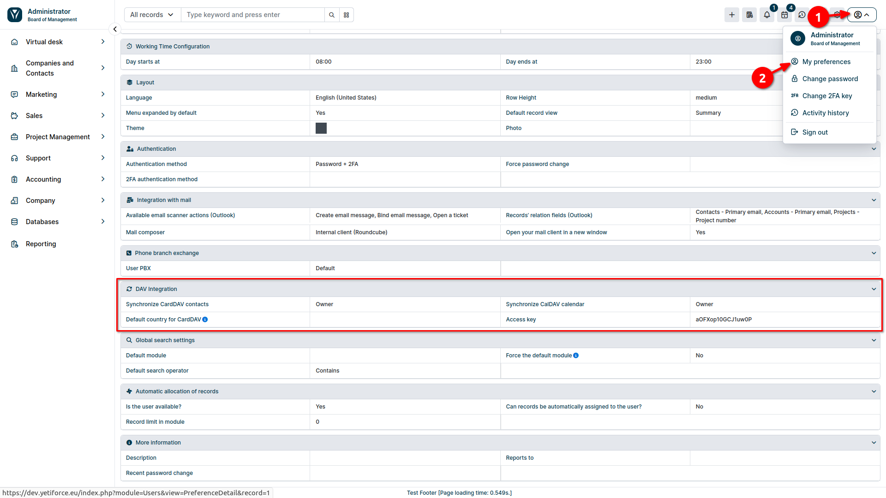
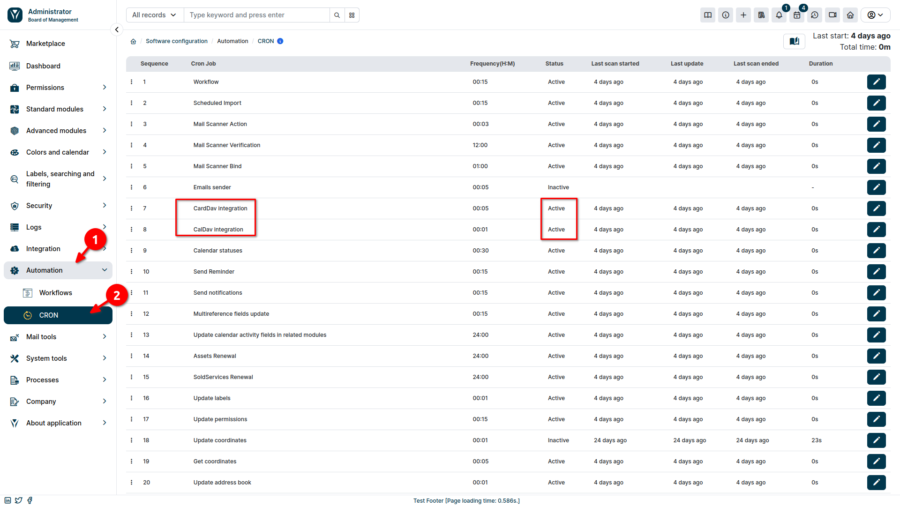
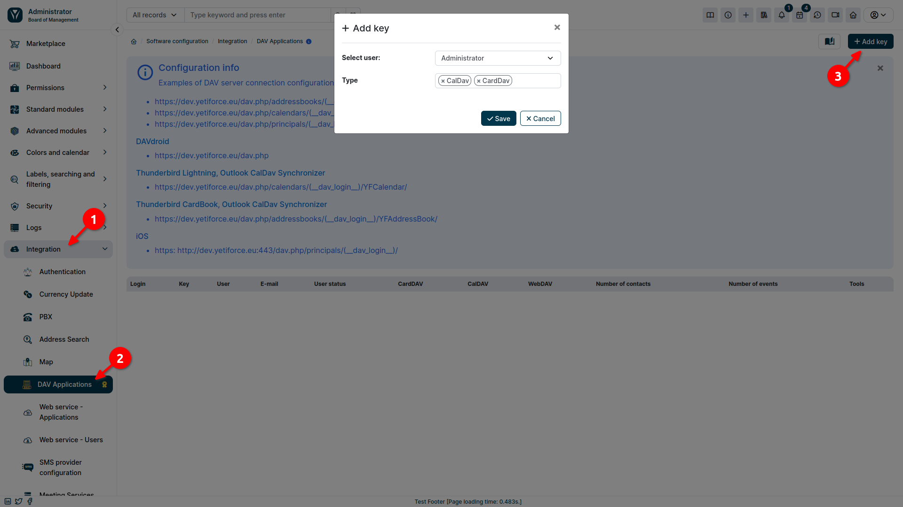
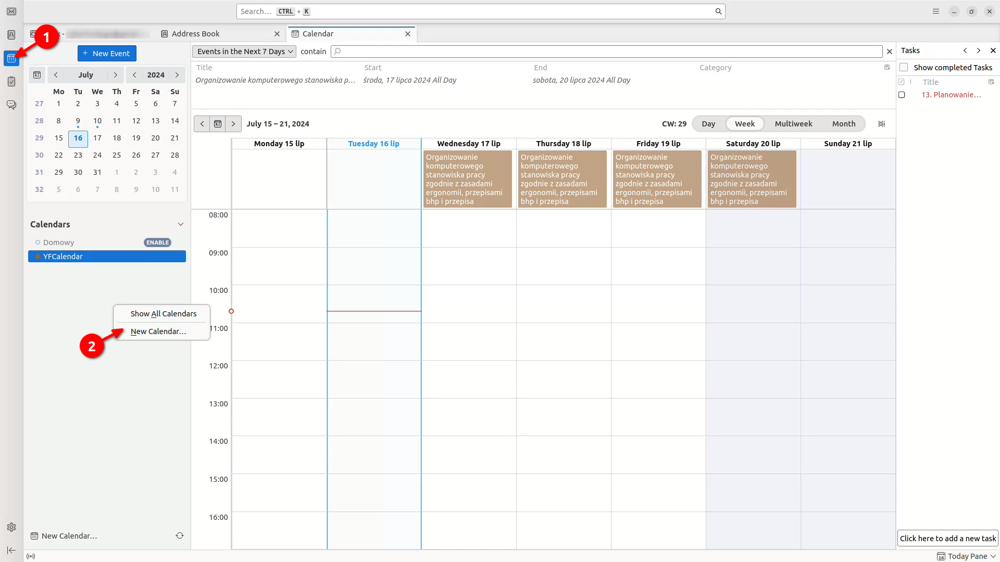
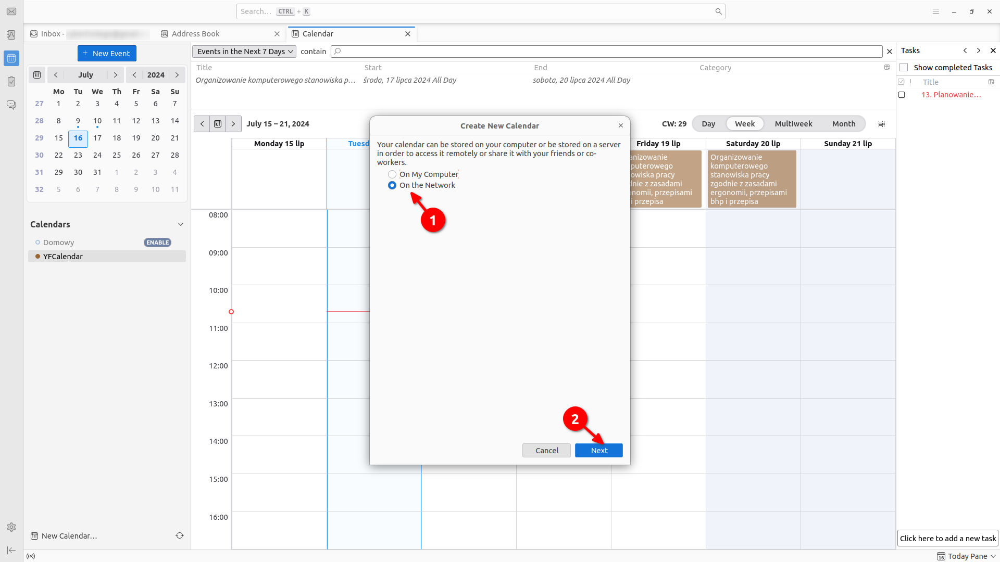
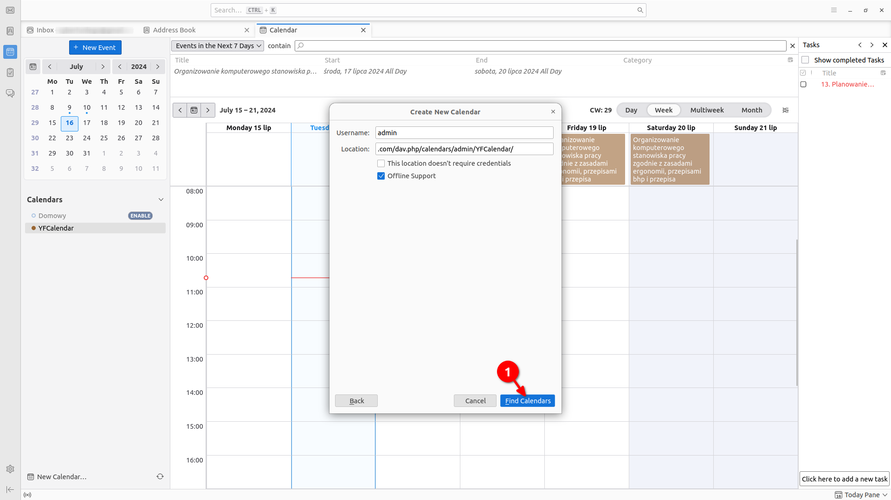
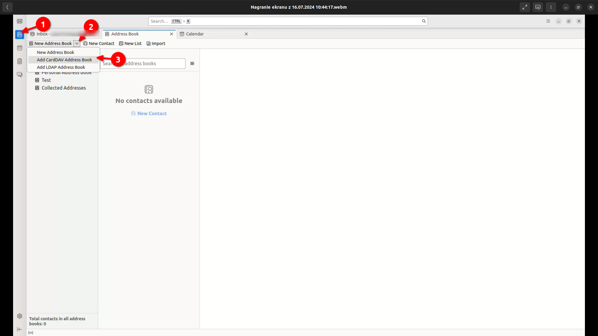
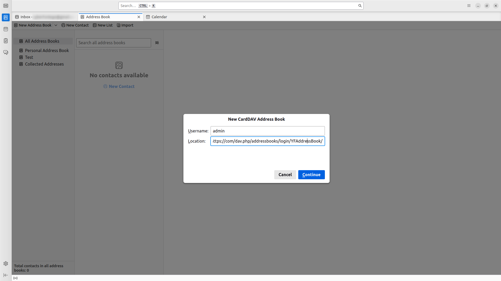

System YetiForce umożliwia integrację z innymi aplikacjami, co pozwala na płynne działanie we współpracujących programach jednocześnie, bez potrzeby ciągłego przełączania się między nimi. Wykorzystywane są do tego protokoły **CalDAV** i **CardDAV** służące do synchronizacji odpowiednio kalendarza i kontaktów między różnymi urządzeniami i aplikacjami. Pozwala na integrację YetiForce z klientami poczty, kalendarzami i aplikacjami kontaktowymi.

**Co to oznacza dla użytkownika?**

* **Synchronizacja kalendarza**: Możesz dodawać, edytować i usuwać wydarzenia w kalendarzu YetiForce z dowolnego urządzenia obsługującego CalDAV (np. telefon komórkowy, tablet, komputer). Zmiany będą automatycznie synchronizowane między wszystkimi urządzeniami.

* **Synchronizacja kontaktów**: Podobnie jak w przypadku kalendarza, możesz zarządzać swoimi kontaktami w YetiForce za pomocą dowolnego klienta CardDAV. Dodawanie, edytowanie i usuwanie kontaktów będzie synchronizowane między różnymi urządzeniami.


:::warning

**Uwaga!** Aby móc zintegrować YetiForce z Dav, potrzebujesz płatnego dodatku **Outlook Integration Panel & DAV**, dostępnego w Marketplace YetiForce.
:::

Poniżej znajduje się instrukcja, która krok po korku pokaże jak skonfigurować integrację DAV w systemie YetiForce.

## 1. Konfiguracja systemu YetiForce

W celu skorzystania z Dav należy najpierw upewnić się, że system YetiForce został odpowiednio skonfigurowany.

### a) Ustawienie uprawień

* Wybierz ikonę użytkownika znajdującą się w prawym górnym rogu.
* Z menu, które się pojawiło, wybierz <kbd>Moje ustawienia</kbd>.
* Na liście ustawień przejdź do sekcji ```Integracja z DAV```.
* Ustaw odpowiednie uprawienia dostępów dla CardDav i CalDav.



### b) Uruchomienie odpowiednich zadań Cron

Zadania Cron odgrywają kluczową rolę w synchronizacji danych między YetiForce a zewnętrznymi usługami, takimi jak Dav. Umożliwiają one automatyczne uruchamianie skryptów w określonych odstępach czasu, co zapewnia ciągłą i bezproblemową wymianę informacji. Dlatego istotnym jest upewnienie się, że odpowiednie zadania Cron zostały uruchomione. W tym celu:

* W sekcji administracyjnej w lewym menu wybierz ```Automatyzacja ➔ CRON```
* Upewnij się, że wyzwalacze ```Integracja CardDav``` i ```Integracja CalDav``` mają status ```Aktywny```.



### c) Uruchomienie w kodzie

* Otwórz plik ```config/Api.php```.
* Do tablicy znajdującej się w zmiennej ```$enabledServices``` dodaj element ```dav```.
* Ustaw wartości zmiennych ```enableCardDAV``` i ```enabledCalDAV``` na true, w zależności od tego, co chcesz zsynchronizować (kontakty, kalendarze lub oba).

Poniżej znajduje się przykładowy kod PHP:

```php
public static $enabledServices = ['webservice', 'dav'];

public static $enableCardDAV = true;

public static $enableCalDAV = true;

```

---

## 2. Dodanie klucza

Gdy system YetiForce jest odpowiednio przygotowany, należy wygenerować klucz, który umożliwi integrację z usługą DAV.

* W sekcji administracyjnej w lewym menu wybierz ```Integracja ➔ Aplikacja DAV```.
* Kliknij przycisk <kbd>Dodaj klucz</kbd>.
* W oknie modalnym, które się pojawi, wybierz użytkownika, dla którego chcesz wygenerować klucz, a następnie określ typ synchronizacji:
  * CalDav: Synchronizacja kalendarzy.
  * CardDav: Synchronizacja kontaktów.
  * WebDAV: Synchronizacja plików.



---

## 3. Integracja YetiForce z narzędziem pocztowym

Zaprezentujemy, jak zintegrować YetiForce z narzędziem pocztowym, na przykładzie programu Thunderbird.

### a) CalDAV: Synchronizacja kalendarzy

* Uruchom program Thunderbird na swoim komputerze.
* Z lewego menu wybierz zakładkę **Kalendarze**
* Na liście dostępnych kalendarzy kliknij prawym przyciskiem myszy i z menu, które się pojawi, wybierz <kbd>Nowy kalendarz</kbd>.



* W oknie modalnym wybierz <kbd>Kalendarz zdalny</kbd> i przejdź dalej.



* W następnym kroku uzupełnij formularz następująco:
	* **Nazwa użytkownika**: wartość ```Login```, która się pojawiła przy wygenerowanym kluczu.
    * **Położenie**: Odpowiednio skonfigurowany adres, mający postać: ```https://dev.yetiforce.eu/dav.php/calendars/(__dav_login__)/YFCalendar/```, gdzie ciąg ```(__dav_login__)``` zamieniamy na wartość ```Login``` z wygenerowanego klucza.
* Naciskamy przycisk <kbd>Znajdź kalendarz</kbd>.



Po wykonaniu opisanych powyżej kroków kalendarz YetiForce powinien zostać pomyślnie zsynchronizowany z narzędziem pocztowym. Oznacza to, że dodanie, edycja bądź usunięcie zdarzenia lub zadania w jednym miejscu będzie miało odzwierciedlenie w pozostałych.

### b) CardDAV: Synchronizacja kontaktów

* Uruchom program Thunderbird na swoim komputerze.
* Z lewego menu wybierz zakładkę **Książka adresowa**
* Naciśnij przycisk <kbd>Nowa książka adresowa</kbd>.
* Z menu, które się pojawi, wybierz <kbd>Dodaj książkę adresową CardDAV</kbd>.



* W oknie modalnym, które się pojawi, należy wypełnić formularz:
	* **Nazwa użytkownika**: wartość ```Login```, która się pojawiła przy wygenerowanym kluczu.
	* **Położenie**: Odpowiednio skonfigurowany adres, mający postać: ```https://dev.yetiforce.eu/dav.php/addressbooks/(__dav_login__)/YFAddressBook/```, gdzie ciąg ```(__dav_login__)``` zamieniamy na wartość ```Login``` z wygenerowanego klucza.
* Naciskamy przycisk <kbd>Kontynuuj</kbd>.



* W kolejnym oknie modalnym, które się pojawi, należy wypełnić formularz:
	* **Nazwa użytkownika**: wartość ```Login```, która się pojawiła przy wygenerowanym kluczu.
	* **Hasło**: wygenerowany klucz.
* Naciskamy przycisk <kbd>OK</kbd>.


### Powiązane Artykuły

[Integracja Sabre DAV](/administrator-guides/apps/#sabredav-integration)
