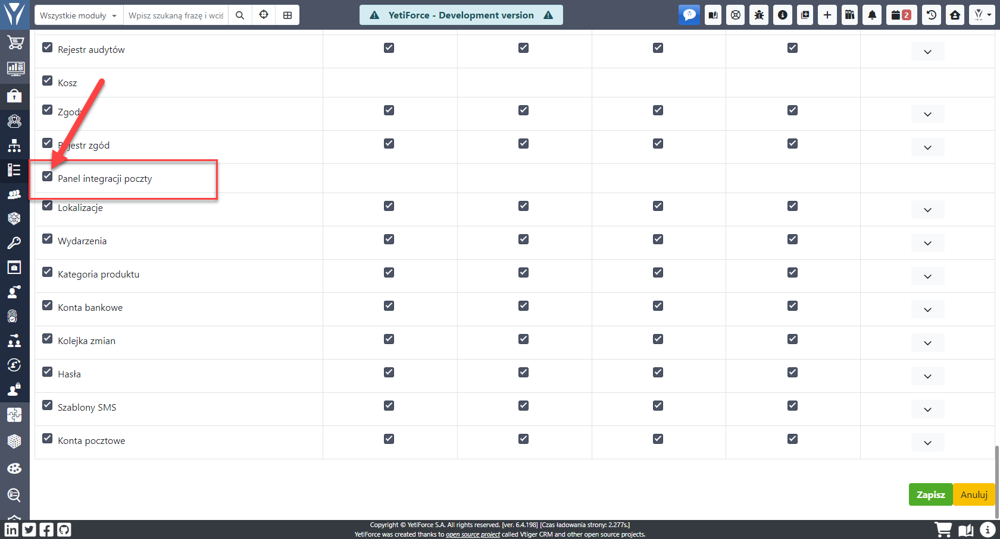
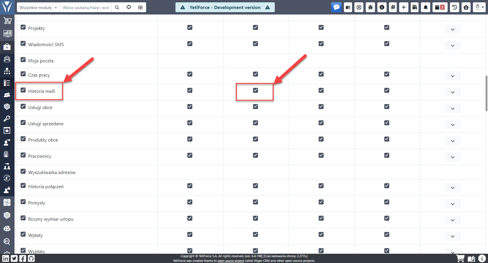
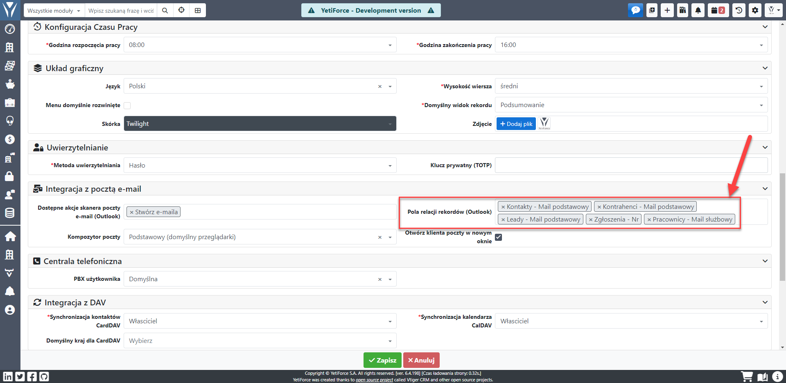
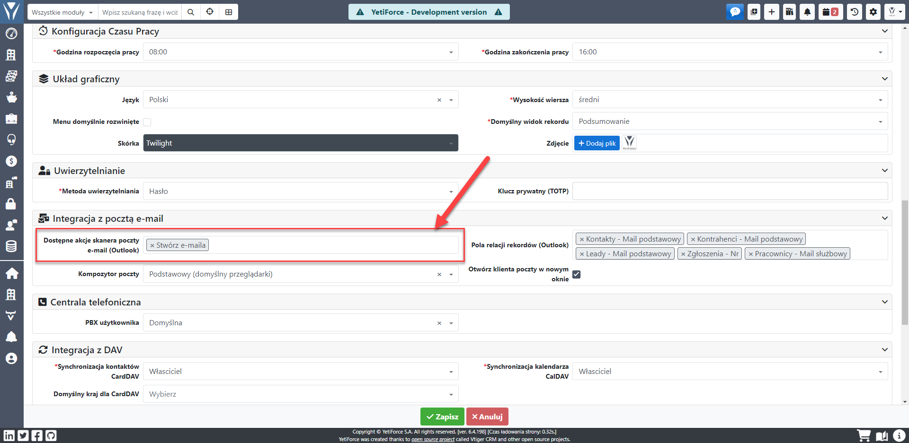
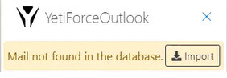

import Tabs from '@theme/Tabs';
import TabItem from '@theme/TabItem';
import ReactPlayer from 'react-player';

## Opis panelu

Dodatek został zbudowany zgodnie z Office Outlook Add-in ([Dokumentacja](https://docs.microsoft.com/en-us/office/dev/add-ins/outlook/)), który umożliwia pokazanie okna w postaci panelu systemu YetiForce we wszystkich aplikacjach Outlook.

Dzięki takiemu rozwiązaniu nie jest konieczne wykonywanie kopii całego systemu YetiForce w Outlook - zamiast tego CRM jest pokazany i zintegrowany z pewnymi funkcjami Outlook-a.

Implementacja umożliwia korzystanie ze wszystkich funkcjonalności YetiForce w Outlook.

:::important

Artykuł omawia najważniejsze kwestie związane z dodatkiem Outlook do systemu YetiForce. Przeczytaj go w całości i zwróć szczególną uwagę na wytyczne aby dodatek działał prawidłowo.

:::

## Prezentacja wideo

<Tabs groupId="WwgE1yX6akE">
    <TabItem value="youtube-WwgE1yX6akE" label="🎬 YouTube">
        <ReactPlayer
            url="https://www.youtube.com/watch?v=WwgE1yX6akE"
            width="100%"
            height="500px"
            controls={true}
        />
    </TabItem>
    <TabItem value="yetiforce-WwgE1yX6akE" label="🎥 YetiForce TV">
        <ReactPlayer url="/video/outlook-integration-panel.mp4" width="100%" height="500px" controls={true} />
    </TabItem>
</Tabs>

## Wymagania

### SSL/HTTPS

Dodatek wymaga aby system YetiForce działał z ważnym certyfikatem SSL. Nieakceptowane są `self signed certificate`.

### Kompatybilność

Dodatek Outlook do systemu YetiForce działa z następującymi typami aplikacji Outlook:

- Outlook 2013 lub nowszy w systemie Windows
- Outlook 2016 lub nowszy na komputerze Mac
- Outlook na iOS
- Outlook na Androida
- Outlook w sieci Web dla programu Exchange 2016 lub nowszego
- Outlook w sieci Web dla programu Exchange 2013
- Outlook.com

:::warning

Klient poczty musi być połączony z serwerem Exchange lub Microsoft 365 (dawniej Office 365) przy użyciu połączenia bezpośredniego. Podczas konfigurowania klienta użytkownik musi wybrać typ konta Exchange, Office lub Outlook.com. Dodatki nie zostaną załadowane jeśli klient poczty jest skonfigurowany do łączenia się przez POP3 lub IMAP.

Więcej informacji na stronie: [Wymagania dotyczące dodatku Outlook](https://learn.microsoft.com/en-us/office/dev/add-ins/outlook/add-in-requirements)

:::

### Silnik przeglądarki

Należy sprawdzić wersję Outlook, ponieważ dodatek bazuje na silniku przeglądarki internetowej. Stare wersje wspierają silnik „Internet Explorer”, dla którego CRM nie będzie działał w pełni prawidłowo.

Pełny opis wymagań znajduje sie na stronie [Przeglądarki używane przez dodatki pakietu Office](https://learn.microsoft.com/en-us/office/dev/add-ins/concepts/browsers-used-by-office-web-add-ins)

## Instalacja/uruchomienie integracji

Po zakupie należy aktywować dodatek, jest to jednorazowa operacja. Gdy w Marketplace pojawi się przycisk `Wymaga interwencji`, należy wtedy przejść do zakładki `Integracja`, kliknąć `Aktywuj`, wprowadzić wymagane dane i ściągnąć plik instalacyjny.


### Tutorial wideo

<ReactPlayer url="https://www.youtube.com/watch?v=HTRG81waq54" width="100%" height="500px" controls={true} />

### Aktywuj

W trakcie aktywacji system zostanie skonfigurowany pod kątem integracji z Outlook. Zostaną zmienione następujące parametry:

- zezwala na ładowanie CRM w ramce iframe
- zezwala na ładowanie zewnętrznych skryptów WWW (https://appsforoffice.microsoft.com, https://ajax.aspnetcdn.com)
- wyłącza HttpOnly w cookie (aby nie logować się za każdym uruchomieniem panelu integracyjnego)
- zmienia cookie „SameSite” na „None”


### Pobranie rozszerzenia add-ins

Aby była możliwa instalacja rozszerzenia konieczne jest pobranie pliku w formacie XML i zaimportowanie go w Outlook.

Przejdź do `Konfiguracja systemu → Integracja → Panel integracji poczty` i kliknij `Pobierz plik instalacyjny dodatku Outlook`. Pobrany plik XML jest dedykowany tylko dla danej wersji CRM i zawiera w sobie APP ID CRM-a. Gdy [APP ID](/administrator-guides/app-id) ulegnie zmianie wymagane jest ponowne zainstalowanie pluginu. Zostało to tak zrobione, aby nie nie można było załadować CRM w dowolnym innym oknie.

### Instalacja w Outlook rozszerzenia add-ins

Instrukcja instalacji znajduje się na oficjalnej stronie microsoft.com: https://support.microsoft.com/en-us/office/installed-add-ins-a61762b7-7a82-47bd-b14e-bbc15eaeb70f Należy postępować zgodnie z wytycznymi zawartymi w instrukcji, aby prawidłowo zainstalować.

### Zezwolenie na dostęp do cookie (tylko wersja przeglądarkowa Outlook Web App)

Wymagane jest zezwolenie na dostęp do cookie innych stron internetowych na stronie Outlook Web App. Domyślnie przeglądarka blokuje niechciane skrypty z dodatkowych stron internetowych.


Bez tego nie będzie możliwości zalogowania się do systemu YetiForce i użytkownik będzie cały czas widział stronę logowania, pomimo że wprowadza dane dostępowe.


## Uprawnienia

Użytkownicy muszą mieć dostęp do modułu `Panel integracji poczty` w celu korzystania z panelu integracyjnego.

### Dostęp do panelu

Uprawnienia do tego modułu konfiguruje się w [Konfiguracja systemu → Uprawnienia → Profile](/administrator-guides/permissions/profiles/). Dla odpowiedniego profilu należy nadać uprawnienia do tego modułu.

Jeśli użytkownik nie będzie miał dostępu do modułu, to zobaczy komunikat `Błąd!!! Brak uprawnień`.



### Dostęp do importu wiadomości e-mail

Aby pojawił się przycisk importu maila, użytkownik w profilu musi mieć uprawnienia do tworzenia wiadomości mail. W tym celu należy zaznaczyć akcję `Tworzenie` dla modułu `Historia maili`.



## Powiązywanie danych

Aby móc powiązać dane z wiadomości e-mail z danymi systemowymi, konieczne jest określenie, w jaki sposób system może znaleźć dane.

Każdy użytkownik, na którego logujemy się w panelu integracyjnym, powinien w miejscu `Pola relacji rekordów (Outlook)` mieć ustawione pola z dostępnych modułów, w których ma szukać danych do powiązania.

Wprowadzamy tu pola w zależności z jakich modułów/pól korzystamy, i z których dany użytkownik może korzystać.

W polu `Dostępne akcje skanera poczty e-mail` należy wybrać `Stwórz e-maila` oraz `Tworzenie linków do e-maila`.

Pola będą używane do wyszukiwania powiązanych rekordów przy wyświetlaniu maila oraz określenia z czym ma zostać powiązany email podczas importu.

Bez tego w panelu integracyjnym nie zobaczymy żadnych danych, ponieważ system nie będzie wiedział gdzie ma szukać informacji.

Standardowe pola to: Kontakty - Mail podstawowy, Kontrahenci - Mail podstawowy, Leady - Mail podstawowy, Zgłoszenia - Nr, Pracownicy - Mail służbowy.



## Akcje

Aby pojawił się przycisk `Zaimportuj maila ręcznie` użytkownik musi mieć skonfigurowane akcje. Akcje konfigurujemy na użytkowniku w polu `Dostępne akcje skanera poczty e-mail (Outlook)`.

Standardowe akcje:

- Utwórz wiadomość e-mail - akcja, która tworzy e-mail (nie pobiera załączników ani osadzonych zdjęć)
- Tworzenie linków do e-maila - akcja powiązująca wiadomość mailową z rekordami w systemie, w polu `Pola relacji rekordów` określamy po czym ma szukać i pozwiązywać. Jeśli w polu "Pola relacji rekordów" nie wybrano wartości, to powiązanie nie będzie działać.



## Debugowanie

Gdy panel nie pokazuje się prawidłowo lub brakuje w nim danych: https://docs.microsoft.com/en-US/outlook/troubleshoot/user-interface/office-add-ins-not-displayed-correctly

Debugowanie: https://docs.microsoft.com/en-us/office/dev/add-ins/testing/test-debug-office-add-ins

Debugowanie przy użyciu Microsoft Edge DevTools: https://docs.microsoft.com/en-us/office/dev/add-ins/testing/debug-add-ins-using-f12-developer-tools-on-windows-10#debug-using-microsoft-edge-devtools

## Możliwe problemy


Zawsze podczas wystąpienia problemów z panelem integracyjnym należy rozpocząć debugowanie problemu.

Poniżej umieszczamy listę możliwych problemów które napotkaliśmy.

### Polityka CSP

`Refused to frame 'https://appsforoffice.microsoft.com/' because it violates the following Content Security Policy directive: "frame-src 'self' mailto: tel:".`


W pliku konfiguracyjnym [config/Security.php](https://doc.yetiforce.com/code/classes/Config-Security.html) w zmiennej [$allowedDomainsLoadInFrame](https://doc.yetiforce.com/code/classes/Config-Security.html#property_allowedDomainsLoadInFrame) należy ustawić wartość :

https://github.com/YetiForceCompany/YetiForceCRM/blob/developer/config/Security.php#L181-L185

```php
/**
 * Allowed domains for loading script, used in CSP.
 */
public static $allowedScriptDomains = ['https://appsforoffice.microsoft.com', 'https://ajax.aspnetcdn.com'];
/**
 * Specifies valid sources for nested browsing contexts loading using elements such as <frame> and <iframe>.
 * CSP: frame-src.
 */
public static $allowedDomainsLoadInFrame = ['https://appsforoffice.microsoft.com'];
```

### Problemy z importem wiadomości e-mail



Jeśli użytkownik kliknie przycisk importu, ale system nie zaimportuje wiadomości, to oznacza że nie zostały skonfigurowane akcje, które mają być uruchomione podczas importu.

Opis konfiguracji akcji podczas importu można znaleźć w sekcji [Akcje](#akcje). Konfiguracja powinna być wykonana dla wszystkich użytkowników, którzy korzystają z panelu integracji.

### Brak powiązań


Panel integracji wyświetla powiązania z bieżącą wiadomością w podglądzie wiadomości w oparciu o pola określone w ustawieniach użytkownika. Jeśli pola niezbędne do wyszukiwania powiązanych informacji w systemie nie zostaną wybrane, nie będzie żadnych powiązań w panelu i po zaimportowaniu wiadomości.

Opis konfiguracji po których polach system ma szukać powiązań znajduje sie w punkcie [Powiązywanie danych](#powiązywanie-danych). Konfiguracja powinna być wykonana dla wszystkich użytkowników, którzy korzystają z panelu integracji.
