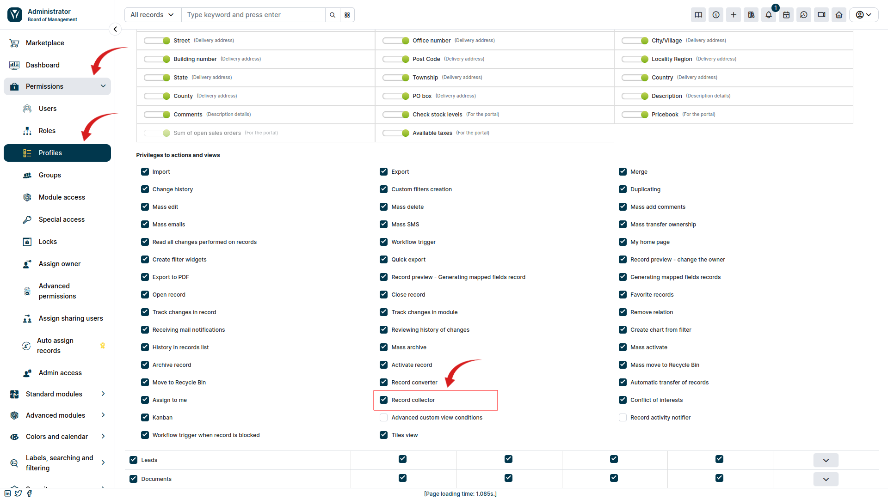

## Prezentacja wideo

import Tabs from '@theme/Tabs';
import TabItem from '@theme/TabItem';
import ReactPlayer from 'react-player';

<Tabs groupId="XlIXiQpC9ug">
    <TabItem value="youtube-XlIXiQpC9ug" label="🎬 YouTube">
        <ReactPlayer
            src="https://www.youtube.com/watch?v=XlIXiQpC9ug"
            width="100%"
            height="500px"
            controls={true}
        />
    </TabItem>
    <TabItem value="yetiforce-XlIXiQpC9ug" label="🎥 YetiForce TV">
        <ReactPlayer src="https://public.yetiforce.com/tutorials/record-collector.mp4" width="100%" height="500px" controls={true} />
    </TabItem>
</Tabs>

## Uprawnienia

By kolektor działał prawidłowo, w konfiguracji uprawnień poszczególnych profili (`Konfiguracja systemu → Uprawnienia → Profile`) należy zaznaczyć (☑) pole "kolektor rekordów" widoczne na zrzucie ekranu poniżej:

Jeśli w profilach nie widać akcji "kolektor rekordów" należy w pliku: modules/Settings/ModuleManager/models/Module.php w zmiennej dodać tekst (tylko gdy nie istnieje)

## Automatyzacja

Kolektory oferujące możliwość autouzupełniania danych, mogą być wykorzystywane w akcjach workflow, w celu automatycznej aktualizacji danych, na przykład podczas importu rekordów do systemu.

Wystarczy, że ustawisz warunki, aby zawsze kolektor rekordów był uruchamiany podczas tworzenia i wybierzesz odpowiednie pola, które mają zostać zaktualizowane, dzięki temu możesz łatwo zautomatyzować proces importu danych np. leadów.
