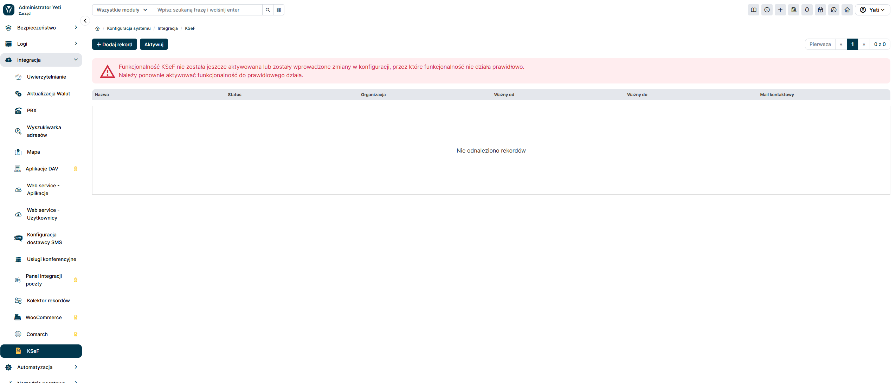
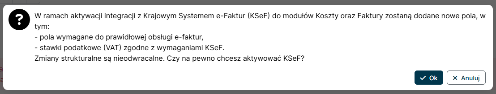

## Pierwsza aktywacja integracji z KSeF

Integracja z KSeF w systemie YetiForce jest domyślnie wyłączona i wymaga przeprowadzenia procesu aktywacji, który umożliwi korzystanie z funkcjonalności związanych z Krajowym Systemem e-Faktur. Poniżej znajdziesz instrukcję krok po kroku, jak przeprowadzić pierwszą konfigurację integracji z KSeF.

### 1. Przejdź do panelu administracyjnego systemu YetiForce (Konfiguracja systemu > Integracja > KSeF)

### 2. Kliknij przycisk `Aktywuj`. Pojawi się komunikat potwierdzający. Przejście dalej spowoduje rekonfigurację systemu i włączenie funkcjonalności integracji z KSeF

:::warning

**Uwaga!**

Aktywacja integracji z KSeF spowoduje zmiany w modułach faktur (Faktury Sprzedażowe, Faktury Kosztowe, Faktury Korekty, Faktury Proforma) oraz w ustawieniach dotyczących m.in. stawek podatkowych. Zalecamy wykonanie kopii zapasowej systemu oraz przeprowadzenie próbnej aktywacji na środowisku testowym przed przystąpieniem do aktywacji tej funkcjonalności.

Proces ten może potrwać kilka minut, a w tym czasie system może być niedostępny.

:::
