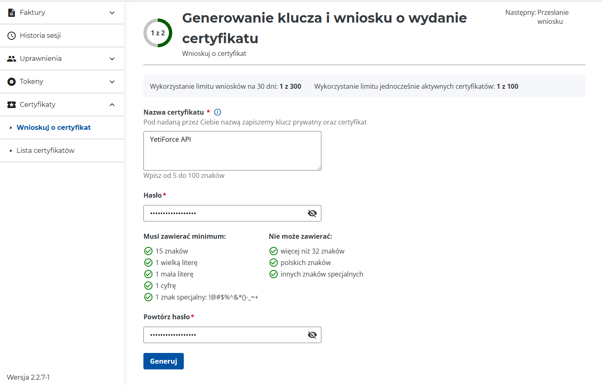
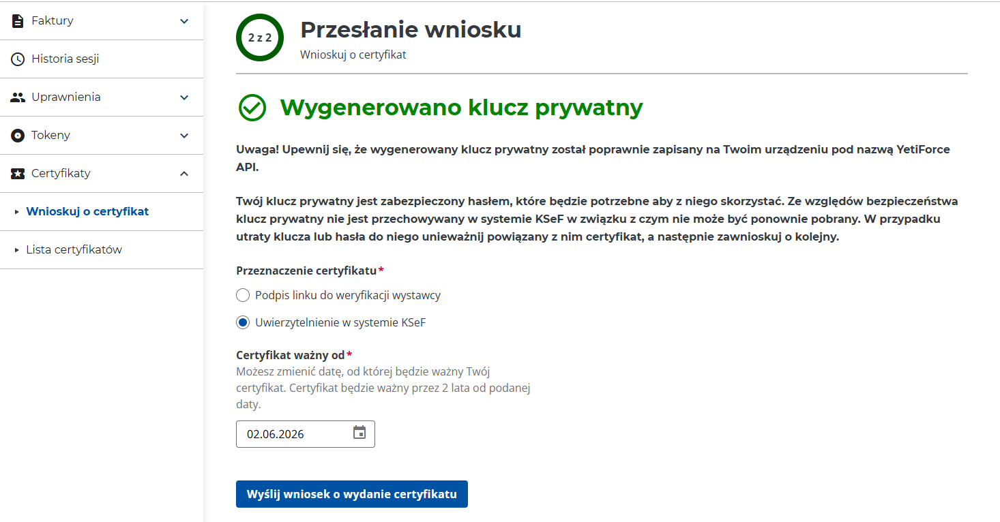
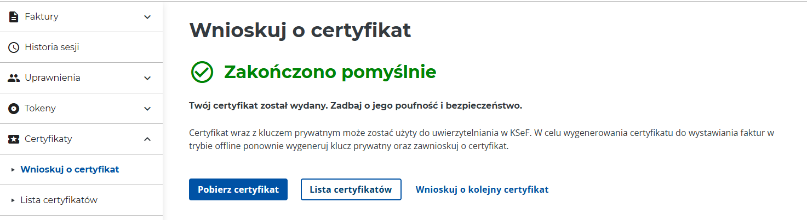
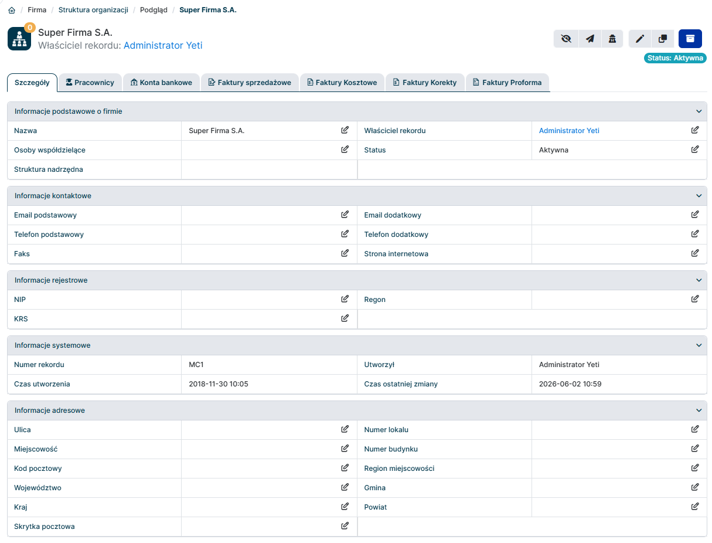
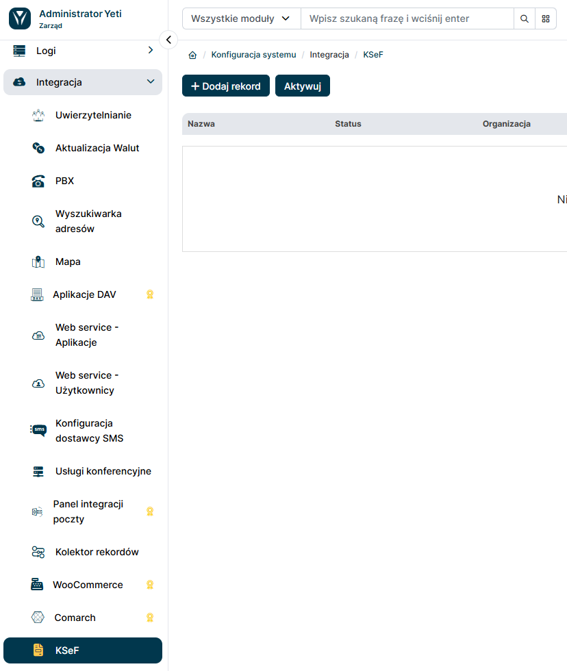
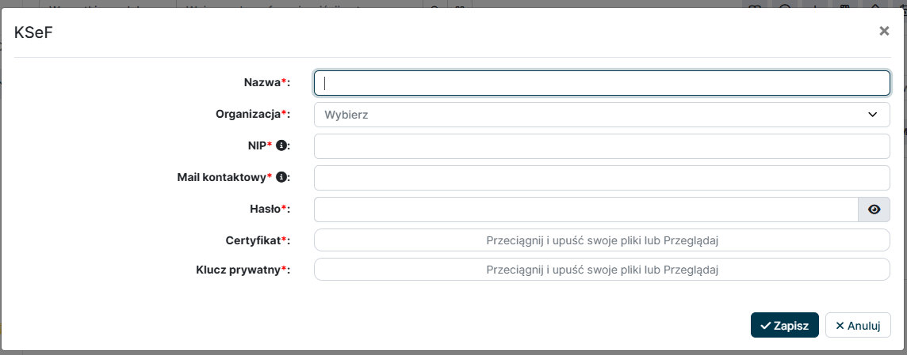

Certyfikat KSeF jest podstawową metodą uwierzytelniania w Krajowym Systemie e-Faktur (KSeF) i jest niezbędny do korzystania z funkcjonalności integracji z KSeF w systemie YetiForce. W tej sekcji znajdziesz instrukcję krok po kroku, jak dodać i zarządzać certyfikatami KSeF w systemie YetiForce, aby umożliwić bezproblemową komunikację między tymi dwoma systemami.

## Dodanie Certyfikatu KSeF do YetiForce

Integracja z KSeF w systemie YetiForce jest domyślnie wyłączona i wymaga przeprowadzenia procesu aktywacji, który umożliwi korzystanie z funkcjonalności związanych z Krajowym Systemem e-Faktur. Poniżej znajdziesz instrukcję krok po kroku, jak przeprowadzić pierwszą konfigurację integracji z KSeF.

:::info

Certyfikat KSeF należy wygenerować i pobrać z Aplikacji Podatnika KSeF.

:::

### Generowanie nowego certyfikatu w Aplikacji Podatnika KSeF

1. Po zalogowaniu do Aplikacji Podatnika KSeF, przejdź do zakładki `Certyfikaty` i kliknij przycisk `Wnioskuj o certyfikat`.

2. Wypełnij wymagane dane w formularzu wniosku o certyfikat, w tym:
   - `Nazwa` - dowolna nazwa, która pozwoli zidentyfikować certyfikat
   - `Hasło` - hasło do certyfikatu zgodne z wymaganiami. Będzie potrzebne do konfiguracji w YetiForce.
3. Po kliknięciu przycisku `Generuj` utworzony zostanie klucz o nazwie `{Nazwa}.key`, gdzie `{Nazwa}` to nazwa podana w formularzu wniosku o certyfikat. Plik powinien automatycznie pobrać się na komputer użytkownika.

4. W polu `Przeznaczenie certyfikatu` wybierz opcję `Uwierzytelnianie w systemie KSeF`. Natomiast w polu `Certyfikat ważny od` wybierz datę, od której certyfikat ma być aktywny (domyślnie od dzisiaj). Po wypełnieniu tych danych kliknij przycisk `Wyślij wniosek o wydanie certyfikatu`.
5. Po przetworzeniu wniosku, certyfikat powinien pojawić się na liście certyfikatów w Aplikacji Podatnika KSeF. Pobierz plik certyfikatu o nazwie `{Nazwa}.crt` klikając na `Pobierz certyfikat`. (Jeżeli certyfikat jest w trakcie przetwarzania, kliknij przycisk `Odśwież`).

Po zakończeniu powyższych kroków, będziesz mieć gotowe pliki **certyfikatu** (`.crt`) i **klucza** (`.key`), które wraz z podanym **hasłem** są niezbędne do konfiguracji integracji z KSeF w systemie YetiForce. Przejdź do kolejnych kroków instrukcji, aby dodać certyfikat do YetiForce i skonfigurować integrację z KSeF.

### 1. Zaktualizuj dane w module `Struktura Organizacji`

Aby certyfikat KSeF był używany do uwierzytelniania wysyłki faktur dla konkretnego podmiotu, należy utworzyć bądź zaktualizować rekordy w module `Struktura Organizacji` o odpowiednie dane firmy. Dane te zostaną użyte do uzupełnienia pól ewidencyjnych i adresowych Podmiotu wystawiającego fakturę.

Pola obowiązkowe do uzupełnienia to:

- `NIP` - numer NIP firmy
- Blok `Informacje adresowe` - uzupełniony o dane adresowe firmy, w tym:
  - `Ulica`
  - `Numer budynku` (i opcjonalnie `Numer lokalu`)
  - `Kod pocztowy`
  - `Miejscowość`
  - `Kraj`

### 2. Przejdź do panelu administracyjnego systemu YetiForce (Konfiguracja systemu > Integracja > KSeF) i wybierz opcję `Dodaj rekord`

### 3. Wypełnij dane certyfikatu

- `Nazwa` - dowolna nazwa, która pozwoli zidentyfikować certyfikat w systemie YetiForce
- `Organizacja` - Podmiot (moduł Struktura Organizacji), którego dotyczy certyfikat 1
- `NIP` - numer NIP 2
- `Mail kontaktowy` - adres e-mail do powiadomień systemowych związanych z certyfikatem
- `Hasło` - hasło do certyfikatu nadane w Aplikacji Podatnika
- `Certyfikat` - plik `.crt` pobrany z Aplikacji Podatnika KSeF
- `Klucz prywatny` - plik `.key` pobrany z Aplikacji Podatnika KSeF

1 Powiązuje konfigurację KSeF z konkretnym podmiotem. Certyfikat będzie używany do uwierzytelniania wysyłki faktur, które mają przypisany dany podmiot w polu "Organizacja", a także pobierania faktur z KSeF, które zostały wystawione na ten podmiot.

2 Musi być zgodny z NIP-em, dla którego został wygenerowany certyfikat w Aplikacji Podatnika.

### 4. Zapisz ustawienia certyfikatu

Podczas zapisywania system przeprowadzi weryfikację poprawności danych i połączenia z KSeF. Jeśli wszystko jest poprawnie skonfigurowane, certyfikat zostanie dodany do systemu YetiForce i będzie gotowy do użycia w integracji z KSeF.
