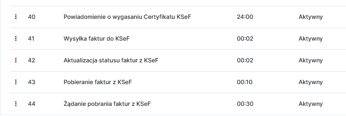

Do prawidłowego działania integracji z KSeF w systemie YetiForce, konieczny jest uruchomiony harmonogram zadań CRON na serwerze. Aktywacja integracji automatycznie dodaje wymagane zadania CRON, które odpowiadają za komunikację z KSeF.

## Opis zadań CRON dla integracji z KSeF

1. **Powiadomienie o wygasaniu certyfikatu KSeF** - zadanie to jest odpowiedzialne za monitorowanie ważności certyfikatu KSeF i wysyłanie powiadomień do wskazanego w konfiguracji certyfikatu użytkownika, gdy certyfikat zbliża się do daty wygaśnięcia. Dzięki temu użytkownicy mogą na czas odnowić certyfikat i uniknąć przerw w działaniu integracji z KSeF.

2. **Wysyłka faktur do KSeF** - wysyła faktury sprzedażowe z CRM do KSeF. Zadanie to wysyła paczkę faktur, które zostały wystawione w CRM i mają przypisaną Organizację (pole `Organizacja`). Organizacja musi mieć skonfigurowany aktywny certyfikat KSeF.

3. **Aktualizacja statusu faktur z KSeF** - pobiera informacje o statusie wysłanych faktur do KSeF i aktualizuje rekordy faktur w YetiForce zgodnie z informacjami zwróconymi przez KSeF.

4. **Żądanie pobrania faktur z KSeF** - wysyła żądanie do KSeF o utworzenie paczki faktur do importu z KSeF do YetiForce, które zostały wystawione na Organizację z aktywnym w YetiForce certyfikatem KSeF. Żądania wysyłane są z filtrem czasowym, który obejmuje faktury umieszczone w KSeF w okresie pomiędzy kolejnymi uruchomieniami zadania.

5. **Pobieranie faktur z KSeF** - importuje faktury z KSeF i tworzy rekordy faktur w YetiForce zgodnie z danymi ustrukturyzowanymi pobranymi z KSeF.
