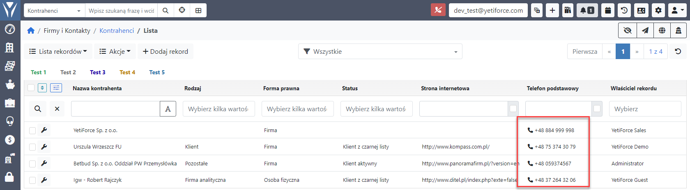

:::tip Funkcjonalność dostępna od wersji YetiForce 6.5
:::

Integracja z centralą telefoniczną za pośrednictwem aplikacji Bria Softphone.

Połączenie z Bria Softphone bazuje na `Bria Desktop API` dzięki której można użytkownik ma w czasie rzeczywistym informacje o połączeniach.


## Video guide

import Tabs from '@theme/Tabs';
import TabItem from '@theme/TabItem';
import ReactPlayer from 'react-player';

<Tabs groupId="sWyz4oqKYwI">
	<TabItem value="youtube-sWyz4oqKYwI" label="🎬 YouTube">
		<ReactPlayer
			url="https://www.youtube.com/watch?v=sWyz4oqKYwI"
			width="100%"
			height="500px"
			controls={true}
		/>
	</TabItem>
	<TabItem value="yetiforce-sWyz4oqKYwI" label="🎥 YetiForce TV">
		<ReactPlayer url="/video/integration-BriaSoftphone.mp4" width="100%" height="500px" controls={true} />
	</TabItem>
</Tabs>

## Konfiguracja

### Dodanie konfiguracji do PBX

Dodajemy wpis o typie `BRIA Softphone`


### Wprowadzanie numeru wewnętrznego w użytkownikach

Wprowadzamy wewnętrzny numer telefonu dla użytkowników którzy mają mieć aktywną integrację z Softphone


## Status połączania z Softphone

Ikona na górnej belce systemu pokazuje aktualny status integracji z aplikacją Bria Softphone.

 Brak połączenia z telefonem

 Aktywne połączenie z telefonem, widać numer/nazwę aktualnie zalogowanego użytkownika w Softphone

 Rozmowa wychodząca lub przychodząca, pokazuje nazwę/numer rozmówcy

## Wybieranie numeru telefonu

Gdy integracja została aktywowana prawidłowo to wszystkie pola o typie telefon będą miała dodatkową ikonę telefonu.
Klikając w numer telefonu lub ikonę zostanie wywołana metoda do utworzenia podłączania z wybranym numerem telefonu.



## Połączenia przychodzące

Gdy ktoś do nas dzwoni system informacje o tym innym kolorem i ikoną oraz pokazuje numer telefonu osoby dzwoniącej


## Odnośniki zewnętrzne

- https://www.counterpath.com/softphone-clients/
- https://www.counterpath.com/teams-pricing/
- https://www.counterpath.com/bria-desktop-api/

## Debugowanie

W celu aktywacji logów w przeglądarce dla integracji należy ustawić w pliku [config/Debug.php](https://doc.yetiforce.com/code/classes/Config-Debug.html#property_JS_DEBUG) parametr [$JS_DEBUG](https://doc.yetiforce.com/code/classes/Config-Debug.html#property_JS_DEBUG) na true.

```php
/** Turn on/off error debugging in javascript */
public static $JS_DEBUG = true;
```


