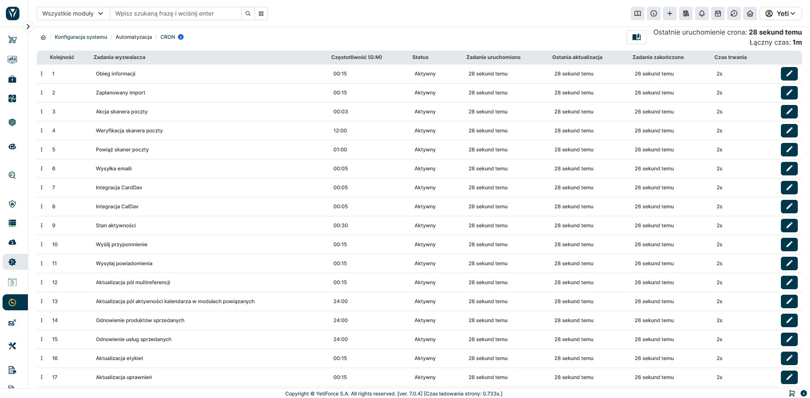

Cron to uniksowy demon zajmujący się okresowym wywoływaniem innych programów. Posługuje się on tabelami crontab do przechowywania informacji jakie zadanie ma uruchamiać. Zalecane jest używanie go na Linuksie, ale jeśli ten sam plik zostanie dodany do harmonogramu na Windowsie, to również zadziała. W praktyce, dzięki niemu system YetiForce wykonuje automatyczne różne zadania, które są wywoływane w tle.



## Jak uruchomić cron-a?

CRON można włączyć w kilku prostych krokach:

### Linux - edytuj plik /etc/crontab, /etc/cron.d/yetiforce lub 'crontab -e':

- Dodaj wpis do crontab, lub plik do CRON, np. w takim formacie (`__YETIFORCE_PATH__`jest pełną ścieżką bezwzględną do folderu systemu YetiForce, np. /var/www/example),

  :::warning

  Ważne jest, aby skrypt był uruchamiany z takimi samymi uprawnieniami jak właściciel plików systemowych.

  :::

```bash
*/2 * * * * www-data __YETIFORCE_PATH__/cron/cron.sh > __YETIFORCE_PATH__/cache/logs/cron.log 2>&1
*/2 * * * * www-data sh /var/www/cron/cron.sh > /var/www/cache/logs/cron.log 2>&1
*/2 * * * * sh __YETIFORCE_PATH__/cron/cron.sh > __YETIFORCE_PATH__/cache/logs/cron.log 2>&1
*/2 * * * * php __YETIFORCE_PATH__/cron.php > __YETIFORCE_PATH__/cache/logs/cron.log 2>&1
*/2 * * * * cd __YETIFORCE_PATH__; /usr/local/bin/php -f cron.php > __YETIFORCE_PATH__/cache/logs/cron.log 2>&1
```

- Zmień uprawnienia pliku `__YETIFORCE_PATH__`/cron/cron.sh na 744 (lub inne uprawnienia kompatybilne z wewnętrzną polityką bezpieczeństwa w firmie).


- Ustaw ścieżkę w pliku `__YETIFORCE_PATH__`/cron/cron.sh do PHP: export USE_PHP=/usr/local/php74/bin/php74 (zwróć uwagę na plik, ponieważ może znajdować się w innej lokalizacji na każdym serwerze, zwrócić uwagę na ścieżkę do PHP, która jest inna dla różnych serwerów. Ścieżkę tą może Ci podać administrator serwera lub możesz ją sprawdzić w phpinfo).

  

- Zwróć uwagę na koniec linii, ponieważ powinna to być Unix (LF). Jeśli jest to Windows na serwerach Linux, może to spowodować błędy, a system nie będzie w stanie uruchomić pliku SH.

  

### Windows - nie zaleca się używania Windows jako serwera dla systemu YetiForce.

### Adres URL może być używany do uruchomienia CRON, np. https://demo.yetiforce.com/cron.php?app_key=xxxx

`app_key` to klucz znajdujący się w pliku [config/Main.php](https://doc.yetiforce.com/code/classes/Config-Main.html#property_application_unique_key) w zmiennej `$application_unique_key`.


### W przypadku problemów z wyzwalaniem CRON z CLI, istnieje alternatywa, ale nie zaleca się:

```bash
*/2 * * * * /usr/bin/lynx -source https://demo.yetiforce.com/cron.php?app_key=xxxx
*/2 * * * * /usr/bin/wget -O - -q -t 1 https://demo.yetiforce.com/cron.php?app_key=xxxx
*/2 * * * * curl -s https://demo.yetiforce.com/cron.php?app_key=xxxx
```
