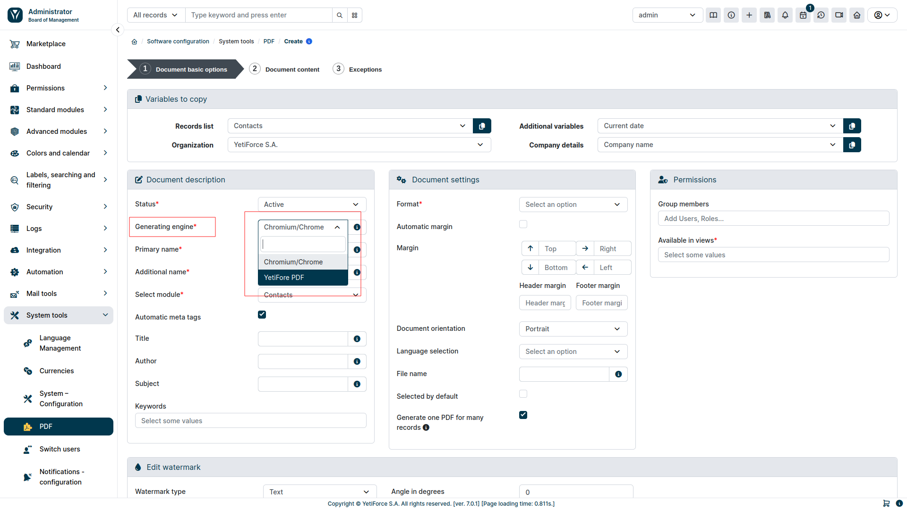

## Chromium/Chrome

### Pobierz

- Chromium - https://www.chromium.org/getting-involved/download-chromium/

### Konfigurowanie ścieżki generatora PDF

Plik konfiguracyjny PDF: [config/Components/Pdf.php](https://doc.yetiforce.com/code/classes/Config-Components-Pdf.html)

Ustaw ścieżkę lokalną lub polecenie do generatora PDF w parametrze [$chromiumBinaryPath](https://doc.yetiforce.com/code/classes/Config-Components-Pdf.html#property_chromiumBinaryPath)

```php
/**
 * Configuration file: Config\Components\Pdf.
 */
class Pdf
{
    /**
     * The name or path of the chrome/chromium engine.
     *
     * @see https://www.chromium.org/getting-involved/download-chromium
     *
     * @var string
     */
    public static $chromiumBinaryPath = 'chromium';

    /**
     * Chromium browser options available for the browser factory.
     *
     * @see https://github.com/chrome-php/chrome#available-options
     *
     * @var array
     */
    public static $chromiumBrowserOptions = ['noSandbox' => true, 'noProxyServer' => true];
}
```

#### Przykładowe wartości `$chromiumBinaryPath`:

- chromium
- chromium-browser
- google-chrome
- /usr/bin/google-chrome
- c:\Program Files (x86)\Google\Chrome\Application\chrome.exe
- c:\ungoogled-chromium\chrome.exe

### Wybierz nowy silnik

Gdy ścieżka `$chromiumBinaryPath` jest poprawnie ustawiona i system ma dostęp do lokalizacji/polecenia, zobaczysz nowy silnik w panelu PDF.



### Prosta instalacja na Linux

Prosty skrypt do pobrania najnowszej wersji bez instalacji.

Upewnij się, że system ma wszystkie wymagane zależności. Dzięki [Puppeteer](https://github.com/puppeteer/puppeteer/blob/main/docs/troubleshooting.md#chrome-headless-doesnt-launch-on-unix) ❤️

The list of required packages may vary depending on the distribution and version. https://source.chromium.org/chromium/chromium/src/+/main:chrome/installer/linux/debian/dist_package_versions.json

<details>
<summary>Debian (np. Ubuntu)</summary>

```
ca-certificates
fonts-liberation
libappindicator3-1
libasound2
libatk-bridge2.0-0
libatk1.0-0
libc6
libcairo2
libcups2
libdbus-1-3
libexpat1
libfontconfig1
libgbm1
libgcc1
libglib2.0-0
libgtk-3-0
libnspr4
libnss3
libpango-1.0-0
libpangocairo-1.0-0
libstdc++6
libx11-6
libx11-xcb1
libxcb1
libxcomposite1
libxcursor1
libxdamage1
libxext6
libxfixes3
libxi6
libxrandr2
libxrender1
libxss1
libxtst6
lsb-release
wget
xdg-utils

Uwaga: Musisz zainstalować również ‘libgbm-dev’ i‘libxshmfence-dev’. This is reported for Ubuntu 20.04.
```

</details>

<details>
<summary>CentOS</summary>

```
alsa-lib.x86_64
atk.x86_64
cups-libs.x86_64
gtk3.x86_64
ipa-gothic-fonts
libXcomposite.x86_64
libXcursor.x86_64
libXdamage.x86_64
libXext.x86_64
libXi.x86_64
libXrandr.x86_64
libXScrnSaver.x86_64
libXtst.x86_64
pango.x86_64
xorg-x11-fonts-100dpi
xorg-x11-fonts-75dpi
xorg-x11-fonts-cyrillic
xorg-x11-fonts-misc
xorg-x11-fonts-Type1
xorg-x11-utils
```

Po zainstalowaniu zależności musisz zaktualizować bibliotekę nss używając tej komendy

```
yum update nss -y
```

</details>

<details>
  <summary>Sprawdź dyskusje</summary>

- [#290](https://github.com/puppeteer/puppeteer/issues/290) - Debian troubleshooting <br/>
- [#391](https://github.com/puppeteer/puppeteer/issues/391) - CentOS troubleshooting <br/>
- [#379](https://github.com/puppeteer/puppeteer/issues/379) - Alpine troubleshooting <br/>

</details>

```bash
apt-get install -y --no-install-recommends libnss3-tools libatk1.0-0 libatk-bridge2.0-0 libdrm-dev libxkbcommon-dev libxcomposite1 libxdamage1 libxfixes3 libxrandr2 libgbm-dev libasound2
```

```bash
#! /bin/bash

cd $(dirname $0)

LASTCHANGE_URL="https://www.googleapis.com/download/storage/v1/b/chromium-browser-snapshots/o/Linux_x64%2FLAST_CHANGE?alt=media"

REVISION=$(curl -s -S $LASTCHANGE_URL)

echo "latest revision is $REVISION"

if [ -d $REVISION ] ; then
  echo "already have latest version"
  exit
fi

ZIP_URL="https://www.googleapis.com/download/storage/v1/b/chromium-browser-snapshots/o/Linux_x64%2F$REVISION%2Fchrome-linux.zip?alt=media"

ZIP_FILE="${REVISION}-chrome-linux.zip"

echo "fetching $ZIP_URL"

rm -rf $REVISION
mkdir $REVISION
pushd $REVISION
curl -# $ZIP_URL > $ZIP_FILE
echo "unzipping.."
unzip $ZIP_FILE
popd
rm -f ./latest
find chromium/* -type d -ctime +1 -exec rm -rf {} \;
ln -s $REVISION/chrome-linux/ ./latest
```

### Tips

#### Watermark on the entire page size

```css title="Styles column"
#watermark-image{position: absolute; left: 0; right: 0; top: 0; bottom: 0;}&#13;
#header{position: absolute; top: 0; left: 0; right: 0;width: 842px; height: 595px;}
```
