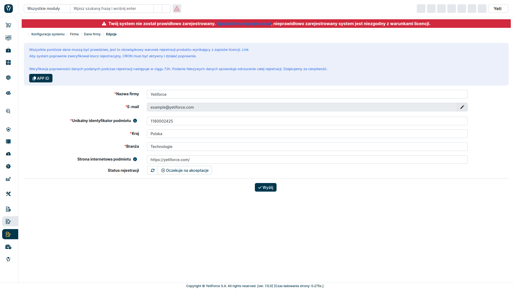

## How to register YetiForce?

The [YetiForce Public License](/introduction/license-open-source) requires YetiForce to be registered. Registration is also necessary if you want to purchase products or services from the Marketplace. There are two ways to properly register your system.

Below you can find step-by-step instructions on how to register YetiForce using the online registration form built into the system.

If the system you are registering has access to the Internet, please use the online registration method according to the instructions below. If your system does not connect to the Internet, the instructions and required information for offline registration can be found in the [license](/introduction/license-open-source).

:::warning

All keys are generated after verifying the information provided in the registration form. We verify the information manually, therefore the proces may take up to 48 hours. Sending an offline registration request will not speed up online registration.

:::

Go to system settings by clicking the cogwheel button in the upper right corner.

In the menu panel on the left select `Company` and then `Company details`.

### OffLine

### OnLine

Read the information at the top of the page and fill in all mandatory fields (marked with a red asterisk) with real details of your company.

Providing fake information will result in the registration being rejected.

For a detailed description of the fields, see the section below.

### Form fields

#### Type

- End user - an entity that uses the system
- Provider - an entity that implements a system for another entity that will use it
- Integrator - an entity that integrates the system

:::tip

If you are a provider/integrator and you want to register the system on behalf of your client, remember that both entities must be registered - you as a vendor/integrator and your client as an end user.

:::

#### Company name or first and last name

Provide the full name of your company. In case of private individuals please enter your first and last name.

#### Entity's unique identifier

- In case of companies, provide unique tax identifier applicable in your country, for example VAT ID.
- In case of private persons, provide a unique identifier assigned on the day of birth, applicable in your country.

#### Country

The country where your company operates

#### Post code

Provide the post code of the city where your company is located.

#### City/Village

Provide the city where your company is located

#### Address

Provide the address of your company

#### Industry

Select the industry from the list

#### The number of employees employed by the entity

Enter the number of employees in your company. This is the number of all the people employed in the company, not only the employees who have YetiForce accounts.

#### The website of the entity

Enter the entity's website or a personal website.

:::tip

**DO NOT** enter the URL where your YetiForce is installed.

:::

#### Newsletter subscription

If you would like to subscribe to our newsletter, please provide your:

- Name
- Last name
- Email

## Check status

Click the `Check status` button, on the right side the time of the last update should change to `a moment ago.`

