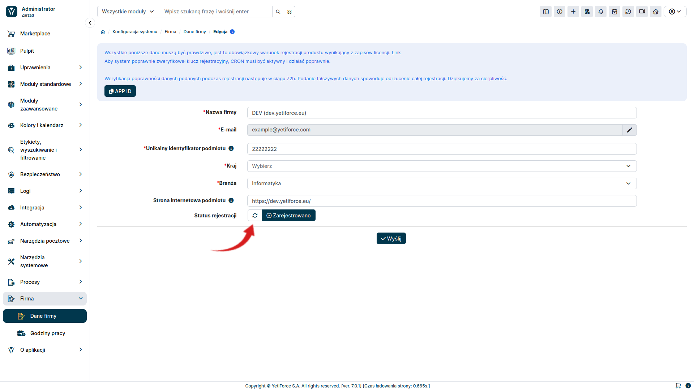

## Registration

### OffLine

### OnLine

## Check status

Click the `Check status` button, on the right side the time of the last update should change to `a moment ago.`

## How to register YetiForce?

The [YetiForce Public License](/introduction/license-open-source) requires YetiForce to be registered. Registration is also necessary if you want to purchase products or services from the Marketplace. There are two ways to properly register your system.

Below you can find step-by-step instructions on how to register YetiForce using the online registration form built into the system.

If the system you are registering has access to the Internet, please use the online registration method according to the instructions below. If your CRM does not connect to the Internet, the instructions and required information for offline registration can be found in the [license](/introduction/license-open-source).

:::warning

All keys are generated after verifying the information provided in the registration form. We verify the information manually, therefore the proces may take up to 48 hours. Sending an offline registration request will not speed up online registration.

:::
