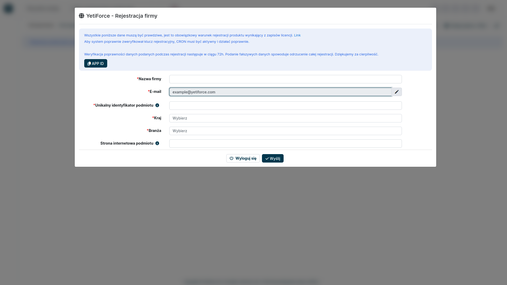
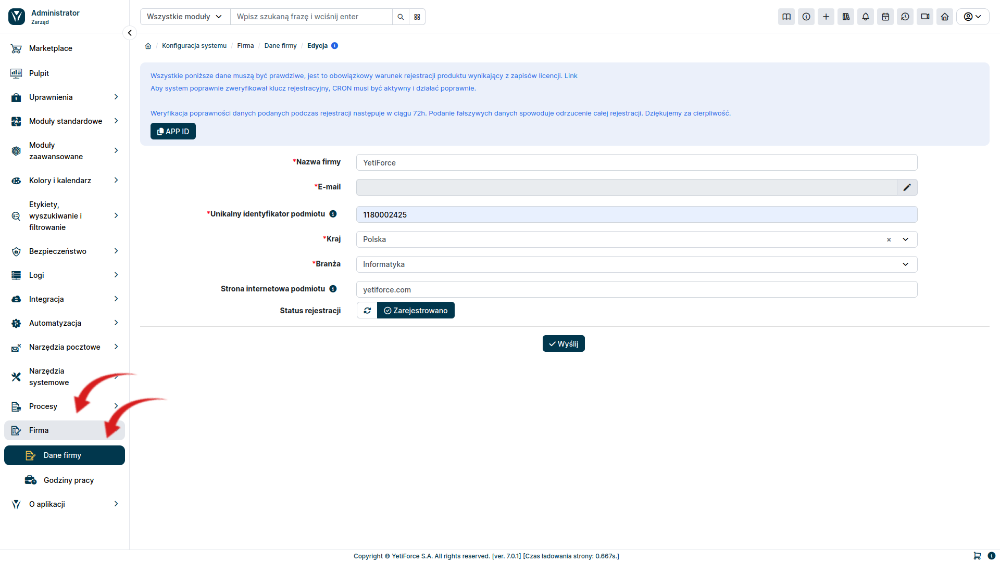

Licencja [systemu YetiForce](/introduction/license-open-source) nakazuje rejestrację oprogramowania YetiForce. Rejestracja jest również niezbędna, jeśli chcesz dokonać zakupu produktów lub usług w Marketplace.

## Jak zarejestrować YetiForce?

Proces rejestracji, rozpoczyna się jako ostatni etap instalacji oprogramowania YetiForce, która została opisana w tym artykule [Instalacja systemu YetiForce](/introduction/installation-manual)

Należy wypełnić wszystkie obowiązkowe pola (oznaczone czerwoną gwiazdką) prawdziwymi danymi firmy. Podanie fałszywych informacji spowoduje odrzucenie rejestracji.

### Pola formularza

#### Nazwa firmy

- Podaj pełną nazwę firmy. W przypadku osób prywatnych podaj imię i nazwisko.

#### E-mail

- Pole domyślnie wypełnione wartością podaną podczas rejestrcji.

#### Unikalny identyfikator podmiotu

- W przypadku przedsiębiorstw należy podać unikalny identyfikator podatkowy stosowany w danym kraju, na przykład numer VAT.

#### Kraj

- Kraj, w którym działa Twoja firma

#### Branża

- Wybierz branżę z listy

#### Strona internetowa podmiotu

- Wprowadź stronę internetową podmiotu lub osobistą stronę internetową.

:::tip

**NIE WPROWADZAJ ADRESU URL GDZIE ZAINSTALOWANY JEST YETIFORCE!**

:::

Po wysłaniu formularza rejestracyjnego czekamy na weryfikację systemu.

:::warning
Klucze rejestracyjne generowane są automatycznie i wysyłane na adres email podany podczas rejestracji. W przypadku podania nieprawidłowych informacji, rejestracja zostanie odrzucona.
:::

Jeżeli dane podane w formularzu są poprawne, system zostanie zatwierdzony. Wówczas w polu **status rejestracji** pojawi się wartość **zarejestrowano** a na górze zniknie czerwony komunikat o braku rejestracji.

## Sprawdź status

Jeśli status rejestracji nie został automatycznie zaktualizowany, można odświeżyć go ręcznie za pomocą przycisku <kbd><i className="fas fa-refresh"></i></kbd>, który znajduje się na formularzu rejestracji w kolumnie **status rejestracji**

## Odrzucenie rejestracji

W przypadku, gdy w formularzu znajdą się nieprawidłowe dane, rejestracja zostanie odrzucona. W celu ponownej weryfikacji, należy poprawnić formularz i ponownie go wysłać.
W tym celu, przejdź do konfiguracji systemu za pomocą kółka zębatego <kbd><i className="ti ti-settings"></i></kbd> widocznego w prawym górnym rogu ekranu.

W menu z lewej strony wybierz `Firma`, a następnie `Dane firmy`. Popraw dane w formularzu i ponownie go wyślij.

:::warning
Każdorazowa zmiana danych w formularzu, automatycznie zmieni status rejestracji na "**oczekuje na akceptację**" i będzie wymagana ponowna weryfikacja wprowadzonych danych.
:::

Dane wprowadzone w formularzu rejestracyjnym, zostaną przesłane do nas w celu weryfikacji. Weryfikacja nastąpi w ciągu 2 dni roboczych.
