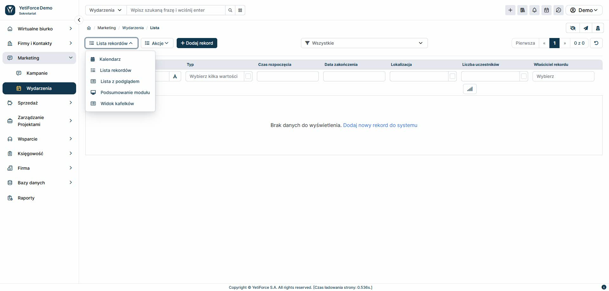
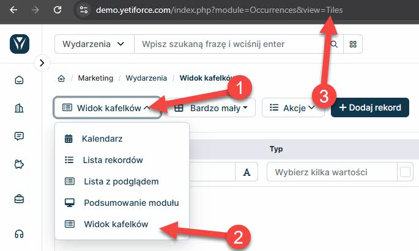

## Wprowadzenie

Ten poradnik wyjaśnia krok po kroku, jak zmienić domyślny widok wybranego modułu w systemie YetiForce. Dzięki tej funkcji możesz dostosować wygląd modułu do własnych preferencji i wygody pracy.



:::tip

Przykład dotyczy modułu Wydarzenia, ale możesz zastosować te same kroki do dowolnego innego modułu w YetiForce.

:::

## Jak znaleźć systemową nazwę modułu

Aby zmienić widok, najpierw sprawdź nazwę modułu, który chcesz dostosować. Nazwę znajdziesz w pasku adresu przeglądarki, w parametrze `module`. Przykład:

`https://demo.yetiforce.com/index.php?module=Occurrences&view=List&mid=162&parent=52`

W tym przypadku nazwa modułu to **Occurrences**.

## Zmiana domyślnego widoku modułu – instrukcja krok po kroku

1. **Utwórz plik konfiguracyjny (jeśli nie istnieje)**

   - Przejdź do katalogu `config/Modules/` na serwerze, gdzie zainstalowany jest YetiForce.
   - Utwórz nowy plik (jeśli nie istnieje) o nazwie odpowiadającej nazwie systemowej modułu, np. `Occurrences.php` dla modułu Wydarzenia.

2. **Wklej poniższy kod do pliku**
   - Skopiuj i wklej poniższy kod, dostosowując nazwę klasy do wybranego modułu:

```php
<?php

namespace Config\Modules;

class Occurrences
{
	public static $defaultViewName = 'Tiles';
}

```

3. **Zapisz plik**
   - Po zapisaniu pliku, domyślny widok modułu zostanie zmieniony na wybrany.

## Jak sprawdzić dostępne widoki

Aby zobaczyć, jakie widoki możesz ustawić:

- Wejdź do wybranego modułu w YetiForce.
- Kliknij przycisk wyboru widoku w lewym górnym rogu listy.
- W menu rozwijanym zobaczysz dostępne widoki.
- W adresie URL pojawi się parametr `view` z nazwą wybranego widoku, np. `Tiles`, `List` itp.



## Lista podstawowych widoków

- **List** – [Widok listy, umożliwiający przeglądanie danych w formie tabeli.](/user-guides/interface-guide/list-view/)
- **ListPreview** – Widok listy z podglądem, pozwalający na szybki wgląd w szczegóły rekordów.
- **DashBoard** – Widok pulpitu nawigacyjnego, umożliwiający szybki dostęp do najważniejszych informacji.
- **Tiles** – Widok kafelkowy, idealny do wizualizacji danych.
- **Calendar** – [Widok kalendarza, przydatny do zarządzania wydarzeniami i terminami.](/user-guides/interface-guide/calendar-view/)
- **Kanban** – [Widok Kanban, umożliwiający zarządzanie zadaniami w formie kart.](/user-guides/interface-guide/kanban-view/)

:::warning

Każdy moduł może mieć inną listę dostępnych widoków

:::

## Dodatkowe wskazówki

- Jeśli nie masz dostępu do plików konfiguracyjnych, skontaktuj się z administratorem systemu.
- Zmiana widoku nie wpływa na bezpieczeństwo ani działanie innych modułów.
- W każdej chwili możesz przywrócić poprzedni widok, edytując plik konfiguracyjny.
