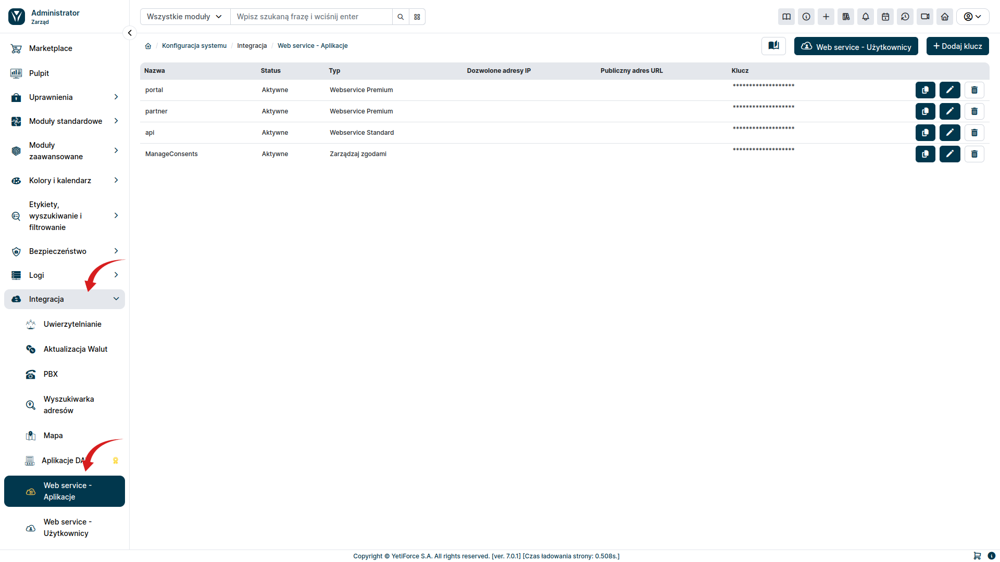
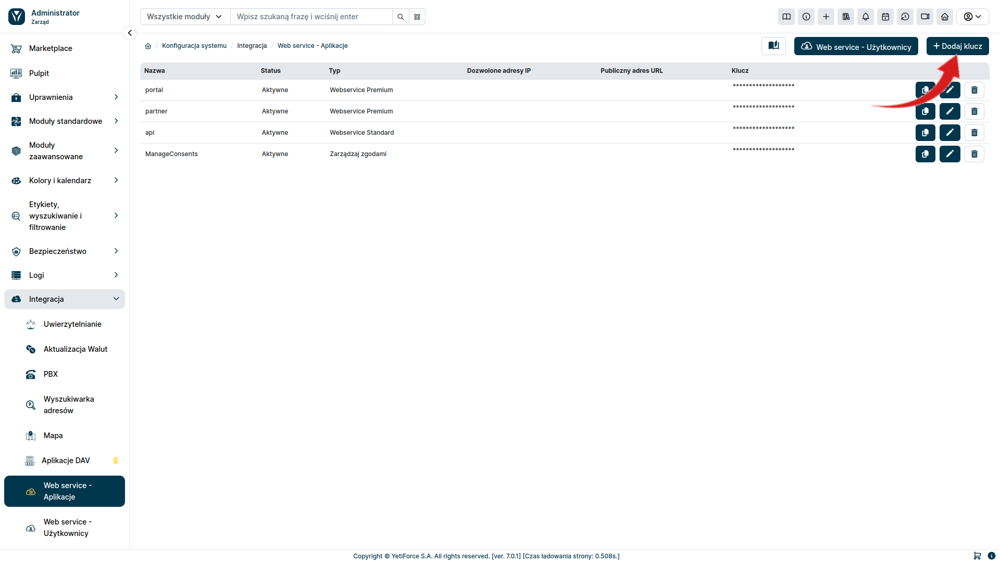
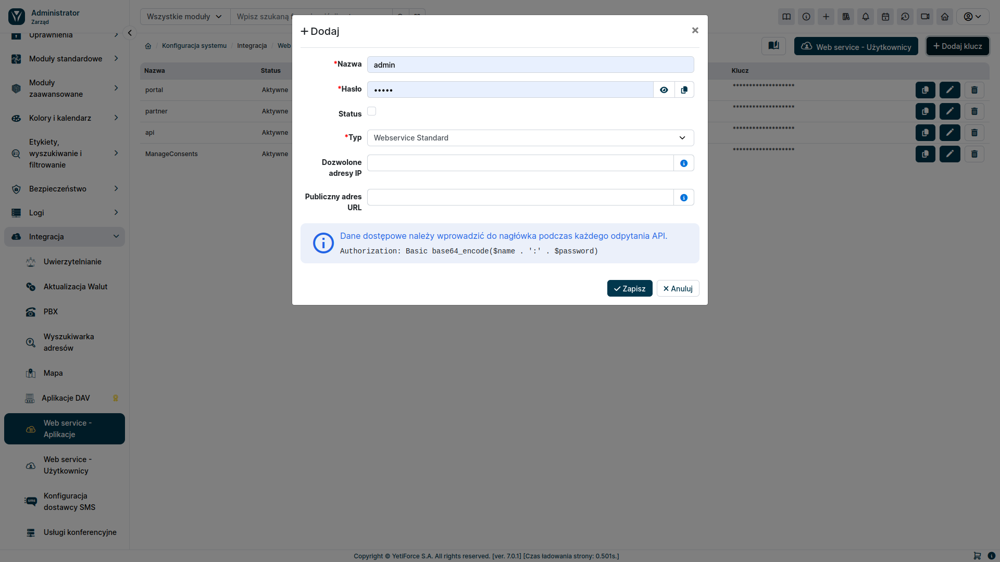
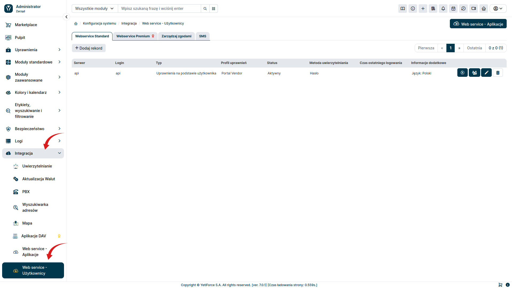
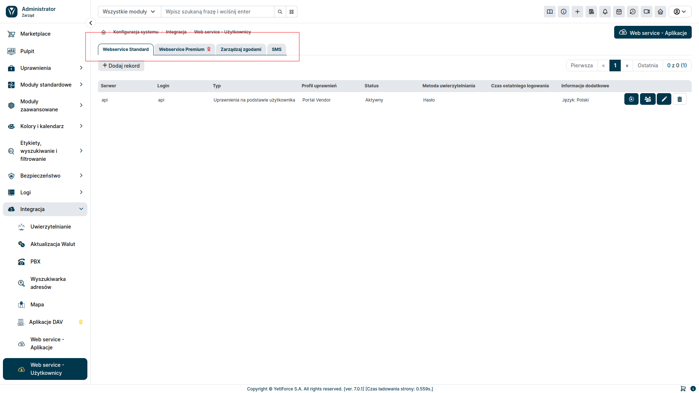
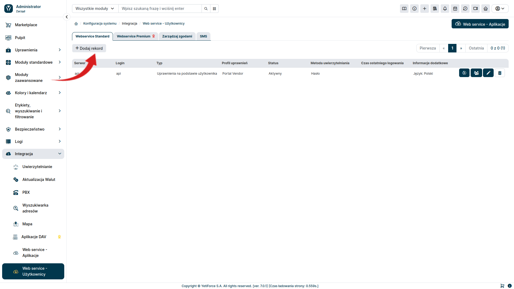
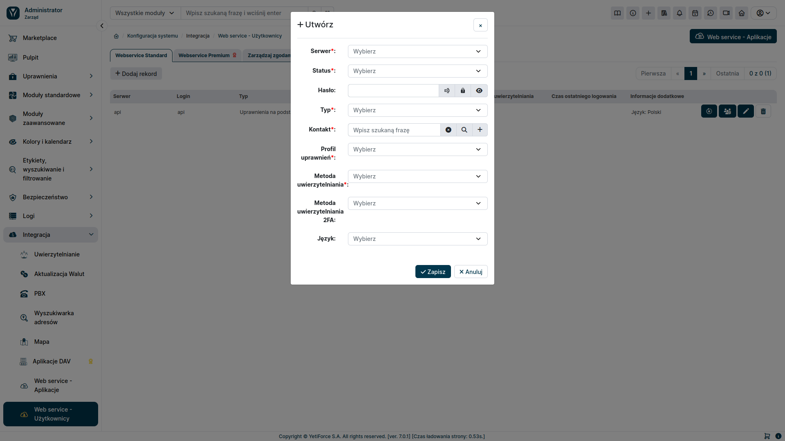

## Konfiguracja

### API Key

Pierwszym krokiem w celu podłączenia się do API, jest wygenerowanie API Key. W tym celu, w panelu administracyjnym przechodzimy w lewym menu do ```Integracja``` a następnie wybieramy ```Web service - Alikacje```.



W celu dodania nowego API Key, wybieramy ```Dodaj klucz``` z prawej górnej strony.



Pojawi nam się okno dodawania nowego API Key:



#### Nazwa
- dowolna nazwa, pozwlająca nam zidentyfikować dodany API Key 

#### Hasło
- ciąg znaków wykorzystywany do uwierzytelniania

#### Status
- odznaczenie checkboxa, spowoduje, że API Key nie będzie aktywne

#### Typ
- określa jakich funkcjonalności będzie dotyczył API Key

#### Dozwolone adresy IP
- Pusta wartość - dostęp ze wszystkich serwerów.
  Jeśli adresy IP zostaną wprowadzone (po przecinku), to dostęp do API będzie dozwolony tylko z tych adresów IP.
  Przykład: x.x.x.x , y.y.y.y

#### Publiczny adres URL
- Adres URL będzie używany do wysyłania powiadomień mailowych gdzie w treści będzie można używać adresu URL np. reset hasła w Portalu Klienta, link do podglądu rekordu w Portalu Klienta


### Użytkownik

Kolejnym krokiem jest utworzenie danych walidacyjnych do API. W tym celu w panelu administracyjnym przechodzimy w lewym menu do ```Integracja``` a następnie wybieramy ```Web service - Użytkownicy```.



Użytkownika będziemy dodawać dla konkretnego rodzaju usługi, dlatego w pierwszej kolejności wybieramy odpowiednią zakładkę.



W celu dodania nowego użytkownika, wybieramy przycisk ```Dodaj rekord```. Pojawi się nam okno modalne, w którym będziemy mogli skonfigurować dostępy.





#### Serwer
- wybieramy, API Key, który będzie powiązany z tworzonym użytkownikiem

#### Status
- określamy, czy dany użytkownik jest aktywny

#### Hasło
- ciąg znaków wykorzystywany do autoryzacji

#### Typ
- podstawa uprawień do rekordów

#### Kontakt
- opcjonalny w zależności od wybranego ```Typu``` uprawień do rekordów

#### Profil uprawnień
- użytkownik, na którym bazują uprawnienia do akcji i danych

#### Metoda uwierzytelniania i Metoda uwierzytelniania 2FA
- określa szczegóły odnośnie uwierzytelniania użytkownika


## Konfiguracja w systemie


Set active services `$enabledServices` in the [config/Api.php](https://doc.yetiforce.com/code/classes/Config-Api.html#property_enabledServices) file:

```php
/** List of active services. Available: dav, webservice */
public static $enabledServices = ['webservice'];
```

### Create an API app

To determine what kind of services are to be active, add applications of the relevant type.

Add the services you want to use in the [Web service - Applications](administrator-guides/integration/webservice-apps/) admin panel.

### Session lifetime configuration

[config/Security.php](https://doc.yetiforce.com/code/classes/Config-Security.html#property_apiLifetimeSessionCreate)

```php
/** Maximum session lifetime from the time it was created (in minutes) */
public static $apiLifetimeSessionCreate = 1440;

/** Maximum session lifetime since the last modification (in minutes) */
public static $apiLifetimeSessionUpdate = 240;
```
