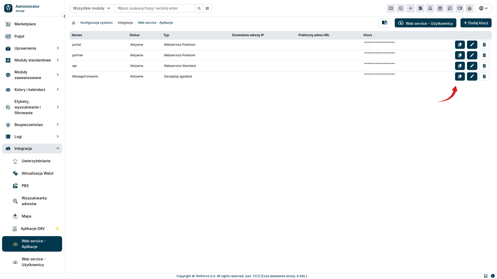
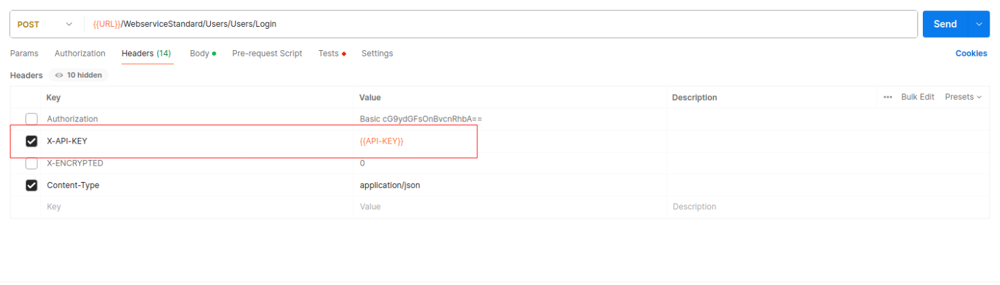
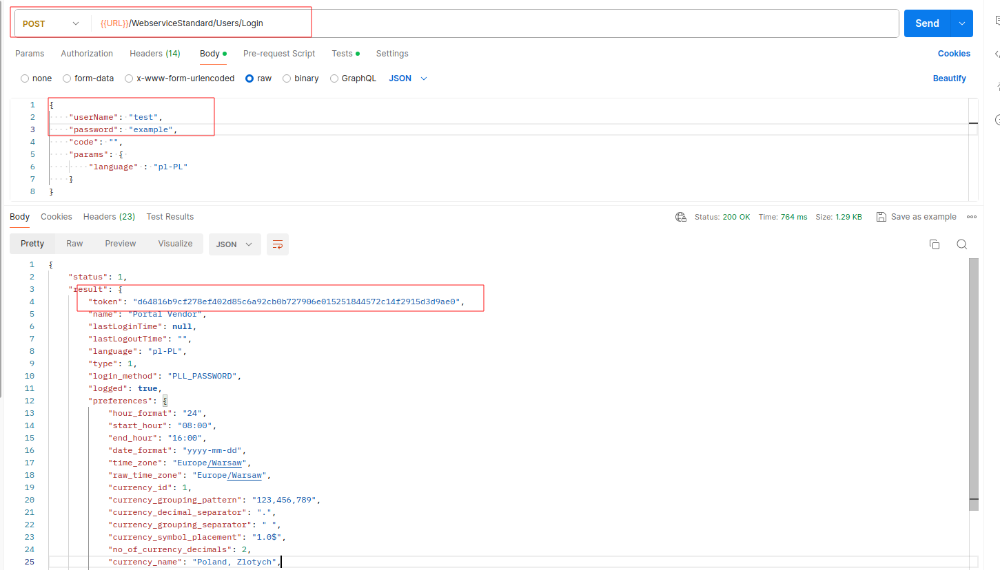
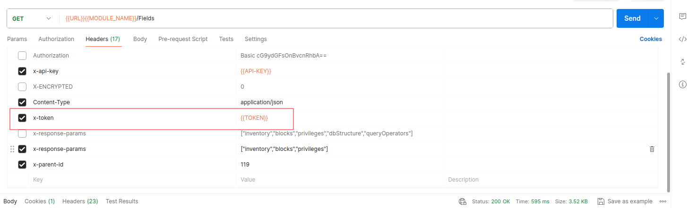

Posiadając już prawidłowo skonfigurowany klucz API i dane uwierzytelniające (zgodnie z instrukcją [konfiguracji](/developer-guides/api/config)), możemy nawiązać połączenie. By pobrać dane z serwera, należy najpierw uzyskać token uwierzytelniający. Poniższa instrukcja wyjaśnia, jak to zrobić.

## Uzyskiwanie Tokenu uwierzytelniającego

W celu uzyskania tokenu, wysyłamy do naszego serwera żądanie pod adres:

Do testowania tego procesu można użyć programu `Postman`. Na kolejnych zrzutach ekranu będzie przedstawione krok po kroku, jak to zrobić.

W pierwszej kolejności będzie potrzebna wartość `API Key`. By ją pobrać, w sekcji administracyjnej wybierz z lewego menu `Integracja ➞ Web service - aplikacje` a następnie przy interesującym cię kluczu naciśnij przycisk <kbd><i class="fa-solid fa-copy"></i></kbd> by skopiować jego wartość.

W programie `Postman` dodajemy nagłówek `X-API-KEY`. Zamiast wartości `{{APi-KEY}}` wpisujemy wartość API Key skopiowaną z systemu YetiForce.

Następnie podajemy dane do logowania, zgodnie z poniższym zrzutem ekranu. Zamiast zmiennej `{{URL}}` podajemy adres naszej platformy YetiForce. Dane uwierzytelniające `userName` i `password` wpisujemy zgodnie z wartościami ustalonymi w sekcji administracyjnej w zakładce `Integracja ➞ Web service - użytkownicy`.

W informacji zwrotnej otrzymamy parametr `token`, który będziemy przekazywać w kolejnych requestach.

## Kolejne requesty

Po uzyskaniu wartości `token`, możemy przejść do odpytywania API o interesujące nas dane. W tym celu do kolejnych requestów dodajemy nagłówek `x-token` z wartością uzyskanego tokena.

W zależności od tego, czy mamy wykupioną usługę `WebService Premium` czy też korzystamy z `WebService Standard`, będziemy mieć do dyspozycji inny zakres dostępnych endpointów.

### Lista Endpointów dla poszczególnych usług

- [Webservice Standard](/developer-guides/api/WebserviceStandard)
- [Webservice Premium](/developer-guides/api/WebservicePremium)
- [Manage consents](/developer-guides/api/ManageConsents)
- [PBX](/developer-guides/api/PBX)
- [SMS](/developer-guides/api/SMS)
- [Token](/developer-guides/api/Token)
