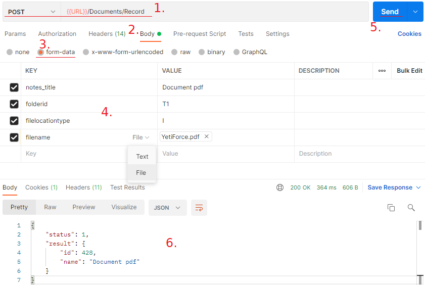

:::tip Funkcjonalność dostępna od wersji YetiForce `6.2.0` i później
:::

Niniejszy artykuł przedstawia instrukcję, jak za pomocą API dodać rekord w module Dokumenty wraz z załącznikiem.

**Przed przejściem dalej należy zapoznać się z dostępnymi metodami i sposobem komunikacji z API opisanymi w [dokumentacji API](https://doc.yetiforce.com/api/).**

## 1. Tworzenie dokumentu wraz z załączeniem pliku

Do utworzenia rekordu w module Dokumenty należy wykorzystać metodę API umożliwiającą tworzenie rekordu, tj.


https://doc.yetiforce.com/api/#/BaseModule/ea3b9bea091cbde741323b5393901825

Utworzenie nowego rekordu w module Dokumenty wymaga podania następujących wartości:

- `notes_title` - nazwa dokumentu.

- `folderid` - identyfikator katalogu.

- `filelocationtype` - typ pliku. Pole to określa typ załącznika. Dostępne są dwie wartości: `I` - wewnętrzny (załącznik), `E` - zewnętrzny (odnośnik).

- `filename` - plik lub adres URL. Załącznik lub odnośnik.

Poniżej przedstawiono kilka przykładów konstrukcji zapytań API:

### Postman



### Guzzle - klient HTTP dla PHP

https://github.com/guzzle/guzzle

```php
$uri = 'https://example.com/webservice/RestApi/Documents/Record';
$options = [
   'headers' => [
     'User-Agent' => 'YetiForceRestApi',
     'x-api-key' => 'P0fzRUuzPNWC9pxYq3MeEUp6AJ9EJpWN',
     'x-token' => '9c65f656c9380b7066d992ec59c00c0d29147a579351742b0e9f43a73312f5be',
   ],
  'auth' => ['userName', 'Password'],
  'timeout' => 10,
  'connect_timeout' => 2
];
$httpClient = new \GuzzleHttp\Client($options);
$options['multipart'] = [
   ['name' => 'notes_title', 'contents' => 'Document pdf'],
   ['name' => 'filelocationtype', 'contents' => 'I'],
   [
     'name' => 'filename',
     'filename' => 'YetiForce.pdf',
     'contents' => file_get_contents('YetiForce.pdf')
   ]
];

$response = $httpClient->request('POST', $uri, $options)->getBody()->getContents();
```

### cURL - PHP

```php
$url = 'https://example.com/webservice/RestApi/Documents/Record';
$headers = [
   'User-Agent: YetiForceRestApi',
   'x-api-key: P0fzRUuzPNWC9pxYq3MeEUp6AJ9EJpWN',
   'x-token: 9c65f656c9380b7066d992ec59c00c0d29147a579351742b0e9f43a73312f5be',
   'Content-Type: multipart/form-data'
];
$userName = 'userName';
$password = 'Password';

$cf = new CURLFile(realpath('YetiForce.pdf'));
$ch = curl_init();
curl_setopt($ch, CURLOPT_URL, $url);
curl_setopt($ch, CURLOPT_HTTPHEADER, $headers);
curl_setopt($ch, CURLOPT_HTTPAUTH, CURLAUTH_ANY);
curl_setopt($ch, CURLOPT_USERPWD, "{$userName}:{$password}");
curl_setopt($ch, CURLOPT_RETURNTRANSFER, true);
curl_setopt($ch, CURLOPT_POST, true);
curl_setopt($ch, CURLOPT_POSTFIELDS, ['notes_title' => 'Document pdf', 'filelocationtype' => 'I', 'filename' => $cf]);

$response = curl_exec($ch);
```

## 2. Powiązanie utworzonego dokumentu z innym wpisem

Aby powiązać tworzony dokument z innym rekordem w systemie, do zapytania API z pkt. 1 należy dodać:

- `relationOperation` (bool) - ustawiając wartość `true`, określamy, że tworzony wpis podlega powiązaniu w relacji.

- `sourceModule` (string) - nazwa modułu, z którym należy powiązać utworzony dokument.

- `sourceRecord` (int) - identyfikator rekordu, z którym należy powiązać utworzony dokument.

- `relationId` (int) - opcjonalne, identyfikator relacji między modułami. Uzupełniamy, jeśli istnieje więcej niż jedna relacja między modułami.

Przykładowa konstrukcja zapytania z powiązaniem relacji:

```php
$httpClient = new \GuzzleHttp\Client($options);
$options['multipart'] = [
 ['name' => 'notes_title', 'contents' => 'Document pdf'],
 ['name' => 'filelocationtype', 'contents' => 'I'],
 [
     'name' => 'filename',
     'filename' => 'YetiForce.pdf',
     'contents' => file_get_contents('YetiForce.pdf')
 ],
 ['name' => 'relationOperation', 'contents' => true],
 ['name' => 'sourceModule', 'contents' => 'Contacts'],
 ['name' => 'sourceRecord', 'contents' => 124]
];
$response = $httpClient->request('POST', $uri, $options)->getBody()->getContents();
```
