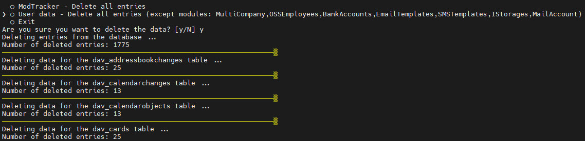

The `Data Eraser` module is available from version `6.4.146`


### ModTracker - Delete the history of non-existent entries

```bash
php cli.php -m Eraser -a mtNonExist
```


### ModTracker - Delete all entries

```bash
php cli.php -m Eraser -a mtAll
```


### User data - Delete all entries

The mechanism removes data from all the modules, excluding:

- MultiCompany
- OSSEmployees
- BankAccounts
- EmailTemplates
- SMSTemplates
- IStorages
- MailAccount

```bash
php cli.php -m Eraser -a userEntries
```


