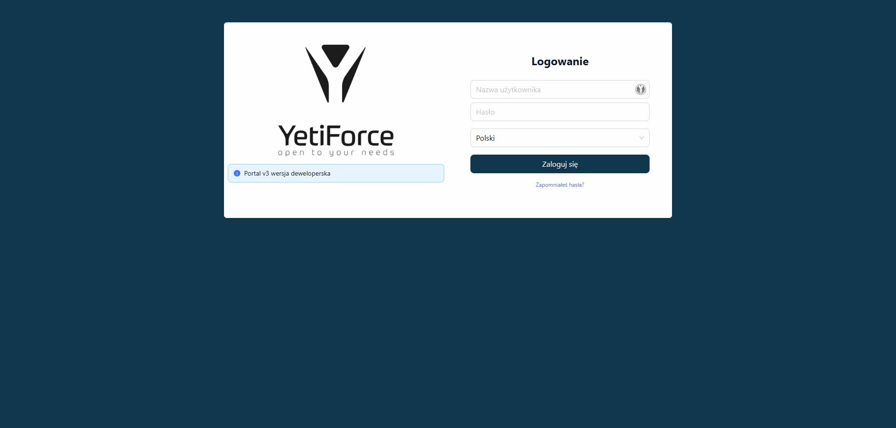
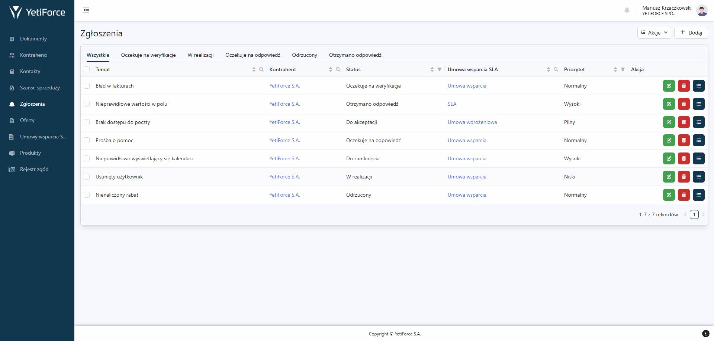
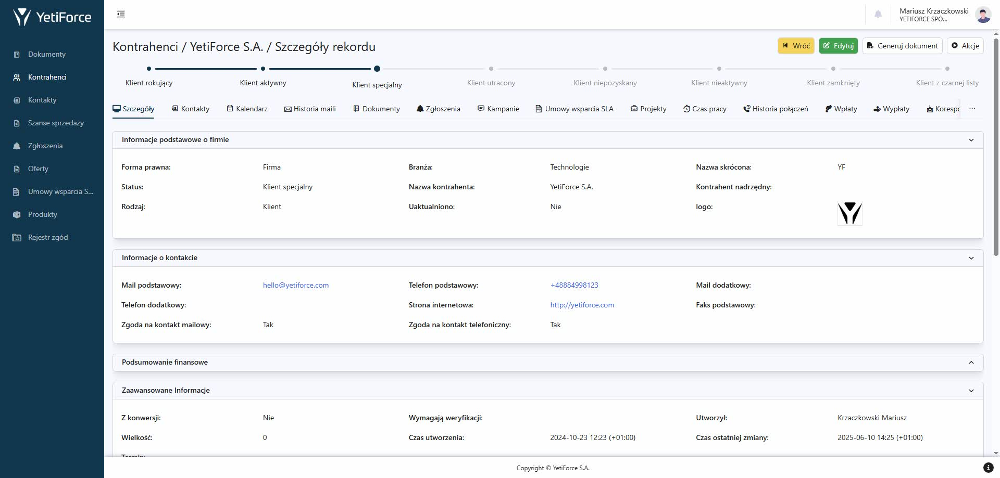
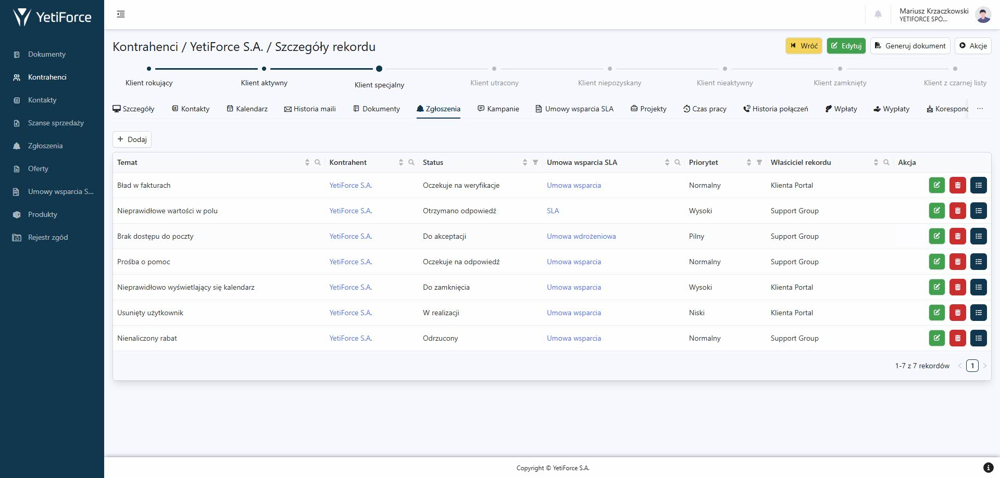
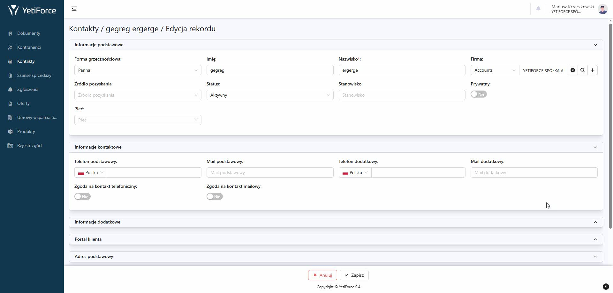
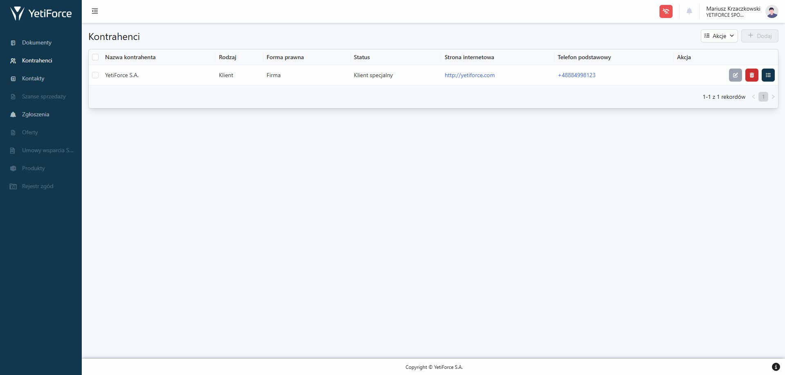

## 🚀 Portal Klienta v3 – nowoczesna komunikacja z klientami

**Portal Klienta v3** to dedykowane i nowoczesne narzędzie umożliwiające efektywną komunikację Twojej firmy ze swoimi klientami, partnerami i wszystkimi firmami zewnętrznymi. Zbudowany w technologii **React**, oferuje lepszą wydajność i doświadczenie użytkownika.

### 📊 Kluczowe korzyści biznesowe

- **Przejrzysty przepływ informacji:** Klienci mają bezpośredni dostęp do swoich danych (np. zamówienia, zgłoszenia, faktury).
- **Redukcja obciążenia działu obsługi:** Znaczące zmniejszenie liczby pytań i telefonów od klientów dzięki samoobsłudze.
- **Pełna integracja z systemem YetiForce:** Portal wykorzystuje rozszerzone **API Webservice Premium**, zapewniając bezpieczną i pełną synchronizację danych.
- **Elastyczna konfiguracja:** Możliwość definiowania ról, profili, użytkowników i menu, co pozwala idealnie dopasować dostęp i interfejs do potrzeb.

### ⚙️ Technologie i kompatybilność

- **Frontend:** Zbudowany w **React** dla szybkiego i płynnego działania.
- **Backend:** Integruje się z YetiForce przez **Webservice Premium API**.
- **Kompatybilność:** W pełni kompatybilny z najnowszą wersją systemu YetiForce (7.x).

## 🖼️ Galeria

### 1. Logowanie

Nowoczesny i responsywny ekran logowania.

### 2. Lista rekordów

Przejrzyste widoki list z zaawansowanymi filtrami i sortowaniem.

### 3. Podgląd rekordu

Szczegółowy podgląd pojedynczego rekordu ze wszystkimi powiązanymi danymi.

### 4. Moduł powiązany

Nawigacja między powiązanymi rekordami (np. kontrahent → zamówienia).

### 5. Edycja rekordu

Formularze edycji z walidacją i wsparciem dla zależności pól.

### 6. Tryb offline

Działanie w trybie offline po utracie połączenia z internetem.

## 📞 Potrzebujesz więcej informacji?

Skontaktuj się z nami, aby omówić wdrożenie Portalu Klienta dla Twojej firmy:
📧 **hello@yetiforce.com**

---

Portal Klienta v3 jest częścią ekosystemu YetiForce – otwartego, darmowego i zaawansowanego system który możliwościami daje więcej niż to co zwykły CRM.
