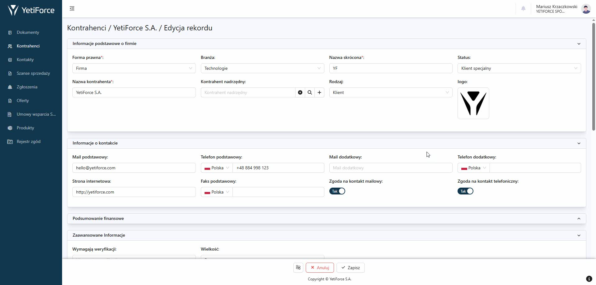

## Opis

Portal Klienta to dedykowane narzędzie umożliwiające komunikację Twojej firmy ze swoimi Klientami. Dzięki dostępowi do różnego rodzaju danych (np. zamówienia czy zgłoszenia) dbasz o przejrzysty przepływ informacji z Klientami, a także w znaczny sposób zmniejszysz liczbę pytań i telefonów od nich.

Portal Klienta korzysta z rozszerzonego API Webservice Premium, które zapewnia pełną funkcjonalność i integrację z systemem YetiForce. Konfiguracja Portalu obejmuje ustawienie ról, profili, użytkowników oraz menu, co pozwala na dostosowanie dostępu i interfejsu do potrzeb użytkowników. W porównaniu do poprzedniej wersji Portalu, jest on stworzony w technologii React, posiada więcej funkcjonalności i jest w pełni kompatybilny z najnowszą wersją systemu YetiForce (7.x).

:::info

Potrzebujesz więcej informacji? Napisz do nas wiadomośc na hello@yetiforce.com

:::

## Galeria

### Logowanie

### Lista rekordów

### Podgląd rekordu

### Moduł powiązany

### Edycja rekordu

### Tryb offline, dostęp po utracie połączenia z internetem

