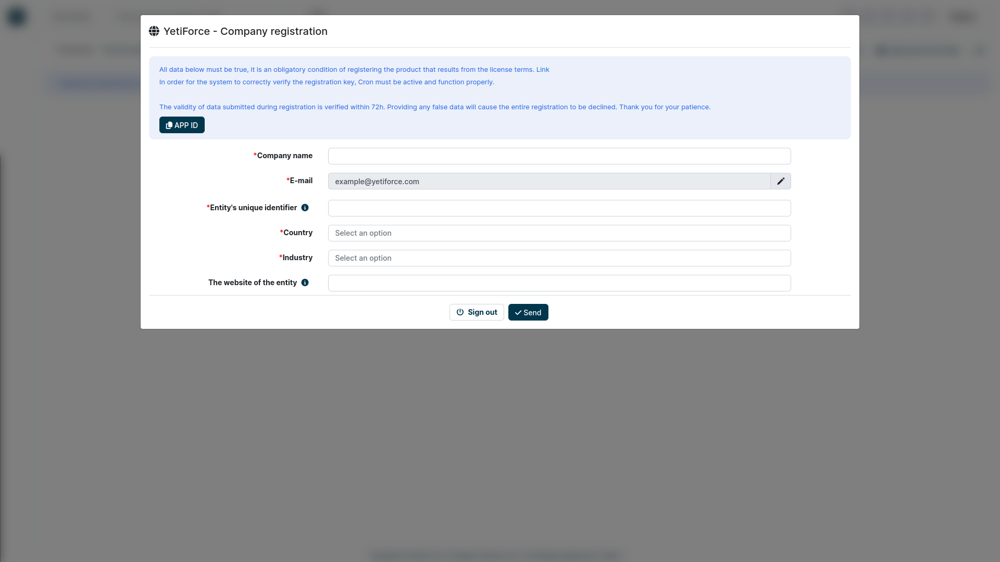

In this article, you will find everything you need to know about installing YetiForce - the necessary information, step-by-step installation instructions, as well as the most common errors and problems. **Read all of the following information before proceeding with the installation process.**

## How to install YetiForce?

The installation process of YetiForce is very simple. It's done using a browser-based wizard - just like most web applications.

Before the installation, check if your server complies with the requirements: [YetiForce requirements](requirements) or [How to configure a Debian 10 server for YetiForce](/developer-guides/environments/debian-10)

:::important

A person who is going to install the system should have at least basic knowledge of web servers, databases, and server permissions. 99% of installation issues come from people with insufficient experience attempting to install the system. If you are not sure whether you can manage on your own, you can ask somebody with adequate IT expertise. The entire installation process will take up to 30 minutes. Installation of YetiForce is similar to the installation of applications such as WordPress, Joomla, Drupal. Różnice pomiędzy poszczególnymi narzędziami są niewielkie.

:::

## Download and upload system files

First, prepare the installation files. **[Download YetiForce](download) from our official sources.**

:::warning

We recommend downloading the "complete" versions, for example `YetiForceCRM-7.0.0-complete.zip`. If you don't download the "complete" version, you will have to install the libraries using `yarn` and `composer` before installing the system. The right order is important - first `yarn`, then `composer`. A sample installation script can be downloaded from [here](https://github.com/YetiForceCompany/YetiForceCRM/blob/developer/tests/setup/dependency.sh).

:::

- Unzip the file, with e.g [7-Zip](http://7-zip.org/).
- Katalog z systemem CRM, który otrzymasz po rozpakowaniu pliku ZIP, skopiuj na serwer WWW, np. za pomocą programu [WinSCP](https://winscp.net/).
- Następnie postępuj zgodnie z kreatorem, którego wywołasz z poziomu WWW tam, gdzie skopiowałeś pliki YetiForce CRM.

You can also use the bash console

```bash
cd /home/yfprod/html/
wget -O YetiForceCRM.zip https://api.yetiforce.eu/download/crm/www/7.0.0-complete
unzip YetiForceCRM.zip
chown -R yfprod:yfprod /home/yfprod/html/
```

## Step 1 - Run the installation wizard

Run the target address of your system in the browser window, the system should show the installation wizard. If it doesn't, there may be some problems, you can try running the address: **SITE_URL**/install/Install.php


On the start screen there are options that allow you to select a language of the installation (browser language is the default language) and to choose an installation mode (new installation or migration from a different system). We will go through the steps of a new installation. **Click `Install` and proceed to the next step.**

## Step 2 - Read and accept the license

W drugim kroku kreator wymaga zaakceptowania licencji. The YetiForce License is very similar to the standard MIT license, it allows modification of the code and to leave information about the initial developer. Przeczytaj w pełni informacje o licencji, ponieważ z perspektywy firmy, dla której wdrażasz oprogramowanie, zapisy i warunki licencji są istotne.


## Step 3 - Server configuration review

In the third step, you can find your current web server configuration compared to the requirements of YetiForce (what needs to be changed and to what values to set). It is necessary to remember that this configuration may change according to different requirements applied to the application and a deployment company should take it into consideration. Firma wdrożeniowa powinna uwzględnić zmiany we własnym zakresie. For example, if you generate large reports that have a longer generating time than the maximum time set in the `max_execution_time` parameter, then it is necessary to set the parameters in such a way that the time of executing a script is always longer than the time for generating a report. Otherwise, reports may not be generated successfully.

Make sure your administrator is familiar with [web server requirements](/introduction/requirements/). If all required parameters are not met, and you attempt to proceed with the installation, the application will display a warning message.

Once you are aware of the risks associated with incorrect web server configuration you can click "OK", and move to the next step.


## Step 4 - Access data configuration

In this step, you need to enter access data to a database as well as set output parameters for the system. A database will be created on the basis of this data (when this option has been activated). The structure of the database will be copied together with basic records and an administrator account will be created, so after completing the installation it will be possible to log on this account.

If incorrect access data is entered into the database, an error message will be displayed.

In this case, it is necessary to go back and enter the correct access data. If everything is set correctly, the screen from Step 5 will appear.


## Step 5 - Data summary


## Step 6 - Specify business profile


## Step 7 - Verify email address


## Step 8 - Enter registration information

Enter the data of the company that will use the system, the data will then be used to register the system. Copy the directory to the web server, using e.g.

According to the license, each system must be registered after the trial period of 14 days.



When the installation is performed correctly, you will be automatically redirected to the system.

## The installation process has failed

What to do when the system shows the message `Invalid session ID` at the beginning of the installation.


### What does the message `Invalid session ID` mean?

"Sent session ID does not match the one received from the server. We recommend clearing your browser cache, and if that does not fix the problem, we recommend correcting your server configuration."

The error often appears when there are (or there were) several instances of different system versions on one address. Different system versions have different cookie configurations, and therefore sometimes the session ID cannot be updated during installation.

This can be checked in the browser console:


### How to repair invalid session ID

The repair is simple, it is required to delete the browser cache or delete all cookies for the domain (which the system is running on).

:::warning

Pay attention to delete cookies for HTTP and HTTPS!!!

:::

#### HTTP


#### HTTPS


### How to clear the browser cache for only one domain

You can easily remove all browser cache, but how to do it for one domain only so as not to lose all data?

In the development tools, it is possible to view and delete the cache. Opcje usuwania danych podręcznych znajdują się w różnych modułach konfiguracji przeglądarki, w zależności od rodzaju używanej przeglądarki. More details can be found in the article [How to clear browser cache?](/administrator-guides/faq/how-to-clear-browser-cache/)
