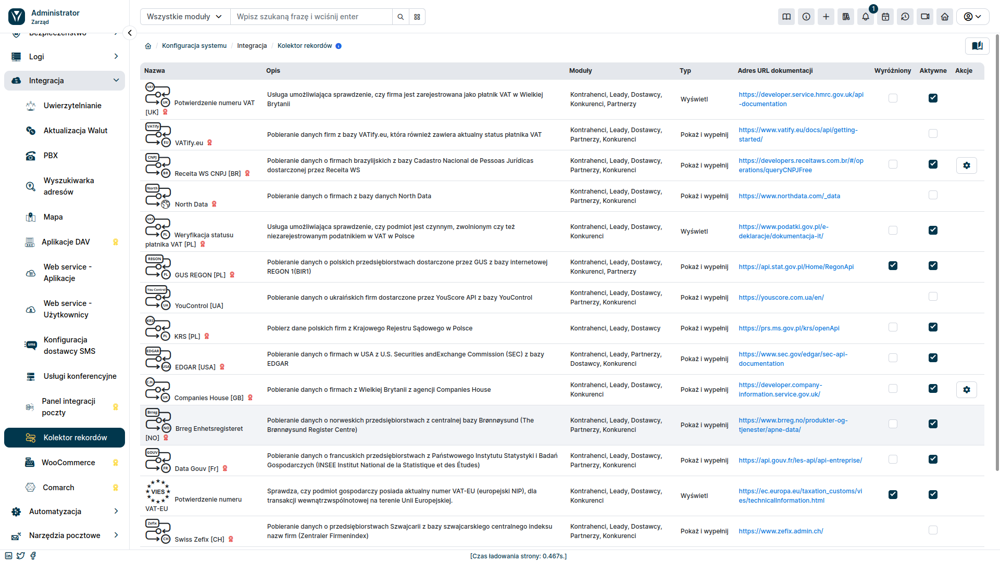
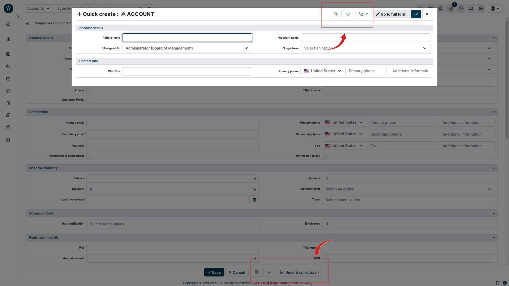

## Video presentation

import Tabs from '@theme/Tabs';
import TabItem from '@theme/TabItem';
import ReactPlayer from 'react-player';

<Tabs groupId="XlIXiQpC9ug">
    <TabItem value="youtube-XlIXiQpC9ug" label="🎬 YouTube">
        <ReactPlayer
            url="https://www.youtube.com/watch?v=XlIXiQpC9ug"
            width="100%"
            height="500px"
            controls={true}
        />
    </TabItem>
    <TabItem value="yetiforce-XlIXiQpC9ug" label="🎥 YetiForce TV">
        <ReactPlayer url="https://public.yetiforce.com/tutorials/record-collector.mp4" width="100%" height="500px" controls={true} />
    </TabItem>
</Tabs>

Record collector is used to load data from various sources and enables displaying and loading data into the YetiForce CRM system.

The mechanism is available in all modules, however it has to be enabled and configured for each module to work correctly.

## Configuration

When configuring a **record collector**, you must first grant the necessary permissions to the relevant roles in the system. For details, see the article: [Record collector permissions](/administrator-guides/integration/record-collectors/).

Then go to the administration section and select `Integration → Record Collectors`. After opening the tab, a list of available collectors will be displayed.

Main sections

- **Modules** - displays modules in the system where the record collector is available
- **Type** - defines the record collector type:
  - **display** - displays information downloaded by the collector
  - **show and fill** - displays information downloaded by the collector and allows you to fill form fields using these data
- **Documentation URL** - a link to the service provider's documentation containing the collector's details, such as configuration manuals, guides for obtaining authorization credentials if necessary
- **Featured** - tick this checkbox if you want the collector's icon to be displayed separately, next to the dropdown list of all active collectors. This will provide quick access to your most often used collectors
- **Active** - tick the checkbox to activate it in the system
- **Actions** - click the action icon (<kbd><i className="fas fa-cog"></i></kbd>), to display a popup window with additional configuration options available for the collector

## Available collectors

Below is a list of all currently available record collectors. Free record collectors available in the system are tagged by default, the rest can be purchased in the Marketplace.

:::warning

Keep in mind that access to data from some of the available record collectors may require additional credentials.

**Please refer to each specific collector documentation for more information on access requirements.**

:::

- GUS [PL] - Fetches data on Polish companies from the online **REGON 1(BIR1**) database provided by GUS
- ★ VIES [EU] - Checks if the business entity has a valid VAT-EU number for intra-community transactions within the European Union
- KRS [PL] - Fetches data on Polish companies from The National Court Register in Poland (KRS)
- Receita WS CNPJ [BR] - Fetches data on Brazilian companies from the database of the **Federal Tax Office of Brazil (Cadastro Nacional de Pessoas Jurídicas)** provided by Receita WS
- Swiss Zefix [CH] - Fetches data on Swiss companies from the Swiss Central Business Name Index (Zentraler Firmenindex)
- Danish CVR [DK] - Fetches data on Danish and Norwegian companies via CVR API from the Danish Central Business Register (CVR)
- Data Gouv [FR] - Fetches data on French companies from the INSEE (Institut National de la Statistique et des Études Économiques)
- Brreg Enhetsregisteret [NO] - Fetches data on Norwegian companies from the Central Brønnøysund Database (The Brønnøysund Register Centre)
- North Data - Fetches data about companies from the North Data's company database
- ★ Orb Intelligence - Fetches data about companies worldwide
- CEIDG [PL] - Fetches data on Polish companies from the **Central Register and Information on Economic Activity (CEIDG)** in Poland
- VAT [PL] - Verifies whether an entity is an active, exempt, or unregistered VAT taxpayer in Poland
- ★ YouControl [UA] - Fetches data on Ukrainian companies from the YouControl database provided by YouScore API
- Companies House [GB] - Fetches data on UK companies from the **Comapnies House** agency
- VAT [GB] - Verifies whether a company is registered as a VAT taxpayer in the United Kingdom
- EDGAR [USA] - Fetches data on US companies from the **United States Securities and Exchange Commission** via EDGAR
- VATify.eu - Fetches data from VATify.eu database, which also contains the taxpayer's current status

## Using the collectors

To use the record collector, go to the record create/edit form in the module where the collector is available. A list of available collectors will appear at the bottom, next to the Save and Cancel buttons. Collectors marked in the administration section as **Featured** will be displayed as separate icons next to the list. Other active collectors are available under the <kbd>Record collectors</kbd> button. After clicking this button, a list of active, non-featured collectors will be displayed.

Collectors can also be accessed from "Quick Create" forms. They appear at the top right in popup windows, as shown in the screenshot below.

