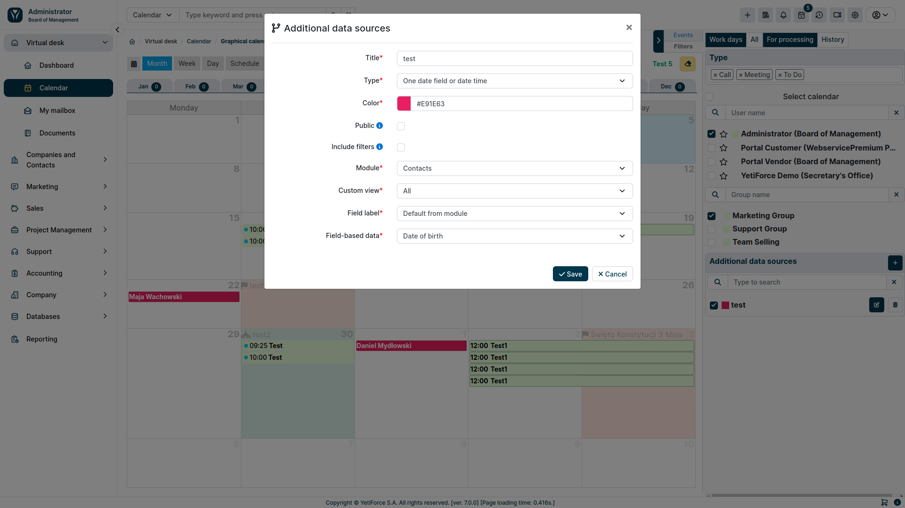

## Additional data sources

:::tip The functionality is available for YetiForce version `7.0` and later
:::

Additional data sources allow you to show information from all record modules that have a date or time and date field. The configuration block is available in the filter panel on the right.

### Fields

#### Title

The name that will be displayed in the list of data sources

#### Type

The type determines on the basis of how many and what types of fields the data is to be presented. Thanks to this solution, the system gives you the option of showing data from a range or based on two date and time fields as one value.

You can choose the following types:

- One date field or date time
- Two fields date and time
- Time range for one date field or date and time field
- Time range for two date and time fields

#### Public

The parameter determines whether a given data source will be visible to other users. By default, everyone can only see their own data sources, and this option makes it possible to share them. Only available to system administrators.

#### Include filters

Selecting this option will narrow down the results to selected users and groups. Leaving this option unchecked will show all entries, regardless of the selected users and groups.

#### Module

Specifies from which module the data will be displayed.

#### Custom view

List with filters for the selected module, it gives the possibility of additional filtering of the displayed data based on the conditions from the filters. More information can be found in the [Filter conditions](/user-guides/interface-guide/list-view/filter#conditions) article.

#### Label field

The selection list allows you to change the default record label to the selected field that you want to show in the calendar.

#### Field-based data

Depending on the selected type, one or four picklists with fields will be available for the selected module. The calendar display data will be shown based on the selected fields.

### Uprawnienia

The functionality of additional data sources is available to a regular user only after granting them the necessary permissions.

You can manage permissions in [System configuration → Permissions → Profiles](/administrator-guides/permissions/profiles/)

Permissions are divided into two options:

- **Calendar - Additional data sources** - grants access to the entire block and data display
- **Calendar - Create additional data sources** - allows the user to create their own data sources
