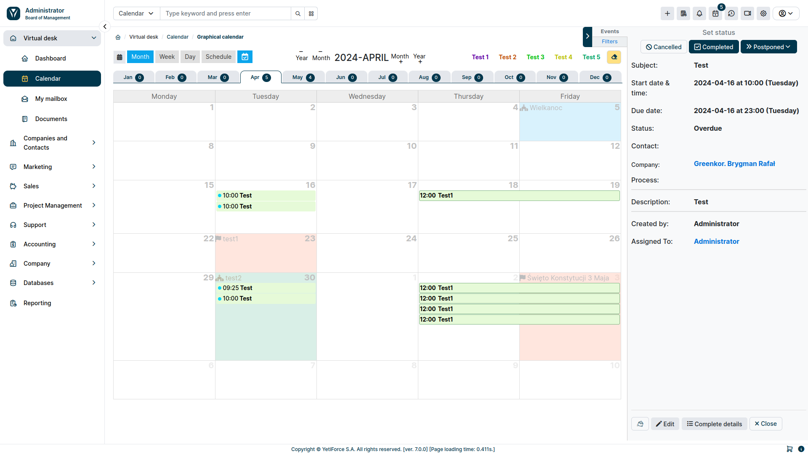
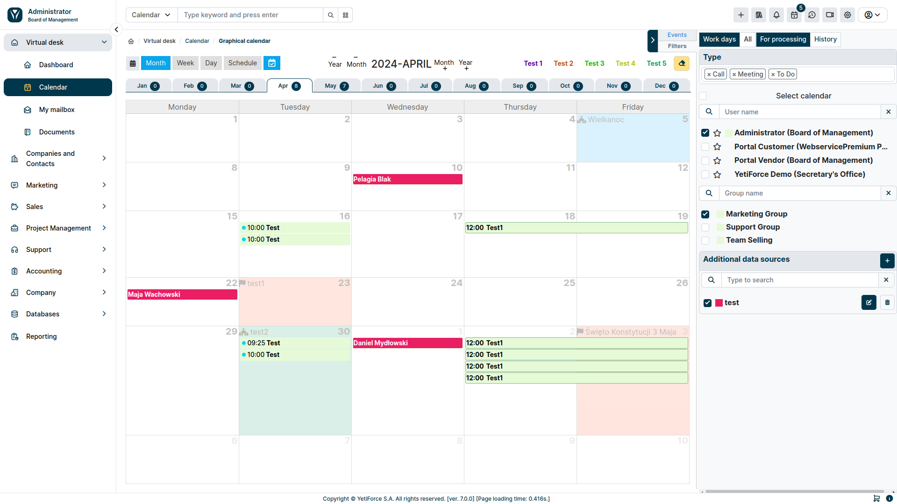
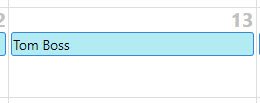
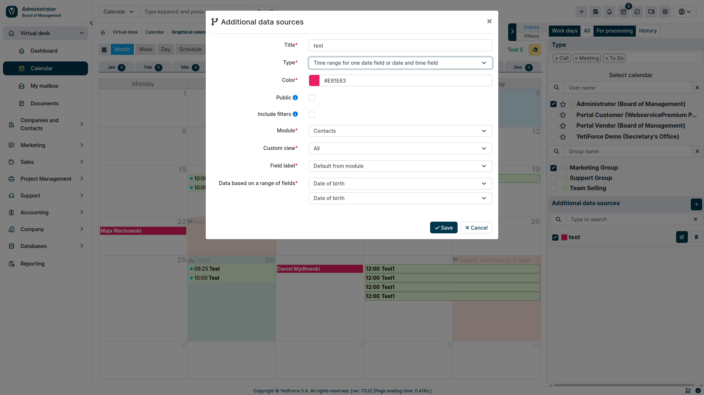

## Additional data sources

:::tip

This feature is available for YetiForce version `7.0` and later

:::

Additional data sources allow you to display information from all modules with records that have a `date` or `time and date` field. The configuration block is available in the filter panel on the right.

### Fields

#### Title

The name that will be displayed on the list of data sources

#### Type

The type determines how many and what fields are to be used to present data. Thanks to this solution, the system provides the ability to display data from a range, or based on two date and time fields as one value.

You can choose the following types:

- One date field or date and time
- Two date and time fields
- Time range for one date field or date and time field
- Time range for two date and time fields

#### Public

The parameter determines whether the data source will be visible to other users. By default, everyone sees only their own data sources, and this option allows sharing them. Available only to system administrators.

#### Include filters

Checking this option will narrow down the results to selected users and groups. Leaving this option unchecked will always show all entries, regardless of selected users and groups.

#### Module

Specifies from which module the data will be displayed.

#### Custom view

The list with filters for the selected module gives you the ability to additionally filter the displayed data based on the conditions from the filters. More information in [Filter conditions](/user-guides/interface-guide/list-view/filter#conditions).

#### Label field

The selection list allows you to change the default record label to the selected field that you want to show in the calendar.

#### Field-based data

Depending on the selected type, one or four drop-down lists of fields will be available for the selected module. Calendar display data will be shown based on the selected fields.

### Permissions

The functionality of additional data sources is available to a regular user only after granting them the necessary permissions.

You can manage permissions in [System configuration → Permissions → Profiles](/administrator-guides/permissions/profiles/)

Permissions are divided into two options:

- **Calendar - Additional data sources** - grants access to the entire block and data display
- **Calendar - Create additional data sources** - allows the user to create their own data sources
