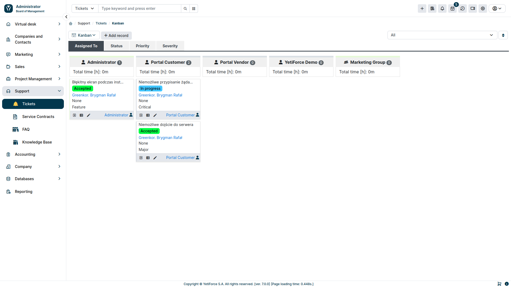
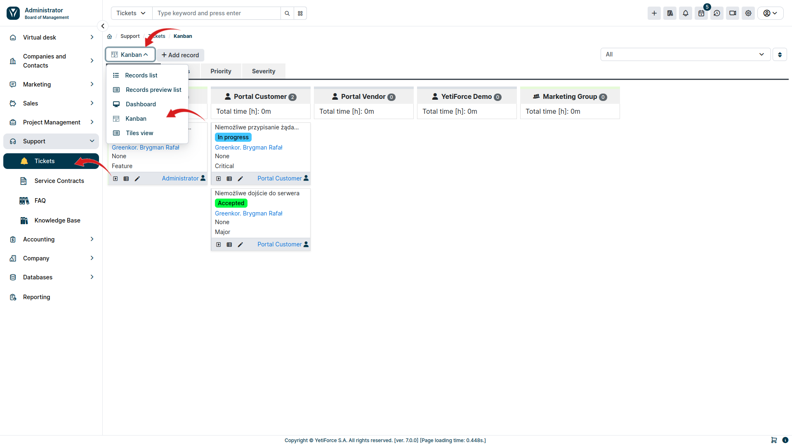
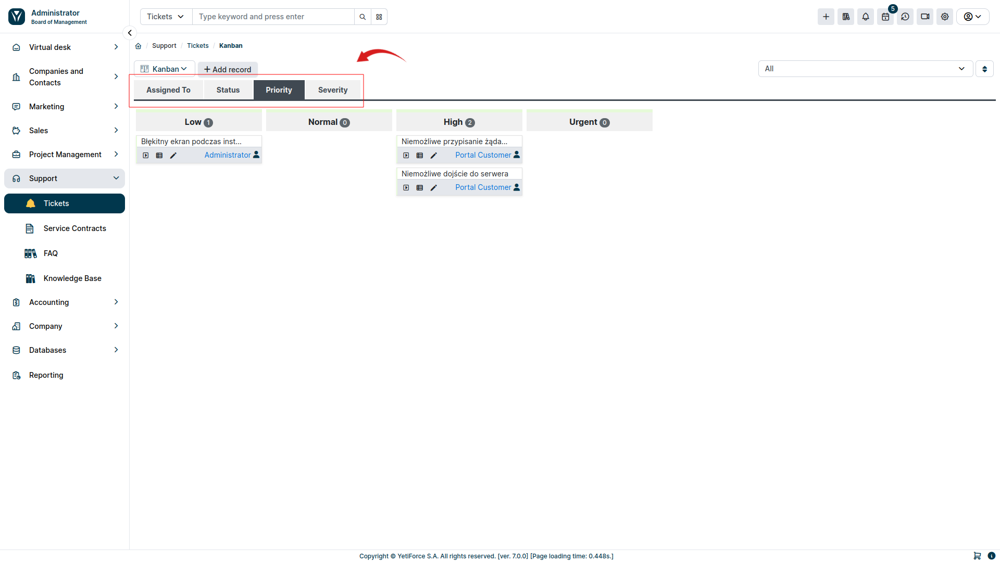
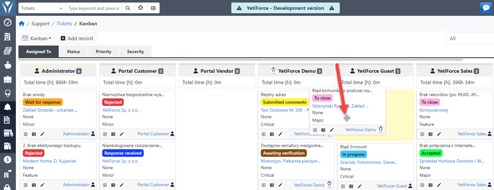

The Kanban board is a tool used mainly for project management, but in YetiForce CRM this view is available in all user modules where data is stored. Kanban helps visualize data by grouping them in various ways, effectively define the amount of work in progress and increase efficiency

:::warning

The Kanban board is a paid addon available in the Marketplace in your YetiForce system.

:::

## Kanban view setup

To display Kanban Boards in a module where you previously configured the boards, select the module from the menu and pick the Kanban view from the list of all available views:

If more tables have been configured in a given module, they will be visible as tabs. Switch between tabs to view different boards:

## Moving elements

To move elements simply drag and drop them by the bottom bar. The mouse cursor will change into <i class='fa-solid fa-up-down-left-right'></i> and allow you to drag the window:

## Configuration

The configuration panel for the YetiForce Kanban Board can be found in [`Software configuration  → Standard modules → Kanban`](/administrator-guides/standard-modules/kanban/)
